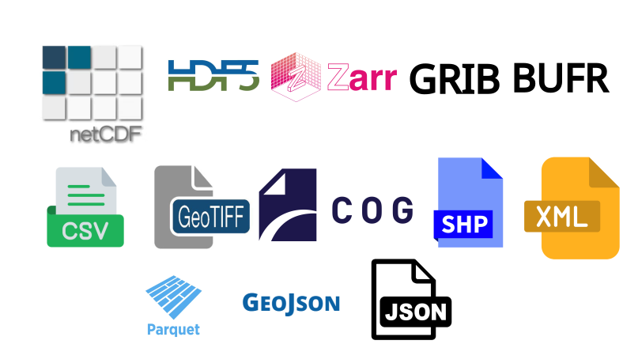
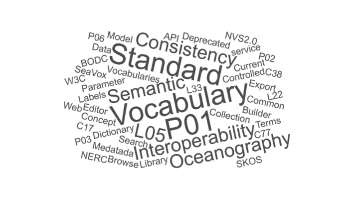

::::::::::::::::::::::::::::::::::::::::::  objectives

- "Recognize common data formats used in oceanography and meteorology (e.g. NetCDF, GRIB, BUFR, Zarr)."
- "Explain what metadata is and why it is essential for discovery and reuse."
- "Describe what controlled vocabularies are and how they support consistent metadata."
- "Identify key international and community standards (CF conventions, ISO 19115/INSPIRE, MEDIN, NERC NVS)."
- "Relate traditional formats and standards to emerging cloud‑native formats such as Zarr."

::::::::::::::::::::::::::::::::::::::::::::::::::

:::::::::::::::::::::::::::::::::::::::::::  questions

- "What are the main data formats used to store ocean and atmosphere data?"
- "What is metadata, and how does it help other people find and understand my data?"
- "What is a controlled vocabulary, and why is it better than free text?"
- "Which international standards should I be aware of when publishing environmental data?"
- "How do these standards connect to modern cloud‑native formats like Zarr?"

::::::::::::::::::::::::::::::::::::::::::::::::::

## Why formats and metadata matter

When we work with environmental data, we are not just storing the data itself. We also need to encode meaning: what was measured, where, when, how, and under which conditions. Good choices of data format and metadata make this meaning accessible to both humans and machines, enabling discovery, analysis, and long‑term reuse.

Broadly:

- **Formats** define how data and metadata are physically organised (arrays vs tables, gridded vs vector, binary vs text, cloud‑native vs legacy).
- **Metadata and vocabularies** define the semantics: variable names, units, coordinate reference systems, quality information, and controlled terms.

Using standards‑aware formats together with a good metadata and controlled vocabulary helps ensure that environmental data is self‑describing and semantically consistent, which is essential for interoperability across models, archives, visualisation tools, and cloud‑native services. Following widely used standards also means we can plug into existing tools and infrastructures (catalogues, visualisation software, cloud services) instead of reinventing everything ourselves.

## Common data formats in oceanography and meteorology

Environmental scientists use several families of formats. Here we focus on those most relevant to gridded, multidimensional ocean and atmosphere data, and then briefly note other formats that appear around them in modern workflows.

{alt="Common file formats in environmental data, including NetCDF, HDF5, Zarr, GRIB, BUFR, GeoTIFF, GeoJSON, Shapefile, Parquet/GeoParquet, and CSV."}

### Self‑describing array formats

These formats store both array data and structural metadata (dimensions, variables, units, coordinate systems) in the same file or object:

- [**NetCDF (Network Common Data Form)**](https://www.unidata.ucar.edu/software/netcdf) is a machine‑independent, binary, self‑describing format designed for array‑oriented scientific data, widely used to store gridded climate, ocean and meteorological variables.
- [**HDF5 (Hierarchical Data Format)**](https://www.hdfgroup.org/solutions/hdf5/) is another self‑describing format supporting large, complex datasets with a "directory‑like" internal structure. It is used for satellite products, model output and other multidimensional data.
- [**Zarr**](https://zarr.dev/) is a newer, cloud‑native format for chunked, N‑dimensional arrays. The GeoZarr standard describes how to represent geospatial datasets in Zarr using concepts from the Unidata Common Data Model, including dimensions, coordinate variables, attributes and metadata style.

This "self‑describing" property is particularly important for large climate model outputs, reanalysis products and ocean observing systems, where many different tools need to interpret the same files without bespoke documentation.

### WMO exchange formats

The World Meteorological Organization maintains binary formats optimised for exchange over telecommunications networks:

- [**GRIB (GRIdded Binary)**](https://codes.wmo.int/wmdr/DataFormat/FM-92-grib) is a compact, self‑describing binary format for gridded meteorological fields such as numerical weather prediction (NWP) output.
- [**BUFR (Binary Universal Form for the Representation of meteorological data)**](https://codes.wmo.int/wmdr/DataFormat/FM-94-bufr) is a flexible, table‑driven binary format designed to represent many kinds of meteorological and oceanographic observations efficiently.

These WMO "table‑driven code forms" are widely adopted for transmitting satellite products and model fields between operational centres and can also be used for storage. You will often encounter reanalysis products and forecast grids available as GRIB or NetCDF, sometimes convertible between them.

### Other and emerging formats you may meet

Alongside the array formats above, you will often work with:

- **ASCII / CSV**: simple text tables, easy to read but not ideal for large multidimensional data.
- [**GeoTIFF**](https://www.ogc.org/standards/geotiff/): common in remote sensing and GIS for 2D georeferenced images such as sea‑surface temperature or altimetry maps. The [**Cloud‑Optimized GeoTIFF (COG)**](https://cogeo.org/) is a widely used cloud‑native variant.
- [**GeoJSON**](https://geojson.org/): a JSON‑based format for vector geometries and attributes, often used for footprints, regions of interest, and feature‑based metadata in web APIs and STAC items.
- [**Shapefiles**](https://doc.arcgis.com/en/arcgis-online/reference/shapefiles.htm): an older but still common vector format in GIS for points, lines and polygons describing stations, coastlines, regions, etc.
- **[Parquet](https://parquet.apache.org/) / [GeoParquet](https://geoparquet.org/)**: columnar, compressed table formats increasingly used in cloud‑native analytics. GeoParquet adds conventions for storing vector geometries alongside tabular attributes, making large point or polygon datasets efficient to query in data lakes and lakehouses.
- **XML / JSON**: often used for metadata documents, catalog records or service responses, rather than bulk gridded data.

::::::::::::::::::::::::::::::::::::::::::  callout

## Concept: "Self‑describing" data

A file is called *self‑describing* when it contains enough structural metadata (dimensions, variables, units, coordinate systems) that a tool can understand and subset the data without external manuals or code lists. NetCDF, HDF5, GRIB, Zarr and CF conventions all aim to make scientific files self‑describing.

The other formats (vector, tabular, point‑cloud, XML/JSON) typically rely more on external schemas or conventions, and are often used to provide context and cataloguing around core array datasets rather than to store the primary model or reanalysis fields themselves.

::::::::::::::::::::::::::::::::::::::::::::::::::

::::::::::::::::::::::::::::::::::::::::::  callout

## Parquet and GeoParquet in practice

Parquet and GeoParquet are increasingly used as cloud‑native table and vector formats in data lakes and lakehouses, especially for large point, line and polygon datasets. They are replacing many large CSV and Shapefile/GeoJSON workflows in logistics, urban planning, mobility, environmental monitoring, remote sensing, and national‑scale GIS platforms, because they are compact, fast to scan, and integrate directly with analytics engines like Spark, DuckDB, BigQuery, Snowflake and modern GIS tools.

In this course, we mention Parquet/GeoParquet as part of the broader cloud‑native ecosystem, but our main focus is on self‑describing array formats (NetCDF, HDF5, Zarr and GeoZarr) for multidimensional ocean and atmosphere data.

::::::::::::::::::::::::::::::::::::::::::::::::::

## What is metadata?

**Metadata** is "data about data": information that describes a dataset so that people (and software) can understand, find, and reuse it.

In the marine and atmospheric domains, common metadata elements include:

- Who collected the data and why.
- What was measured (variables, units, methods).
- Where and when (spatial/temporal coverage, coordinate reference system).
- How it was processed (algorithms, quality flags, versions).
- How to access, cite, and interpret it.

Standards such as [ISO 19115](https://www.iso.org/standard/53798.html) for geographic information define sets of metadata elements covering identification, extent, quality, spatial and temporal schema, reference systems and distribution. These are used in catalogues and portals to support dataset discovery and evaluation.

{alt="Word cloud of common metadata elements, including title, abstract, keywords, contact, spatial extent, temporal extent, units, standard_name, cell_methods, coordinates, bounds, grid_mapping, quality flags, provenance."}

### Controlled vocabularies and vocabulary services

Free‑text metadata can be ambiguous ("temp", "T", "temperature") and hard to search. Controlled vocabularies fix this by providing curated lists of standard terms and identifiers.

The [NERC Vocabulary Server (NVS)](https://vocab.nerc.ac.uk/), operated by the [British Oceanographic Data Centre (BODC)](https://www.bodc.ac.uk/), publishes centrally managed lists of terms for annotating marine and related Earth science data, using the SKOS (Simple Knowledge Organization System) model to represent concepts and collections. NVS hosts vocabularies for platforms, instruments, parameters, projects, geographic regions and more. These vocabularies are used to:

- Populate drop‑down lists in metadata editors, ensuring consistent choice of parameter names, platforms, and methods.
- Mark up metadata with stable URIs rather than free text, enabling machine‑readable search and semantic cross‑walks between different metadata schemas.
- Support "smart search" and semantic web services in marine data portals, including collections specifically for MEDIN controlled vocabularies and SeaDataNet common vocabularies.

[MEDIN's Discovery Metadata Standard](https://medin.org.uk/data-standards/medin-discovery-metadata-standard) is a marine profile of the UK government's GEMINI standard and is aligned with INSPIRE and ISO 19115, providing a consistent template for describing marine datasets in the UK context. This profile focuses on "discovery metadata", the core elements needed for catalogues and portals to help users find and evaluate datasets.

::::::::::::::::::::::::::::::::::::::::::  callout

## Example: A parameter name from NVS

A single measured variable (e.g. "sea water temperature at 5 m") might be described by a P01 code in NVS that encodes the phenomenon, medium, vertical position and statistical operation in a single, standardised label. Using that code in your metadata ensures different datasets use exactly the same concept when they mean the same thing.

::::::::::::::::::::::::::::::::::::::::::::::::::

## Key standards you should know

### CF metadata conventions

The [Climate and Forecast (CF) metadata conventions](https://cfconventions.org/) define how to describe Earth science data in self‑describing formats (originally NetCDF) so that files from different sources can be processed and compared consistently. CF specifies attributes such as `standard_name`, `units`, `cell_methods`, `coordinates`, `bounds` and `grid_mapping`, plus rules for how to represent grids, time coordinates and climatological statistics.

CF has been widely adopted for atmosphere and ocean data, including climate model output for major intercomparison projects, and is considered a recommended standard for gridded data in programmes like [IOOS](https://ioos.noaa.gov/).

### ISO 19115, INSPIRE, and profiles

ISO 19115 is the international standard for describing geographic information and services, covering identification, extent, quality, spatial/temporal schema, spatial reference and distribution. The INSPIRE Metadata Implementing Rules define how to implement discovery metadata using ISO 19115 and related standards for spatial data sets and services in the European context.

MEDIN's Discovery Metadata Standard is an ISO 19115‑based UK profile, ensuring that marine metadata records are compliant with INSPIRE and ISO while tailored to national practice. Other marine communities, such as [SeaDataNet](https://www.seadatanet.org/), also use ISO 19115‑based community profiles for their portals.

### WMO code forms and operational formats

The WMO maintains binary and alphanumeric code forms such as BUFR and GRIB for efficient exchange of meteorological and oceanographic data over telecommunication networks. GRIB is widely used for NWP output, while BUFR is used for high‑volume observational data (satellites, aircraft reports, profilers) and can include quality information alongside the observations.

Operational data centres and services often distribute ocean and marine meteorological data in formats such as NetCDF, GRIB and BUFR, which are recognised by cloud platforms and big‑data tools.

### STAC - SpatioTemporal Asset Catalogs

[STAC (SpatioTemporal Asset Catalogs)](https://stacspec.org) defines a common JSON/GeoJSON‑based language to describe and organise geospatial assets (files, APIs, data cubes) in space and time. It introduces three core objects:

- Catalog: an entry point that links to Collections and Items.
- Collection: a grouped set of related data (e.g. "ERA5 surface climate cubes"), with shared metadata and spatial/temporal extent.
- Item: a single spatiotemporal asset (e.g. one product or one NetCDF file), linking to the actual data files via "assets".

STAC is often used *on top of* ISO 19115‑style discovery metadata: ISO profiles provide rich descriptions, while STAC standardises how those assets are organised and queried via static catalogs or STAC APIs. In this course we focus mainly on CF and NVS for internal metadata, but later lessons show how STAC can reference datasets and support cloud‑native discovery workflows.

### Metadata inside data files vs discovery metadata

In formats like NetCDF, metadata lives "inside" the file as attributes attached to variables and dimensions (e.g. `units`, `standard_name`, `long_name`, `history`). Normally, this metadata is structured according to the CF conventions, which allow software tools to interpret the data correctly.

Discovery metadata standards (MEDIN, GEMINI, INSPIRE, ISO 19115, STAC) describe datasets at a higher level, typically as XML or JSON records in catalogues, including title, abstract, keywords, contact, spatial/temporal extent, and links to data services.

Both layers are needed: internal metadata lets analysis tools interpret arrays correctly, while discovery metadata lets users and catalogues know the dataset exists and decide whether it is suitable for their purpose.

:::::::::::::::::::::::::::::::::::::::  challenge

## Exercise 1 - Match format and standard

For each scenario, suggest a "format + metadata standard" combination that would be appropriate, and explain your reasoning.

1. Global daily sea surface temperature reanalysis on a regular grid, published for long‑term reuse.
2. Ship‑based CTD profiles with detailed instrument metadata, to be ingested into a national marine data centre.
3. Operational global numerical weather prediction forecast fields disseminated to weather services every 6 hours.

Take 5 minutes to think or discuss in pairs, then share your answers.

:::::::::::::::  solution

Example answers:

1. NetCDF (or cloud‑native Zarr) with CF conventions for internal metadata, plus an ISO 19115/INSPIRE‑compliant discovery metadata record using the relevant national profile (e.g. MEDIN Discovery Metadata in the UK), and a STAC Collection/Items to expose the Zarr stores in a cloud‑native catalog.
2. NetCDF or CSV for the data, with rich internal metadata (units, calibration info) and discovery metadata following MEDIN Data Guidelines and Discovery Metadata Standard, using NVS controlled vocabularies for parameters, platforms and instruments, and optionally STAC Items to reference individual cruises or deployments.
3. GRIB (or GRIB2) as the WMO‑recommended binary format for gridded NWP forecasts, with WMO‑compliant GRIB metadata, and catalogue / API metadata using ISO 19115/INSPIRE or the relevant organisational profile, potentially wrapped in a STAC Collection and Items for each forecast run to support cloud‑native discovery.

:::::::::::::::::::::::::

::::::::::::::::::::::::::::::::::::::::::::::::::

## Why following standards is so important

Using community standards has practical benefits:

- **Interoperability**: CF‑compliant NetCDF datasets can be read by widely used libraries (xarray, Iris, CF‑Python), visualisation tools and data portals without custom code.
- **Discoverability**: ISO 19115 / INSPIRE / MEDIN‑compliant metadata records can be harvested by catalogues, making your data visible in national and international portals.
- **Semantic clarity**: Controlled vocabularies via NVS ensure that different datasets and organisations use the same, well‑defined concepts for parameters, platforms and methods, reducing ambiguity.
- **Governance and efficiency**: Embedding data management (including standards, metadata and vocabularies) into organisational policy can reduce risk, support audits, and lower costs over the data lifecycle.

For cloud‑native data, standards are what allow us to move from traditional files to object storage and APIs without losing meaning: GeoZarr's alignment with CF and NetCDF, and catalogue metadata aligned with STAC, make Zarr‑based datasets interoperable with both scientific and geospatial ecosystems.

:::::::::::::::::::::::::::::::::::::::  challenge

## Exercise 2 - Spot the missing metadata

Imagine you find a file `sst_daily.nc` containing a global sea surface temperature field. Inside the file you see:

- Variable name: `temp`
- No `units` attribute
- No `standard_name` attribute
- Time coordinate has values but no `calendar` or reference time (e.g. "days since …")

Discuss:

1. What problems might this cause for someone else trying to use the data?
2. Which CF and/or ISO/MEDIN metadata elements would you add to improve the situation?

Take 5 minutes, then share your ideas.

:::::::::::::::  solution

Example answers:

1. Without `units`, users cannot be sure whether `temp` is in Kelvin, Celsius, or something else. Without `standard_name`, automated tools cannot recognise the variable as sea surface temperature. Ambiguous time coordinates make it hard to align with other datasets or interpret the temporal coverage.
2. At minimum, add CF attributes: `standard_name="sea_surface_temperature"`, `units="K"` (or appropriate units), `long_name` describing the variable, and proper time metadata (e.g. `time` with `units="days since 1970-01-01"` and `calendar="gregorian"`), plus a descriptive `title` and `institution` for provenance. In discovery metadata (ISO 19115 / MEDIN), ensure fields like abstract, keywords (from NVS vocabularies), temporal extent and geographic bounding box are populated.

:::::::::::::::::::::::::

::::::::::::::::::::::::::::::::::::::::::::::::::

::::::::::::::::::::::::::::::::::::::::::  keypoints

- "Oceanography and meteorology rely on self‑describing array formats (NetCDF, HDF5, Zarr) and WMO exchange formats (GRIB, BUFR) for gridded and observational data."
- "Metadata is 'data about data' and lives both inside files (e.g. CF attributes) and in separate discovery records based on standards such as ISO 19115, INSPIRE and MEDIN."
- "Controlled vocabularies, delivered through services like the NERC Vocabulary Server, provide standardised terms and identifiers that make metadata consistent and machine‑actionable."
- "CF metadata conventions define how to describe Earth science variables, grids and coordinates in self‑describing formats and underpin many ocean and climate data tools."
- "Discovery profiles such as the MEDIN Discovery Metadata Standard align national practice with international standards (ISO 19115, INSPIRE), supporting data discovery across portals and organisations."
- "STAC catalogs (Catalogs, Collections, Items) provide a modern, JSON‑based way to organise and expose geospatial assets, including NetCDF and Zarr stores, in cloud‑native workflows."
- "Cloud‑native formats like Zarr become interoperable when combined with established metadata and vocabulary standards (CF, Unidata CDM, ISO profiles, NVS) and can be complemented by STAC for discovery."

::::::::::::::::::::::::::::::::::::::::::::::::::
