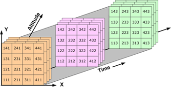

:::::::::::::::::::::::::::::::::::::::::: objectives

- "Describe how NetCDF, GRIB, and HDF5 organise n-dimensional data and impact file size."
- "Explain why meteorological and oceanographic datasets have grown so large over the last 30 years."
- "Recognise practical challenges when opening, sharing, and inspecting NetCDF and GRIB files."
- "Explain why we do not want to download whole files all the time, and how partial access and chunking help."
- "Gain hands-on experience exploring file structure and chunks with xarray as a first step toward cloud-native solutions."

::::::::::::::::::::::::::::::::::::::::::::::::::

::::::::::::::::::::::::::::::::::::::::::: questions

- "How do NetCDF, GRIB, and HDF5 organise large n-dimensional arrays?"
- "Why have typical datasets in meteorology and oceanography grown so much in size?"
- "What happens when we open these files in standard tools like xarray?"
- "Why is it important to share data in a way that supports partial access rather than whole-file downloads?"
- "How do chunking and parallel processing affect performance, scalability, and memory use?"

::::::::::::::::::::::::::::::::::::::::::::::::::


## Why n-dimensional data is hard

In oceanography and meteorology, most core data products are naturally n-dimensional: time, latitude, longitude, height or depth, and often additional dimensions such as ensemble member, forecast lead time, and variable.

{alt="Schematic showing a 3D field (latitude, longitude, height) evolving over time, with multiple ensemble members."}

Over the last three decades, higher spatial and temporal resolution, more vertical levels, longer archives, and ensembles have pushed typical file sizes from megabytes to gigabytes, and today large collections can reach terabytes or petabytes.

Early attempts to manage this data with generic database systems ran into limitations: they did not treat multidimensional arrays as first-class objects and performed poorly on large scientific datasets, motivating specialised formats like NetCDF and GRIB.


### NetCDF: self-describing arrays

NetCDF was designed in the late 1980s as a portable, self-describing file format and data model for array-oriented scientific data such as climate and ocean model output.
A NetCDF file stores variables (arrays), dimensions (e.g. `time`, `lat`, `lon`, `level`), and attributes (metadata) in a single container, enabling programs to discover structure and metadata at runtime without relying on separate documentation.

NetCDF-3 stores data in a simple, contiguous layout, while NetCDF-4 builds on HDF5 as a storage layer, adding features such as groups and support for very large arrays and complex hierarchies.
From the user's point of view, NetCDF provides an intuitive way to represent n-dimensional fields. But as datasets grow, organisational choices (e.g. which dimensions to include, how to structure variables and files) strongly affect how easy they are to work with.

### GRIB: compact operational exchange

GRIB (GRIdded Binary) is a World Meteorological Organization format designed for efficient transmission and storage of gridded meteorological fields, especially numerical weather prediction outputs.
It uses many "messages", each containing a field plus encoded metadata, and is governed by WMO tables that define parameters, levels, and other descriptors.

GRIB was declared operational as a standard in the early 2000s with GRIB2, providing more flexible metadata, additional compression methods, and improved support for missing values compared to the original GRIB.
This message-based structure is highly compact and well suited to operational workflows, but it can be more difficult to treat GRIB files as simple n-dimensional arrays, and heterogeneous messages may need to be filtered or regrouped before analysis.

### HDF5: a general high-performance container

HDF5 is a general hierarchical data format that supports large, complex datasets, and underpins NetCDF-4's storage layer.
It provides groups, datasets, and rich metadata, allowing complex scientific data structures to be represented in a single file, and has been widely adopted beyond atmospheric science, including in remote sensing and other Earth-observation products.

NetCDF-4 hides much of HDF5's complexity behind the NetCDF API and data model, so most users interact with variables, dimensions, and attributes rather than low-level storage details.
However, the ability to represent large hierarchical datasets efficiently is one reason NetCDF-4/HDF5 has become a backbone for many modern environmental archives.


### Thirty years of growing data volumes

Over roughly the last 30 years, several trends have driven data growth in meteorology and oceanography:

- Higher spatial resolution in models and reanalyses, moving from coarse global grids to kilometre-scale domains.
- Higher temporal resolution, with more frequent output (e.g. hourly, sub-hourly) instead of monthly or daily only.
- More vertical levels in atmosphere and ocean models, capturing detailed vertical structure.
- Longer archives of observations and reanalyses, often spanning many decades.
- Ensembles of forecasts and climate simulations, multiplying data volume by the number of members.

These trends have pushed archives from simple files to huge collections, requiring careful selection of formats, file organisation strategies, and access tools.

![The volume of worldwide climate data is expanding rapidly [^overpeck_etal2011]](fig/data_size_trends.png){alt="Chart showing the growth of climate data volumes over time, with a steep increase in the last decades."}

## Typical access patterns today

In many workflows, meteorology and oceanography practitioners:

- Use NetCDF (NetCDF-3 or NetCDF-4/HDF5) for archival and analysis of gridded fields and time series.
- Use GRIB for operational forecast products and exchange between centres.
- Rely on high-level libraries such as xarray to open NetCDF and GRIB files and represent them as labelled n-dimensional datasets.

From the perspective of "The NetCDF Developer's Handbook"[^netcdf_handbook], high-performance programs must understand both the logical data model (variables, dimensions, attributes) and practical constraints (file size, number of files, hardware) to manage scientific data effectively. This episode focuses on understanding the problem space and the structures we are working with.

::::::::::::::::::::::::::::::::::::::: challenge

## Exercise 1: Inspecting the structure of a NetCDF file

The example NetCDF file `data/era5_sst/ocean_temperature.nc` contains a subset of the ERA5 Reanalysis, consisting of 2D sea surface temperature fields (latitude and longitude) recorded every 2 hours during the first five days of 2025.

1. Use xarray to open the dataset.
2. Inspect dimensions, coordinates, and attributes.
3. Discuss how the organisation (variables, dimensions, attributes) reflects the n-dimensional nature of the data.

```python
import xarray as xr

base_path = "/gws/ssde/j25b/atlantis_vis/cloud-native-geoscience-course/" # or "" if you have the data in your current working directory

ds = xr.open_dataset(f"{base_path}data/era5_sst/ocean_temperature.nc")
print(ds)
print(ds.dims)
print(ds.coords)
print(ds.attrs)
```

Think about:

- Which dimensions does this dataset use (e.g. `time`, `lat`, `lon`, `depth`)?
- How would the structure change if we added ensemble members or vertical levels?
- What might become difficult as the dataset grows larger or more complex?

::::::::::::::: solution

This dataset has dimensions for "time" (`valid_time`), "lat" (`latitude`), and "lon" (`longitude`), with corresponding coordinate variables. Attributes provide metadata about the dataset, such as the source, institution, and conventions used.
Adding ensemble members or more levels would introduce additional dimensions, increasing the size of the dataset and potentially complicating access patterns.

:::::::::::::::::::::::::

::::::::::::::::::::::::::::::::::::::::::::::::::


::::::::::::::::::::::::::::::::::::::: challenge

## Exercise 2 - Comparing NetCDF and GRIB files

Many forecast products are distributed in GRIB, while climate or reanalysis products may be available as NetCDF. To get a feeling for differences:

1. Open a NetCDF example (e.g. `data/era5_sst/ocean_temperature.nc`) with xarray.
2. Open a GRIB example (e.g. `data/era5_sst/ocean_temperature.grib`) with xarray using the `cfgrib` engine.
3. Compare what `print(ds)` shows for each: dimensions, data variables, coordinates, and attributes.

To open a GRIB file, you may need to use `engine="cfgrib"` in `xr.open_dataset()`:

```python
ds_grib = xr.open_dataset(
    f"{base_path}data/era5_sst/ocean_temperature.grib",
    engine="cfgrib",
)
print(ds_grib)
print(ds_grib.dims)
print(ds_grib.data_vars)
```

Questions to discuss:

- Do both files present regular grids with similar dimensions (e.g. `latitude`, `longitude`, `time`)?
- How many variables are present in each, and how are they named?
- What metadata is available (e.g. attributes for conventions, originating centre, parameter names)?

::::::::::::::: solution

Both files expose a very similar data model when opened with xarray. They contain the same spatial grid (721 × 1440), 120 time steps, and a single variable (sst). The main difference is in the temporal and auxiliary coordinates: the NetCDF file uses valid_time as its dimension, whereas the GRIB file uses time as the dimension and retains additional GRIB-specific coordinates such as step, surface, and number. The GRIB dataset also preserves extra metadata, such as the GRIB edition, while the NetCDF file presents a simplified CF-compliant representation. In general, NetCDF stores dimensions, variables, and metadata explicitly, whereas GRIB is a message-based format where much of the metadata is encoded within each field.

:::::::::::::::::::::::::

::::::::::::::::::::::::::::::::::::::::::::::::::

::::::::::::::::::::::::::::::::::::::: challenge

## Exercise 3 - Thinking about growth and organisation

Using the `data/era5_sst/ocean_temperature.nc` NetCDF file, imagine that:

- Spatial resolution doubles in each horizontal direction.
- Output frequency increases from monthly to hourly.
- We add more time steps to cover a 30‑year period.
- Several colleagues also need to analyse this dataset, possibly from different institutions.

Discuss:

1. How would this change the dimensions of your dataset (e.g. `lat`, `lon`, `time`, `depth`)?
2. How might file sizes change for a single file and for the full archive?
3. What practical challenges might you face when trying to open and inspect such datasets with the same tools?
4. How would you share this growing dataset today (local copies, shared server, remote service), and what problems might that create?

You do not need to implement anything. Focus on reasoning about dimensions, size, organisation, and sharing.

::::::::::::::: solution

Doubling the horizontal resolution would increase the number of latitude and longitude points, giving about four times more grid cells at each time step. Changing the output from monthly to hourly and extending the dataset to 30 years would greatly increase the number of time steps, making the dataset much larger overall.

A single file would become difficult to store, move, and analyse, so it would be better to split the data into smaller files. Opening and working with the full dataset would also become slower and could require more memory than is available on a typical computer.

Sharing the dataset by giving everyone a local copy would be inefficient because of its size and could lead to different versions of the data. A better option would be to store the dataset on a shared server or in cloud storage, so everyone can access the same data without downloading the entire archive.

:::::::::::::::::::::::::

::::::::::::::::::::::::::::::::::::::::::::::::::

## Sharing data and accessing subsets

As data volumes grow, the way we share and access n-dimensional datasets becomes just as important as the way we store them.

### Traditional patterns: download first, analyse later

In many workflows, people still:

- Publish NetCDF or GRIB files on an FTP/HTTP server or data portal.
- Download complete files to local disk or a shared server.
- Open them with tools like xarray or command‑line utilities.

For small datasets this is fine, but for multi‑gigabyte or multi‑terabyte archives it is neither efficient nor scalable:

- Whole‑file downloads are slow and expensive (network, storage, time).
- Users often need only a subset (e.g. one variable, a region, a time window), not the full archive.
- Multiple users pulling the same large files creates unnecessary duplication and storage overhead.

Even when chunking is used inside NetCDF‑4/HDF5, the file is still treated as a single object: clients ultimately have to read data from that file (locally or via a server) to do any calculation, and classical NetCDF/HDF5 are optimised for POSIX‑style file systems rather than direct object‑store access.

:::::::::::::::::::::::::::::::::::::::::: callout

## POSIX file systems and object storage

A **POSIX file system** is a traditional file-system model with directories, files, and paths that are accessed through a local or mounted storage interface. It is commonly used for shared filesystems and local disks.

An **object-store file system** is a storage interface that exposes object storage through filesystem-like operations, often used in cloud workflows. It is different from a traditional POSIX filesystem because data are accessed through object APIs rather than a normal directory tree.

::::::::::::::::::::::::::::::::::::::::::

### Server‑side subsetting and remote access

Server‑side access protocols such as [OPeNDAP](https://www.opendap.org/) and modern APIs allow clients to request subsets of NetCDF data (e.g. a bounding box in space and a time range) without transferring the entire file, which is already a step toward "not download the whole file all the time". These services can reduce duplication and help centralise access, but they require maintained infrastructure, and performance still depends on server load and network bandwidth.

### Storage considerations

Storing large archives on traditional networked file systems or shared servers can become costly and hard to scale, especially when data are kept online for many years. Cloud and institutional infrastructures increasingly use **object storage** for large, mostly read‑only datasets, because it scales horizontally and can be cheaper per terabyte for large volumes of unstructured scientific data.

In this lesson we do not go into technical details of object stores or cloud pricing, but it is useful to recognise that:

- Growing data volumes make it expensive to keep multiple full copies on local disks or HPC filesystems.
- Centralised archives and object storage are attractive for long‑term, shared access.
- Formats and access patterns that support subsetting and streaming (rather than whole‑file downloads) will become more important as archives grow.

Later lessons on Zarr and cloud‑native workflows will show how chunking, object storage, and tools like xarray/dask are combined to address these challenges more directly.

:::::::::::::::::::::::::::::::::::::::::: callout

## A note on access and storage

NetCDF and GRIB are often used in a "download first, analyse later" workflow, where people copy the whole file to a local machine or shared server before opening it. Xarray can be *lazy* when it opens NetCDF files, so metadata can be inspected without immediately reading all values, but many analyses still end up pulling large parts of the file into memory when the data are actually used. In practice, this means that sharing data efficiently is still a challenge, especially when many people need access to the same large archive.

For that reason, large scientific archives are often easier to manage on central servers or object storage systems than as many duplicated local copies. Classical NetCDF/HDF5 workflows also tend to fit better with shared file systems than with direct object storage, which is one reason cloud-native formats such as Zarr are becoming important later in this course.

::::::::::::::::::::::::::::::::::::::::::

## Summary: format, scale, and access as core challenges

Over the last 30 years, meteorology and oceanography have moved from modest, locally processed datasets to global, multi‑decadal archives and high‑resolution forecasts stored in specialised formats. NetCDF (particularly NetCDF‑4/HDF5) provides a flexible, self‑describing model for n‑dimensional arrays that has become central to many scientific archives, while GRIB offers compact, operational‑oriented storage and transmission for gridded meteorological fields governed by WMO codes and tables.

Today, tools such as xarray allow us to open both NetCDF and GRIB as labelled n‑dimensional datasets, but the growing scale of data and the organisational choices made in these formats create real challenges for sharing data efficiently, avoiding whole‑file downloads, and managing performance, scalability, memory, and storage cost. Server‑side subsetting and chunked storage help, but classical file‑based formats are still built around single files and shared file systems. The rest of the course will show how cloud‑native formats and workflows build on these ideas, especially chunking and object storage, to make large n‑dimensional data more manageable.

:::::::::::::::::::::::::::::::::::::::::: keypoints

- "NetCDF provides a self‑describing, array‑oriented data model for n‑dimensional scientific datasets and is widely used in meteorology and oceanography."
- "GRIB is a compact, message‑based WMO format designed for operational transmission of gridded meteorological fields, using tables and codes to represent metadata."
- "Data volumes have grown dramatically with higher resolution, more frequent output, longer archives, and ensembles over the last three decades."
- "In many current workflows, large NetCDF and GRIB files are still downloaded in full to local or shared servers, even when only subsets are needed."
- "Server‑side subsetting (e.g. OPeNDAP) and centralised archives can reduce duplication, but long‑term storage on traditional file systems becomes costly at scale compared to object storage."
- "Understanding how existing formats organise n‑dimensional data, and where they strain under growth in size and shared use, prepares us to learn about chunking and cloud‑native solutions in later lessons."

::::::::::::::::::::::::::::::::::::::::::::::::::

[^overpeck_etal2011]: Overpeck, J., Meehl, G., Bony, S., & Easterling, D. (2011). Climate Data Challenges in the 21st Century. Science, 331(6018), 700-702. https://doi.org/10.1126/science.1197869

[^netcdf_handbook]: Harnett, E. (2026). The NetCDF Developer's Handbook: The Authoritative Guide to Writing High-Performance Programs for Scientific Data Management.
