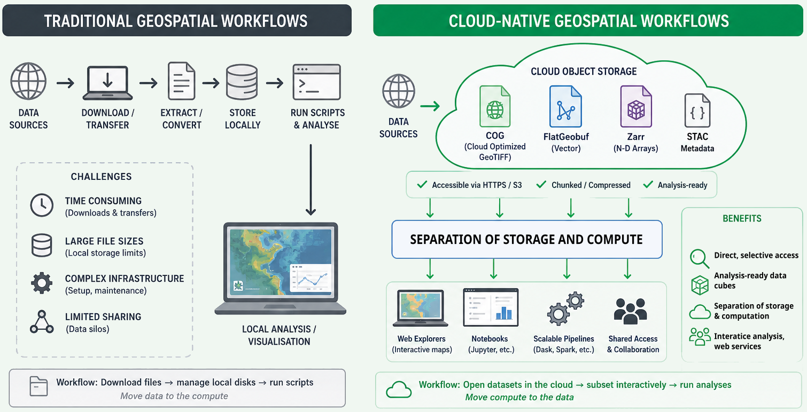
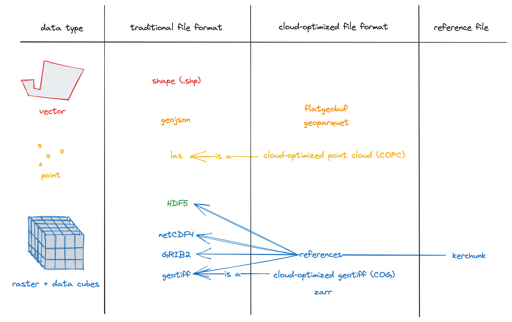

:::::::::::::::::::::::::::::::::::::::::: objectives

- "Explain what is meant by a cloud-native data format."
- "Describe why traditional file-based formats can be inefficient in cloud environments."
- "Identify cloud-native and cloud-optimized approaches used for environmental data, including Zarr, Kerchunk, VirtualiZarr, GeoParquet, and FlatGeobuf."
- "Recognise why cloud-native formats matter for scalable access, sharing, and analysis."

::::::::::::::::::::::::::::::::::::::::::::::::::

::::::::::::::::::::::::::::::::::::::::::: questions

- "What makes a format cloud-native?"
- "Why are traditional file-based formats not always a good fit for cloud storage?"
- "Which cloud-native or cloud-optimized approaches are relevant for Earth system data?"
- "How do cloud-native formats change the way we work with environmental data?"

::::::::::::::::::::::::::::::::::::::::::::::::::

## "Hey, let’s not download the whole file every time."[^cheipesh2018]

Environmental data is growing rapidly in size and complexity, and traditional approaches based on downloading files are becoming increasingly impractical for scientific work. Users often cannot reasonably wait to download, store, and process very large files locally, especially when they only need a subset of the data.

Cloud-native and cloud-optimized formats aim to support more direct access to the parts of a dataset we actually need, without requiring complete file downloads first. This matters in oceanography, climate, and meteorology, where datasets are often large, multidimensional, and shared by many users.

### From files to cloud objects

Traditional scientific formats such as NetCDF, GRIB, and HDF5 were designed mainly for file-based storage systems: local disks, shared servers, and HPC filesystems. In that world, the standard workflow is often "download the file, open the file, analyse the file".

Cloud storage works differently. Instead of one large file on a filesystem, data is commonly stored as many independent objects accessed over HTTP or S3-style APIs. In this setting, performance depends not just on how data is encoded, but also on how many requests are needed, where metadata lives, and whether small subsets can be fetched efficiently.

### What makes a format cloud-native?

A useful community description from the Cloud-Native Geospatial Formats Guide[^cngguides] is that cloud-optimized formats follow a common pattern:

- Metadata provides addresses for data blocks.
- Metadata is stored in a consistent format and location.
- All metadata can be loaded with a small number of reads, ideally one.
- Libraries can use that metadata to read only the required subset of the underlying data.

For multidimensional environmental data, this usually means chunked arrays, lightweight metadata access, and layouts that work well with object storage rather than assuming a POSIX filesystem. The goal is not to change the meaning of the data, but to change how efficiently we can discover, access, and process it.

{alt="Difference between traditional files and cloud-native objects, with metadata and chunks."}

:::::::::::::::::::::::::::::::::::::::::: callout

## Cloud-native does not just mean "stored in the cloud"

Putting NetCDF or HDF5 files into a cloud bucket does **not** automatically make them cloud-native. A format or layout becomes cloud-native or cloud-optimized when it supports efficient remote access to metadata and subsets, instead of treating cloud storage as if it were just another disk.

::::::::::::::::::::::::::::::::::::::::::::::::::

## Key formats and approaches in Earth science

There is no single cloud-native solution for all environmental data, and the community guide explicitly notes that there is no one-size-fits-all approach. Instead, several complementary approaches are used.

- [Zarr](https://zarr.dev/): a format for chunked N-dimensional arrays stored as key-value objects, widely used for climate and Earth observation data.
- [Kerchunk](https://fsspec.github.io/kerchunk/): a Python library that builds reference files describing how to read existing NetCDF/HDF5/GRIB data as if it were a Zarr store, without rewriting the original data.
- [VirtualiZarr](https://virtualizarr.readthedocs.io/): a project for creating cloud-optimized virtual Zarr stores from existing scientific data, exposing non-Zarr data through a Zarr-like interface.
- [Cloud-optimized Geotiff (COG)](https://www.cogeo.org/): a format for geospatial raster data that allows efficient access to subsets of large images over HTTP or Object Storage, using internal tiling and metadata.
- [GeoParquet](https://www.geoparquet.org/): a cloud-friendly columnar format for geospatial vector data, built on Apache Parquet.
- [FlatGeobuf](https://flatgeobuf.org/): a binary geospatial vector format designed for efficient streaming and spatially indexed access, including over HTTP range requests.

In practice, these approaches support different needs. Some workflows rewrite data into a new cloud-native layout such as Zarr, while others keep legacy files and expose them through references for cloud-friendly access.

{alt="Cloud-Optimized Geospatial Formats."}

## Why not rely only on traditional formats?

Traditional formats remain essential in Earth system science, and they are not going away. However, large collections of NetCDF, HDF5, or GRIB files can be awkward in cloud environments because metadata may be embedded inside many separate files, file access patterns may generate many remote reads, and workflows often still assume that files are downloaded or mounted before analysis.

Cloud-native approaches try to reduce those problems by making metadata easier to access, enabling more selective reads, and supporting shared access from central object storage. This is especially useful when many users want small subsets of very large archives, such as time series at one point, one variable over a region, or a slice from a global model output.

## How this changes workflows

With cloud-native approaches, the workflow can shift from "download first, analyse later" to "open remotely, inspect metadata, and read only the needed chunks". This can reduce waiting time, duplicate local copies, and the amount of data transferred over the network.

It also supports more scalable shared analysis: the data can stay in central storage while many users, notebooks, or processing jobs access different parts of it at the same time. For this course, the most important next step is Zarr, because it gives a concrete example of how chunked, multidimensional environmental data can be organised for this style of access.

## How cloud-native formats change data interaction

Cloud-native formats change how scientists and tools interact with environmental data:

- Direct, selective access from the cloud: users can open datasets directly over HTTPS or S3 without prior download, reading only the chunks needed for a computation or visualisation.
- Analysis-ready data cubes: archives can be restructured into large, coherent data cubes (e.g. global climate fields in Zarr with CF conventions) that are easier to query and subset across space, time, and variables.
- Separation of storage and computation: compute runs in scalable cloud environments (e.g. Kubernetes clusters, serverless platforms) while data stays in object storage, reducing data movement and enabling shared access.

In oceanography and meteorology, this means workflows can shift from "download files, manage local disks, run scripts" to "open datasets in the cloud, subset interactively, and run analyses without moving entire archives".
It also enables new services: web-based explorers, interactive notebooks, and scalable processing pipelines that operate directly on cloud-native stores, as demonstrated in several tutorials that use ERA5 data in Zarr together with STAC metadata.

::::::::::::::::::::::::::::::::::::::: challenge

## Exercise 1 - Spot the cloud-native opportunity

Think about a dataset you use in your own work, such as a reanalysis product, climate model output, or an ocean observing dataset.

Discuss:

1. How do you currently access it: download files, mount shared storage, query a service, or something else?
2. When you analyse it, do you usually need the whole dataset or only a subset?
3. What problems would be easier to solve if you could inspect metadata quickly and read only the parts you need?

Write down one example operation, such as:
- extracting a time series at one point,
- selecting one variable for one month,
- computing a statistic over one region.

Then describe how that task might change if the dataset were available in a cloud-native form.

::::::::::::::: solution

There is no single correct answer, but many datasets are still accessed by downloading files or reading them from shared storage, even when only a small part of the data is needed.

For example, if you only want to extract sea surface temperature for one location over one month, you may still need to open a very large file. With a cloud-native dataset, you could first inspect the metadata, then read only the variable, time period, and region you need. This reduces data transfer, speeds up analysis, and allows multiple users to work from the same shared dataset without creating many local copies.

:::::::::::::::::::::::::

::::::::::::::::::::::::::::::::::::::::::::::::::

::::::::::::::::::::::::::::::::::::::: challenge

## Exercise 2 - Thinking in chunks

One of the main ideas behind Zarr is that data is divided into many smaller chunks. Instead of reading an entire dataset, software can load only the chunks needed for a particular operation.

Now, imagine a global sea surface temperature dataset stored as a Zarr archive.

For each task below, discuss which part of the dataset you would expect to read:

1. Plot sea surface temperature for one day over the whole world.
2. Extract a 10-year time series at one location.
3. Compute the average temperature over the North Atlantic for one month.

Questions:

- Would you expect to read the whole dataset or only part of it?
- Why is it useful for the data to be stored in chunks instead of one large file?
- How might the choice of chunk layout affect the speed of these different tasks?

::::::::::::::: solution

For example:

- A global map for one day mainly needs chunks covering that single time step.
- A time series at one location mainly needs chunks containing that location through time.
- A regional average only needs chunks covering the selected region and time period.

Different analyses benefit from different chunk layouts, so choosing an appropriate chunking strategy is an important part of working with Zarr datasets.

:::::::::::::::::::::::::

::::::::::::::::::::::::::::::::::::::::::::::::::

:::::::::::::::::::::::::::::::::::::::::: keypoints

- "Cloud-native formats are designed for efficient access over object storage and web protocols, not just for local filesystems."
- "A cloud-native layout usually combines lightweight metadata with addressable chunks so that tools can read only the data they need."
- "Simply storing NetCDF or HDF5 files in the cloud does not automatically make them cloud-native."
- "In Earth system science, common approaches include Zarr, cloud-optimized NetCDF/HDF5 layouts, Kerchunk, VirtualiZarr, GeoParquet, and FlatGeobuf."
- "Cloud-native approaches can reduce data movement, improve sharing, and support scalable analysis of large environmental datasets."

::::::::::::::::::::::::::::::::::::::::::

[^cheipesh2018]: Cheipesh, E. 2018. Available at: https://pt.slideshare.net/slideshow/cloud-optimized-geottiffs-enabling-efficient-cloud-workflows/97510557
[^cngguides]: Cloud-Native Geospatial Formats Guide. Available at: https://guide.cloudnativegeo.org/
