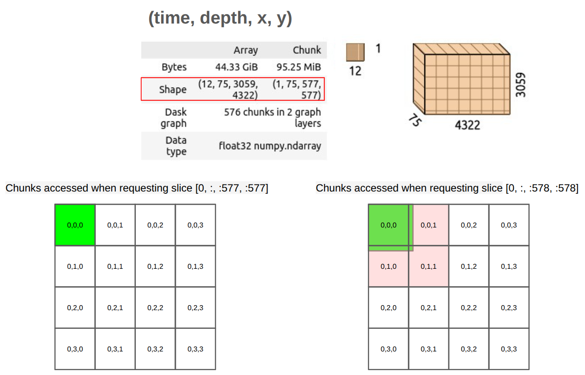

:::::::::::::::::::::::::::::::::::::::::: objectives

- "Explain Zarr's core data model: groups, arrays, stores, and chunks."
- "Describe how Zarr metadata works and how conventions build on it."
- "Understand Zarr's chunked storage and why it matters for oceanography, climate, and meteorology."
- "Practice opening a Zarr store with Python and xarray to see the structure in practice."

::::::::::::::::::::::::::::::::::::::::::::::::::

::::::::::::::::::::::::::::::::::::::::::: questions

- "What is Zarr, and how does its data model differ from formats like NetCDF or HDF5?"
- "How does Zarr store metadata about arrays and groups?"
- "What is chunked storage in Zarr, and why is it useful for large multidimensional datasets?"
- "How is Zarr changing the way ocean, climate, and meteorological data are stored and accessed?"

::::::::::::::::::::::::::::::::::::::::::::::::::


## Zarr in context

Zarr is an open-source format and data model for storing chunked, N-dimensional arrays in a way that works naturally with cloud object storage and file systems. It was originally developed in the scientific Python community, and has since grown into a multi-language ecosystem with implementations in [Python](https://zarr.readthedocs.io/en/stable/), [Rust](https://zarrs.dev/), [Julia](https://github.com/JuliaIO/Zarr.jl), [Matlab](https://github.com/mathworks/MATLAB-support-for-Zarr-files), [R (programing language)](https://cran.r-project.org/web/packages/zarr/index.html), [JavaScript](https://zarrita.dev/)  and others. In the Zarr website and documentation, you can find a list of [implementations](https://zarr.dev/).

For Earth and climate data, Zarr is being adopted by major providers (e.g. ESA's Sentinel products and National Weather Service-USA) and projects such as Earth Data Hub, Pangeo, and DestinE, precisely because it scales to petabyte-sized datasets while remaining accessible from tools like xarray.

## Zarr as a data model

At a high level, Zarr is a way to represent large N-dimensional arrays as smaller pieces that can be stored and accessed efficiently.

A Zarr dataset is usually organised into three main ideas:

- **Arrays**: N-dimensional arrays of a single data type, split into chunks.
- **Groups**: hierarchical containers that can hold arrays and child groups, similar to folders or HDF5 groups.
- **Stores**: the underlying storage system that holds the data and metadata, such as a local directory, an S3 bucket, or another key-value backend.

A typical climate or ocean dataset might use one group containing arrays such as `temperature`, `salinity`, `u_wind`, and `v_wind`, each organised by dimensions such as `time`, `lat`, `lon`, and `level`. Instead of one monolithic file, each array is split into chunks, and each chunk can be stored and read separately.

](episodes/fig/zarr_organisation.png){alt="Zarr organisation, showing groups and arrays with chunked storage."}

### Zarr v2

Zarr version 2 is the older, widely used storage specification. In Zarr v2, the dataset is organised as a directory-like structure with a few small metadata files plus folders for groups, arrays, and chunks.

At the top level, you usually see:

- `.zgroup` for group metadata.
- `.zattrs` for user-defined attributes.
- `.zmetadata` for consolidated metadata, when enabled.

Inside the group, each array usually appears as its own directory, and that array directory contains:

- `.zarray` for array metadata.
- `.zattrs` for array-specific attributes.
- Chunk files, named by their chunk coordinates, such as `0.0.0`, `0.0.1`, `1.0.0`, and so on.

A simple Zarr v2 layout might look like this (please run the following commands in a terminal to see the structure of the Zarr store):

```bash
# Set the base path to your data directory. If you have the data in your current working directory, you can set it to an empty string.
export BASE_DATA_PATH="/gws/ssde/j25b/atlantis_vis/cloud-native-geoscience-course/" # or "" if you have the data in your current working directory

# This command shows the directory structure of a Zarr v2 store for an ocean temperature dataset that we have in the example data folder. You can run this command in a terminal to see the structure of the Zarr store.
tree -L 2 "${BASE_DATA_PATH}data/era5_sst/ocean_temperature_v2.zarr"
```

```output
ocean_temperature_v2.zarr/
├── .zattrs
├── .zgroup
├── .zmetadata
├── sst/
│   ├── .zarray
│   ├── .zattrs
│   ├── 0.0.0
│   ├── 0.0.1
│   ├── 0.1.0
│   └── ...
├── valid_time/
│   └── 0
├── longitude/
│   └── 0
└── latitude/
    └── 0
```

In this example, `sst` is one data variable, while `valid_time`, `longitude`, and `latitude` are coordinate arrays. Each array has its own `.zarray` file describing the array shape, data type, chunk layout, fill value, and other storage settings.

To see the `.zgroup`, `.zattrs`, and `.zmetadata` of this zarr dataset, you can run the following command in a terminal:

```bash
# run the following commands in a terminal

cat "${BASE_DATA_PATH}data/era5_sst/ocean_temperature_v2.zarr/.zgroup"
cat "${BASE_DATA_PATH}data/era5_sst/ocean_temperature_v2.zarr/.zattrs"
cat "${BASE_DATA_PATH}data/era5_sst/ocean_temperature_v2.zarr/.zmetadata"
```

To see the `.zarray` metadata for the `sst` array, you can run:

```bash
cat "${BASE_DATA_PATH}data/era5_sst/ocean_temperature_v2.zarr/sst/.zarray"
```

This tells us that the `sst` array is three-dimensional, stored in chunks of size `10 × 100 × 100`, and encoded as 32-bit floating-point values. The actual chunk data is stored separately in files such as `0.0.0`, `0.0.1`, `0.1.0`, and so on.

A key feature of Zarr v2 is that the metadata is small, human-readable, and easy to inspect without opening the full dataset. That makes it convenient for browsing dataset structure and understanding how the data are organised before any analysis begins.

](episodes/fig/zarrv2.png){alt="Zarr V2 metadata structure, showing .zgroup, .zarray, and .zattrs files."}

### Zarr v3

Zarr version 3 is the newer core specification. It keeps the same basic idea of chunked arrays and groups, but it updates the metadata structure and some of the terminology to better support modern scientific and cloud-native use cases.

At a high level, a Zarr v3 store still contains groups, arrays, and chunks, but the metadata is more explicit and consolidated. Instead of several small hidden JSON files spread through a directory tree, Zarr v3 uses `zarr.json` files to describe groups and arrays. In the metadata itself, the terminology has changed slightly to make it clearer and more flexible. Some important changes from v2 to v3 are:

- `dtype` becomes `data_type`.
- `chunks` becomes `chunk_grid`.
- `dimension_separator` becomes `chunk_key_encoding`.
- `order` is replaced by the transpose codec.
- `filters` and `compressor` are replaced by a more general `codecs` field.

A simplified Zarr v3 structure might look like this:


```bash
tree -L 2 "${BASE_DATA_PATH}data/era5_sst/ocean_temperature.zarr"
```

```output
ocean_temperature.zarr/
├── zarr.json
├── sst/
│   ├── zarr.json
│   └── c
│       ├── 0/0/1
│       ├── 0/1/0
│       └── ...
├── valid_time/
│   ├── zarr.json
│   └── c
│       └── 0
├── longitude/
│   ├── zarr.json
│   └── c
│       └── 0
└── latitude/
│   ├── zarr.json
│   └── c
│       └── 0
```

In this example, the root `zarr.json` describes the top-level group, and each array has its own `zarr.json` file describing its shape, chunk grid, data type, codecs, and other metadata. The chunk data are stored separately under chunk key paths such as `c/0/0/0`.

](episodes/fig/zarrv3.png){alt="Zarr V3 metadata structure, showing zarr.json files"}

An example of a Zarr v3 metadata file for an array might look like this:

```json
{
  "zarr_format": 3,
  "data_type": "<f4",
  "shape": [3650, 1800, 3600],
  "chunk_grid": [10, 100, 100],
  "codecs": [
    {
      "id": "zlib",
      "level": 1
    }
  ],
  "fill_value": null,
  "dimension_separator": "/"
}
```

To see the `zarr.json` metadata for the root group and for the `sst` array, you can run:

```bash
cat "${BASE_DATA_PATH}data/era5_sst/ocean_temperature.zarr/zarr.json"
cat "${BASE_DATA_PATH}data/era5_sst/ocean_temperature.zarr/sst/zarr.json"
```

Zarr v3 also adds more explicit support for features such as sharding, where several chunks can be grouped together inside a larger storage object. This helps reduce the overhead of managing very large numbers of tiny files or keys, especially in cloud object storage. We will talk more about sharding in later lessons.

## Chunked storage: how Zarr stores large arrays

Chunking is central to Zarr's design. Instead of storing one very large array as a single block, Zarr splits it into many smaller pieces called **chunks**. Each chunk is a small N-dimensional block of the array, for example a subset in `time × lat × lon`, and each chunk can be stored and read separately.

You can think of this like cutting a very large map into tiles. If you only want to look at one region, you do not need to unroll the whole map. You only fetch the tiles you need. Zarr does the same thing for multidimensional data.

For environmental data, chunking is useful because:

- Selective reads: a time series at one point, one region, or one variable can often be read without scanning the whole dataset.
- Parallelism: different chunks can be processed at the same time by different workers.
- Compression: each chunk can be compressed separately, which can reduce storage costs and data transfer.

This is one reason Zarr fits cloud workflows well: object storage and HTTP-based access work naturally when data is organised into many addressable pieces rather than one large monolithic file.

### A simple way to think about chunks

Imagine an ocean temperature dataset with dimensions:

- `time = 120`
- `lat = 721`
- `lon = 1440`

If this were stored as one giant array, even small operations could require reading a very large amount of data. With chunking, the dataset can instead be divided into smaller blocks, such as:

- one chunk per group of timesteps,
- one chunk per spatial tile,
- or a combination of both.

When a user asks for "the temperature time series at this point" or "this region for this month", the software can request only the chunks that overlap that query, rather than the whole array.

{alt="Effect of chunking on data access."}

:::::::::::::::::::::::::::::::::::::::::: caution

## Chunking also has trade-offs

Chunking is powerful, but it is not free. If chunks are too large, each read may bring in much more data than needed. If chunks are too small, the dataset may contain a huge number of tiny objects, and managing all those requests can become inefficient, especially in cloud object storage.

So there is always a balance:

- larger chunks can reduce metadata and request overhead,
- smaller chunks can improve fine-grained access,
- the best chunk shape depends on the kinds of analysis people usually perform.

This trade-off is one reason newer Zarr work has added **sharding**.

::::::::::::::::::::::::::::::::::::::::::::::::::

## Why Zarr matters for oceanography, climate, and meteorology

For these disciplines, Zarr brings several important shifts:

- **From files to data cubes**: archives can be published as coherent Zarr "stores" representing large data cubes (e.g. global ERA5 climate fields or Sentinel EO products) rather than thousands of individual NetCDF/GRIB files.
- **Direct cloud access**: scientists can open datasets directly from S3/HTTPS in notebooks or applications, reading only needed chunks instead of downloading entire files.
- **Interoperability and tooling**: Zarr integrates well with xarray, dask, Icechunk, and visualization tools such as [browzarr](https://browzarr.io/latest/) and [zarr-cesium](https://noc-oi.github.io/zarr-cesium/docs/), enabling rich, interactive workflows.
- **Community-driven standards**: Zarr is being adopted by major providers and projects, and conventions are emerging to ensure interoperability and best practices.

In short, Zarr doesn't replace scientific semantics like CF or the Common Data Model. It gives us a new storage and access layer that works natively with cloud infrastructure and modern analysis tools.

## Inspect a Zarr store with Python

To inspect a Zarr store, we can use the `zarr` library in Python. For example, in the example datasets, we have a Zarr store called `data/era5_sst/ocean_temperature_with_groups.zarr`. This zarr store represents a subset of the ERA5 reanalysis dataset, with sea surface temperature data organised into pyramid groups and arrays. We will talk later about pyramids and how they are used for multiscale visualisation, but for now we will focus on the Zarr structure itself.

To open this Zarr store, we can run:

```python
import zarr

base_path = "/gws/ssde/j25b/atlantis_vis/cloud-native-geoscience-course/"  # or "" if you have the data in your current working directory

store = zarr.open_group(f"{base_path}data/era5_sst/ocean_temperature_with_groups.zarr", mode="r")
print(store)
```

To see the arrays and groups inside the store, we can list them:

```python
print(list(store.arrays()))  # List arrays
print(list(store.groups()))  # List groups
```

Because this Zarr store uses groups, the arrays are not directly in the root group. Instead, they are inside child groups. To see the arrays inside a specific group, we can access that group and list its arrays:

```python
# Show arrays inside group "1"
print(list(store["1"].arrays()))
```

To see the information about the array `sst`, we can access it and print its shape, chunk shape, and data type:

```python
# Inspect a specific array
sst = store["1"]["sst"]
print(sst)
print(sst.shape, sst.chunks, sst.dtype)

# Access attributes
print(dict(sst.attrs))
```

::::::::::::::::::::::::::::::::::::::: challenge

## Exercise 1 - Inspecting a Zarr store with Python

Using the Zarr store called `data/era5_sst/ocean_temperature_with_groups.zarr`, please complete the following tasks:

1. Use the Python `zarr` library to open the store.
2. Inspect the group hierarchy and list available arrays, groups, and their attributes.
3. Identify the dimensions, shape, and data type of the `sst` array.
4. Explore the metadata files (`.zarray`, `.zgroup`, `.zattrs` or `zarr.json`) for one array.

Questions:

- How is the store organised (root group, subgroups, arrays)?
- Which variables are stored inside each group?
- What are the shape and data type of the sst array?
- Which attributes are attached to the root group and the sst array?
- Are you loading the dataset into memory, or only inspecting its structure?

::::::::::::::: solution

Code to inspect the Zarr store:

```python
import zarr

base_path = "/gws/ssde/j25b/atlantis_vis/cloud-native-geoscience-course/"  # or "" if you have the data in your current working directory

store = zarr.open_group(f"{base_path}data/era5_sst/ocean_temperature_with_groups.zarr", mode="r")

print(store)
print(list(store.groups()))
print(list(store["1"].arrays()))

sst = store["1"]["sst"]
print(sst.shape)
print(sst.dtype)

print(dict(store.attrs))
print(dict(sst.attrs))
```

Code to list the files and to see the content of the metadata files (as this is a Zarr v3 store, the metadata files are `zarr.json`):

```bash
# These commands are meant to be run in a terminal, not in Python.
export BASE_DATA_PATH="/gws/ssde/j25b/atlantis_vis/cloud-native-geoscience-course/"  # or "" if you have the data in your current working directory

tree -L 2 "${BASE_DATA_PATH}data/era5_sst/ocean_temperature_with_groups.zarr"
cat "${BASE_DATA_PATH}data/era5_sst/ocean_temperature_with_groups.zarr/zarr.json"
cat "${BASE_DATA_PATH}data/era5_sst/ocean_temperature_with_groups.zarr/1/sst/zarr.json"
```

The Zarr store is organised as a hierarchical container. In this example, the root group does not contain any arrays directly:

```bash
ocean_temperature_with_groups.zarr
├── 0/
    ├── sst
    ├── valid_time
    ├── latitude
    ├── longitude
    ├── spatial_ref
    ├── number
    └── zarr.json
├── 1/
    └── ...
└── zarr.json
```

The root `Group` contains two child groups (`0` and `1`). The `sst` variable is stored inside each group `1`. The `sst` array has:

- Shape: `(10, 360, 720)`
  - 10 time steps
  - 360 latitude points
  - 720 longitude points

- Data type: `float32`

The array attributes contain metadata inherited from the original GRIB dataset and CF-style information, including  `long_name` -> `"Sea surface temperature"`, for example.

We are not loading the entire dataset into memory. We are only inspecting the structure and metadata. The actual data is read from disk or object storage only when we explicitly request it (e.g., by slicing the array). This lazy loading is a key feature of Zarr and xarray, allowing efficient handling of large datasets.

:::::::::::::::::::::::::

::::::::::::::::::::::::::::::::::::::::::::::::::

::::::::::::::::::::::::::::::::::::::: challenge

## Exercise 2 - Thinking about chunked storage

Using the same Zarr dataset:

1. Inspect the chunk shape of the `sst` array.
2. Explain what one chunk represents in terms of time and space.
3. Consider how this chunking would affect:
   - reading a time series at one location;
   - computing a spatial mean for each time step.
4. If you were storing a high-resolution global reanalysis, what workloads would you optimise for when choosing chunk shapes?

::::::::::::::: solution

To explore the chunk shape of the `sst` array, you can run:

```python
print(sst.chunks)
```

A chunk shape such as `(10, 100, 100)` represents 10 time steps over a 100×100 spatial block.
Chunk shapes that are "tall in time" can be efficient for time series at specific locations, while chunk shapes that cover larger spatial regions may be better for spatial aggregates. In practice, chunk shapes are a compromise based on dominant workloads.
This exercise prepares you to think critically about chunking decisions, sharding (you will see later what this means), and performance optimisation covered in later lessons (e.g. on cloud-native formats, Zarr V3 features, and tools like Icechunk and Virtualizarr).

:::::::::::::::::::::::::

::::::::::::::::::::::::::::::::::::::::::::::::::

:::::::::::::::::::::::::::::::::::::::::: keypoints

- "Zarr organises data into groups and arrays stored as addressable chunks, which supports efficient partial reads and writes."
- "Metadata in Zarr describes array structure, chunking, and attributes, and can be extended through shared conventions for geoscience workflows."
- "Chunked storage is central to Zarr performance because it lets tools read only the pieces needed for a given query or computation."
- "Inspecting a Zarr store with Python and xarray helps distinguish cheap metadata exploration from actual data loading."
- "Understanding data model, metadata, and chunk layout is the foundation for later lessons on rechunking, parallel processing, and cloud-native analysis."

::::::::::::::::::::::::::::::::::::::::::::::::::
