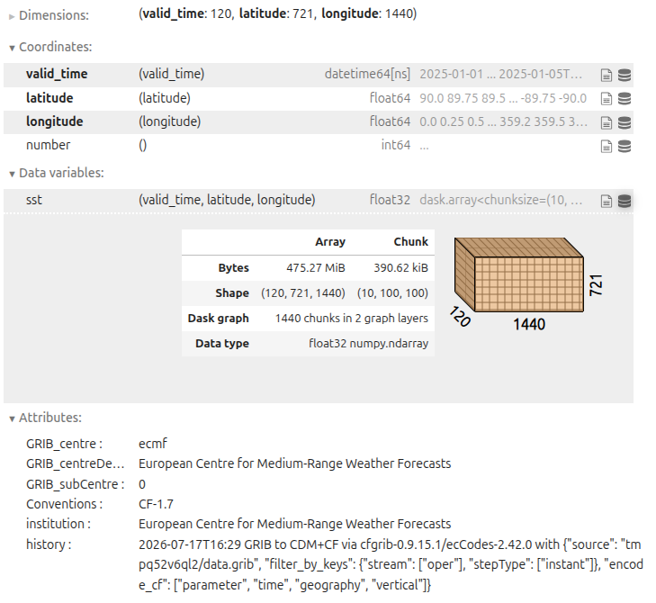

:::::::::::::::::::::::::::::::::::::::::: objectives

- "Import the core Python libraries for working with Zarr data."
- "Inspect a Zarr store directly with the `zarr` library."
- "Open a Zarr dataset with xarray and explore variables, dimensions, and coordinates."
- "Understand lazy loading and why it matters for large datasets."
- "Use a few basic xarray operations on environmental Zarr data."

::::::::::::::::::::::::::::::::::::::::::::::::::

::::::::::::::::::::::::::::::::::::::::::: questions

- "What Python packages are commonly used to work with Zarr data?"
- "How can I inspect a Zarr store directly with the `zarr` library?"
- "How does xarray represent Zarr datasets as labelled N-dimensional data?"
- "When does the data actually get loaded into memory?"
- "What basic xarray operations are useful for oceanography, climate, and meteorology?"

::::::::::::::::::::::::::::::::::::::::::::::::::

## Python ecosystem for Zarr

Zarr has a rich ecosystem of Python tools:

- [**zarr**](https://zarr.readthedocs.io/en/stable/) - the core Python implementation of Zarr's chunked N‑dimensional arrays and groups.
- [**xarray**](https://xarray.dev/en/stable/) - a labelled N‑dimensional array library that can open Zarr datasets and present them as `Dataset` objects with named dimensions and coordinates.
- [**fsspec**](https://filesystem-spec.readthedocs.io/en/latest/) / [**s3fs**](https://s3fs.readthedocs.io/en/latest/) / [**gcsfs**](https://gcsfs.readthedocs.io/en/latest/) / [**obstore**](https://developmentseed.org/obstore/latest/) - filesystem adapters to access Zarr stores on local disk, S3, Google Cloud Storage, and other backends.
- **Supporting tools** - [**Virtualizarr**](https://virtualizarr.readthedocs.io/en/latest/), [**Icechunk**](https://icechunk.readthedocs.io/en/latest/), and others build on Zarr and xarray for specialised workflows (rechunking, transactional storage, cloud‑ready archives).

In this lesson we focus on the essentials: how to use `zarr` directly for low-level inspection and how to use xarray for most day‑to‑day analysis with environmental data in Zarr format.

## Opening with `zarr` library

As you saw in the previous lesson, Zarr stores are organised into groups and arrays. The `zarr` library provides low-level access to these stores, allowing you to open groups and arrays, inspect their shapes, chunk shapes, data types, read and write data, and view or edit attributes (metadata).

On the data directory, we have a Zarr store called `data/ocean_temperature.zarr`. This store contains a single group with one array, representing sea surface temperature data from the ERA5 reanalysis dataset. The array is chunked in time and space, and has metadata attributes such as units and long names.

We can open the Zarr store `data/ocean_temperature.zarr` using the `zarr` library:

```python
import zarr

root = zarr.open_group("data/ocean_temperature.zarr", mode="r")
print(root)
print(list(root.arrays()))
print(list(root.groups()))
print("Group attributes:", root.attrs)
```

You can then inspect one array directly:

```python
temp = root["temperature"]
print(temp)
print("Shape:", temp.shape)
print("Chunks:", temp.chunks)
print("Data type:", temp.dtype)
print("Array attributes:", temp.attrs)
```

A Zarr array tells you how the data are organised on disk or in object storage. Its `shape` tells you the full size of the array, `chunks` tells you how it is split up, and `attrs` can store useful metadata such as units or variable names.

::::::::::::::::::::::::::::::::::::::: challenge

## Exercise 1 - Explore the store

Using the example Zarr store (`data/ocean_temperature.zarr`):

1. List all arrays in the root group.
2. Choose one data variable and print its `shape`, `chunks`, and `dtype`.
3. Inspect the array attributes and identify at least three useful metadata fields.

Questions:

- What dimensions do you think the `shape` represents?
- How does `chunks` divide the data?
- Which attributes look useful for analysis?

::::::::::::::: solution

Each array has a fixed shape and chunk layout, and that metadata provides context such as units, long names, and standard names:

```python
import zarr

root = zarr.open_group("data/ocean_temperature.zarr", mode="r")
print(list(root.arrays()))
sst = root["sst"]
print(sst)
print("Shape:", sst.shape)
print("Chunks:", sst.chunks)
print("Data type:", sst.dtype)
print("Array attributes:", sst.attrs)
```

:::::::::::::::

::::::::::::::::::::::::::::::::::::::::::::::::::

:::::::::::::::::::::::::::::::::::::::::: callout

## Lazy loading and memory

Opening a Zarr store usually reads metadata first, not the full data values. This is often called **lazy loading**: the dataset structure is available immediately, but the chunk data are only read when you ask for values.

With `zarr`, properties such as `shape`, `chunks`, `dtype`, and `.attrs` come from metadata. The actual data are read when you index or slice the array.

```python
first_slice = temp[0, :, :]
```

At that point, Zarr reads only the chunks needed for that selection. It does not need to load the full array unless you request the full array.

The same idea applies with xarray: opening the dataset is cheap, and data are loaded only when you select, compute, plot, or ask for values.

::::::::::::::::::::::::::::::::::::::::::::::::::


## Opening with xarray

While `zarr` is ideal for low-level inspection and manipulation, xarray is usually the main tool for analysing multidimensional environmental data. It provides:

- **Datasets** - collections of data variables (arrays) with shared dimensions and coordinates.
- **Labelled dimensions** - names like `time`, `lat`, `lon`, `depth` instead of numeric indices.
- **Coordinates** - explicit arrays for latitude, longitude, time, etc.
- **High-level operations** - selection (`.sel`), reduction (`.mean`, `.sum`), resampling, plotting, etc.

{alt="Xarray logo."}

xarray can open NetCDF, GRIB (via backends), and Zarr data. Because of this, it makes Zarr datasets accessible in a familiar, analysis-ready format. And it also makes it really easy to update workflows to use cloud-native Zarr stores without changing the analysis code.

For Zarr it uses `xr.open_zarr`, which understands the Zarr metadata and conventions. Basic usage:

```python
import xarray as xr

ds = xr.open_zarr("data/ocean_temperature.zarr")
print(ds)           # Overview of variables and coordinates
print(ds.dims)      # Dimensions
print(ds.data_vars) # Data variables
print(ds.coords)    # Coordinate variables
```

Important points:

- `ds` is an xarray `Dataset`.
- `ds.data_vars` lists data variables (e.g. `temperature`, `salinity`).
- `ds.coords` typically includes `time`, `lat`, `lon`, and any other coordinate variables.
- Metadata from Zarr arrays and attributes is mapped into xarray's structure so that CF conventions and other patterns can be used.

The result is an xarray `Dataset`. Each variable is an xarray `DataArray`, and the metadata from the Zarr store is carried into the xarray structure.

```python
sst = ds["sst"]
print(sst)
print("SST dims:", sst.dims)
print("SST attrs:", sst.attrs)
```

{alt="Zarr dataset opened in Xarray."}

::::::::::::::::::::::::::::::::::::::: challenge

## Exercise 2 - Open with xarray

Using the same dataset:

1. Open it with `xr.open_zarr`.
2. Print `ds.dims`, `ds.data_vars`, and `ds.coords`.
3. Inspect one variable and print its dimensions and attributes.
4. Note whether the dataset opens quickly even if it is large.

Questions:

- Which variables are data variables versus coordinates?
- Which dimensions are present?
- What does xarray tell you about the dataset without loading all the values?

::::::::::::::: solution

```python
import xarray as xr
ds = xr.open_zarr("data/ocean_temperature.zarr")
print(ds.dims)
print(ds.data_vars)
print(ds.coords)
```

Xarray organises the dataset into named dimensions and separates data variables from coordinate variables, which makes the structure easier to understand. Opening the dataset is fast because xarray reads metadata first and loads data only when needed.

:::::::::::::::

::::::::::::::::::::::::::::::::::::::::::::::::::

:::::::::::::::::::::::::::::::::::::::::: callout

## NetCDF vs Zarr with xarray

If we open the same dataset in NetCDF format, we can use `xr.open_dataset`:

```python
ds_netcdf = xr.open_dataset("data/ocean_temperature.nc")
print(ds_netcdf)
```

You will see that the structure is very similar to the Zarr version. The main difference is that NetCDF is a single file, while Zarr is a directory of chunked arrays. But xarray provides a consistent interface for both formats, so analysis code can be reused.

::::::::::::::::::::::::::::::::::::::::::::::::::

### Basic xarray operations

In oceanography, climate, and meteorology, we often want to select data by coordinates, compute means over dimensions, and plot results. Xarray provides a simple interface for these operations:

- Select data with `.sel()` using coordinate values.
- Use `.isel()` when you want numeric positions.
- Compute a mean over one or more dimensions (e.g. `.mean(dim=("latitude", "longitude"))`).
- Plot a slice quickly with `.plot()`.

```python
time_slice = ds["sst"].sel(valid_time=slice("2025-01-01T00:00:00", "2025-01-02T00:00:00"))
global_mean = ds["sst"].mean(dim=("latitude", "longitude"))
point_ts = ds["sst"].sel(latitude=0.0, longitude=0.0, method="nearest")
isel_slice = ds["sst"].isel(valid_time=0, latitude=100, longitude=200)
```

In the operations above, the data is not loaded into memory until you request values or plot the results. For example, the following code will trigger data loading and plotting:

```python
# map plot
time_slice.sel(valid_time="2025-01-01T00:00:00").plot()
```

```python
# time series plot
point_ts.plot()
```

```python
# just to see a point value
print(isel_slice.values)
```

These operations are especially useful for environmental data, because they keep the code readable and let you work with named coordinates rather than raw array positions.

### What comes into memory?

A useful rule of thumb is:

- **Opening** a Zarr store loads metadata.
- **Inspecting** `shape`, `chunks`, `dims`, and attributes mostly uses metadata.
- **Selecting**, **computing**, **plotting**, or calling `.values` reads data chunks into memory.

For example, this mainly inspects metadata:

```python
print(ds["sst"])
print(ds["sst"].dims)
print(ds["sst"].attrs)
```

But this requests actual data values:

```python
ds["sst"].isel(time=0).values
```

This distinction is one of the main reasons Zarr works well for large environmental datasets: you can explore the dataset structure first, and only load the parts you need for analysis.

::::::::::::::::::::::::::::::::::::::: challenge

## Exercise 3 - First analysis on a Zarr dataset

Using the `data/ocean_temperature.zarr` dataset and xarray:

1. Inspect the available variables and pick the sea surface temperature.
2. Compute a spatial mean over latitude and longitude and inspect the resulting time series.
3. Select a small spatial region (e.g. a box around a particular ocean basin) and compute a mean for that region.

Questions:

- How does xarray's interface make these operations readable compared to direct array indexing?
- What would change if the dataset were too large to fit in memory (you'll explore this in later lessons with Dask and cloud‑native formats)?
- How comfortable do you feel with xarray's basic usage now?

::::::::::::::: solution

```python
import xarray as xr

ds = xr.open_zarr("data/ocean_temperature.zarr")

sst = ds["sst"]

# Global mean time series
global_ts = sst.mean(dim=("latitude", "longitude"))
print(global_ts)

# Regional mean (example box)
regional_ts = sst.sel(latitude=slice(-30, 30), longitude=slice(-60, 0)).mean(dim=("latitude", "longitude"))
print(regional_ts)

# Additional plotting if desired
regional_ts.plot()
```

Xarray's labelled dimensions and high‑level methods (`.mean`, `.sel`, `.plot`) make common operations much more expressive and less error‑prone than raw array indexing.
Opening Zarr datasets with xarray offers a consistent interface across storage formats, laying the groundwork for later lessons on performance, chunking, and cloud‑native workflows.

:::::::::::::::::::::::::

::::::::::::::::::::::::::::::::::::::::::::::::::

::::::::::::::::::::::::::::::::::::::: challenge

## Exercise 3 - Read only a small part

Use xarray to open the Zarr dataset, then select only a small part of it. Select temperature data for the first hour of 2025, for a small region in the Brazilian Southest Coast (min lat: -30, max lat: -20, min lon: -50, max lon: -40). Compute the mean of that subset.

Questions:

- Did you need to load the full dataset?
- What parts were actually read into memory?
- Why is this useful for large datasets?
- What would be the comparison if you had to load a NetCDF file instead?

::::::::::::::: solution

```python
import xarray as xr

ds = xr.open_zarr("data/ocean_temperature.zarr")
sst = ds["sst"]

subset = sst.sel(time="2025-01-01T00:00:00", latitude=slice(-30, -20), longitude=slice(-50, -40))
print(subset)
print(subset.mean())
```

We can open a huge dataset and still process only a small portion of it. This is one of the main advantages of Zarr and xarray for large environmental data.

:::::::::::::::

::::::::::::::::::::::::::::::::::::::::::::::::::


:::::::::::::::::::::::::::::::::::::::::: keypoints

- "The zarr Python package provides low-level access to Zarr stores, including groups, arrays, and attributes."
- "xarray is the main high-level tool for working with environmental Zarr datasets as labelled N-dimensional data."
- "Opening Zarr with xarray (`xr.open_zarr`) gives you variables, dimensions, and coordinates in a familiar `Dataset` structure."
- "Data values are loaded only when they are selected or used in a computation."
- "Basic xarray operations such as selection, reduction, and plotting work the same on Zarr data as on NetCDF data."

::::::::::::::::::::::::::::::::::::::::::::::::::
