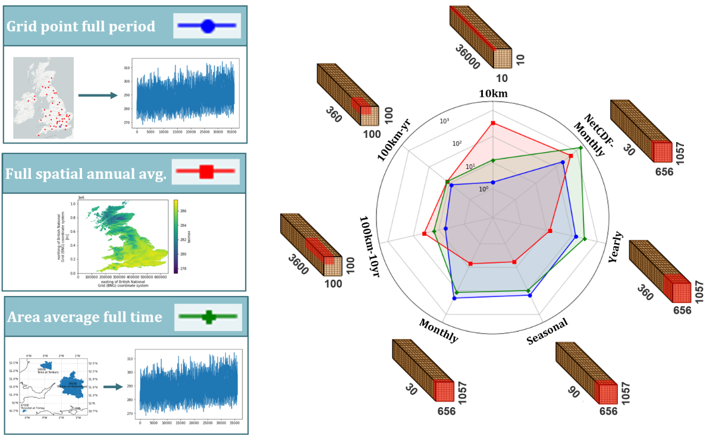
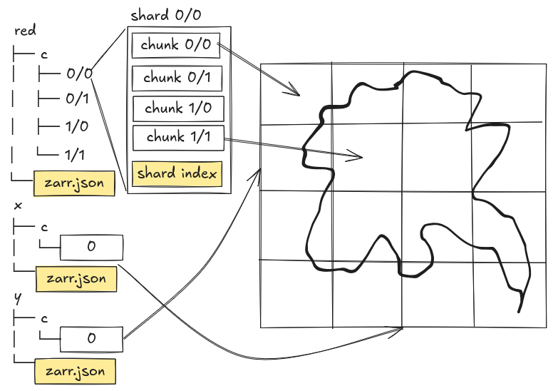

:::::::::::::::::::::::::::::::::::::::::: objectives

- "Understand what chunks are and how they affect performance for large datasets."
- "Relate common analysis workflows (time series, spatial averages, ensembles) to chunk layouts."
- "Use Python (zarr and xarray) to inspect chunk shapes in a Zarr store."
- "Rechunk a Zarr dataset, save it, and observe how analysis performance changes."
- "Understand the concept of sharding and how it can reduce overhead in cloud object storage."

::::::::::::::::::::::::::::::::::::::::::::::::::

::::::::::::::::::::::::::::::::::::::::::: questions

- "What is a chunk, and why does its shape matter for performance?"
- "How should I choose chunk sizes for different types of analysis?"
- "What are the trade-offs between large and small chunks?"
- "How can I rechunk a Zarr dataset and save it for future use?"
- "What is sharding, and how does it help reduce overhead during storage and access of many small chunks?"

::::::::::::::::::::::::::::::::::::::::::::::::::


## What are chunks?

In Zarr (and in many array-based systems), a **chunk** is a small N-dimensional block of an array that is stored and accessed as a unit. Instead of storing one giant array in a single file or object, we:

- Divide the array into chunks (e.g. `(time, lat, lon) = (10, 100, 100)` per chunk).
- Store each chunk separately (e.g. as a separate object in a directory or bucket).
- Read and write data chunk-by-chunk when we need it.

Chunks influence:

- **I/O patterns**: which parts of the dataset are read from storage.
- **Parallelism**: how work can be distributed across many processes or threads.
- **Compression effectiveness**: how well data compresses within each chunk.
- **Metadata overhead**: number of chunks and associated bookkeeping.

Choosing good chunk shapes is critical when you move from "toy" datasets to large-scale reanalysis, ensemble, or high-resolution model data.

### Thinking in dimensions and workloads

To choose chunk shapes, start from your dimensions and typical workloads.

Common dimensions in ocean, climate, and meteorology:

- `time`
- `lat`, `lon` (or `x`, `y`)
- `level` (or `depth`) (pressure or model levels, depth in the ocean)
- `member` (ensemble member)

Common workloads:

- **Time series at a point**: e.g. temperature at one location over many years.
- **Spatial averages per time step**: e.g. global mean temperature as a function of time.
- **Regional subsets**: e.g. data over a specific basin or region.
- **Vertical profiles**: e.g. temperature vs. depth at a given location and time.
- **Ensemble statistics**: e.g. mean and spread across `member`.

Each workload benefits from certain chunk layouts:

- Time series: chunks that include many time steps for a small spatial region.
- Spatial averages per time step: chunks that include complete spatial slices (or large spatial blocks) for a small number of time steps.
- Ensemble statistics: chunks that include multiple ensemble members together, if members are frequently used together.
- Cloud/web visualisation: use smaller, spatially aligned chunks, often around 256×256 or 512×512 pixels (~100-1000 KB size), so that map tiles can be read efficiently and only the needed region is transferred.
- Large HPC analysis: use larger chunks that reduce scheduler overhead and work well with parallel processing, but still fit in memory comfortably (e.g. 10-100 MB size).

There is no single "best" chunking: it depends on which workloads are most important for your users.

{alt="Diagram showing how different chunking strategies affect performance for different workloads."}


## Inspecting chunk shapes in a Zarr store

Let's take a look on one of our example Zarr datasets to see how chunks are laid out. Now we are using a subset of the GLORYS Reanalysis dataset (https://data.marine.copernicus.eu/product/GLOBAL_MULTIYEAR_PHY_001_030/description), stored in a single Zarr group:

```python
import xarray as xr

base_path = "/gws/ssde/j25b/atlantis_vis/cloud-native-geoscience-course/" # or "" if you have the data in your current working directory

ds = xr.open_zarr(f"{base_path}data/glorys/glorys_202605.zarr")
print(ds)
```

Now, let's inspect the `zos` variable (Sea surface height) and see its dimensions, shape, and chunking:

```python

zos = ds["zos"]
print("Dimensions:", zos.dims)
print("Shape:", zos.shape)
print("Chunks:", zos.data.chunks)
```

Seeing `shape` and `dims` helps you reason about how the current chunking might align with your workloads.


::::::::::::::::::::::::::::::::::::::: challenge

## Exercise 1 - Relate current chunking to workloads

Using the GLORYS Reanalysis example Zarr dataset (`data/glorys/glorys_202605.zarr`), answer the following:

1. Inspect the `so` (Salinity) array's `shape` and `chunks` using `xarray`.
2. Map the dimensions to names (e.g. interpret `(time, lat, lon, depth)` from context or attributes and following the CF conventions).
3. For each of these workloads, decide whether the current chunking seems "friendly" or "unfriendly":

   - Time series at a point.
   - Spatial mean per time step.
   - Regional subset (e.g. a North Atlantic box).
   - Vertical profile at a point.

::::::::::::::: solution

```python
# shape
print(ds["so"].shape)

# chunks
print(ds["so"].data.chunks)

# dimensions
print(ds["so"].dims)
```

Following the coordinate names and CF conventions (`standard_name="sea_water_salinity"`), the dimensions represent:

```
so(time, depth, latitude, longitude)
```

where:

- `time` = time steps
- `depth` = vertical ocean levels
- `latitude` = north-south position
- `longitude` = east-west position

The current chunking stores one time step and one depth level with the complete global horizontal grid.

It is friendly for workloads that need the full spatial field at a given time (e.g. computing a global mean), but unfriendly for workloads that need many time steps or many depth levels at a single point, because it requires reading many large chunks to get a small amount of data.

It is not friendly for regional subsets either, because the latitude and longitude dimensions are not chunked, so even a small region requires reading the whole global spatial chunk.

It is also not friendly for time series at a point, because the data is split into separate time chunks, and each chunk contains the full spatial field. To get a time series at a single point, you would need to read many large chunks, which is inefficient.

It is not friendly for vertical profiles at a point either, because we have each depth level in separate chunks, and each chunk contains the full spatial field. To get a vertical profile at a single point, you would need to read many large chunks, which is inefficient.

This example shows that chunking is a trade-off: the current layout is good for global spatial operations but inefficient for point-based time series, regional analysis, or vertical profiles.

:::::::::::::::::::::::::

::::::::::::::::::::::::::::::::::::::::::::::::::

:::::::::::::::::::::::::::::::::::::::::: callout

## Trade-offs: small vs large chunks

Some general guidelines:

- **Chunk size in bytes**: often a target of a few MB per chunk (e.g. 1-100 MB), depending on storage and compute environment.
  - Too small: many tiny reads and lots of metadata overhead.
  - Too large: slow reads and poor parallelism, especially over networks.

- **Chunk shape in dimensions**:
  - Align chunks with common access patterns (e.g. contiguous in time for time series, or contiguous in space for spatial stats).
  - Avoid chunking along rarely used dimensions (e.g. `member` or `level`) unless you often process across them.

::::::::::::::::::::::::::::::::::::::::::::::::::

## Rechunking

Rechunking means changing the way a dataset is divided into chunks. This matters because the best chunk layout depends on how the data will be used: for example, one layout may be better for reading time series, while another may be better for reading maps or writing cloud-optimized storage.

With xarray, rechunking is simple, but it can be expensive for large datasets. The basic steps are:

### Step 1: Open the dataset

Start by opening the original Zarr dataset. For the examples below, we will use the ERA5 reanalysis dataset, because it is smaller and easier to work with than the GLORYS dataset (you can try larger datasets later if you want).

```python
import xarray as xr

ds = xr.open_zarr(f"{base_path}data/era5_sst/ocean_temperature.zarr")
print(ds)
```

You can see that this dataset has dimensions `(valid_time, latitude, longitude)` and is chunked in a certain way. You can inspect the shape and the chunking of the `sst` (sea surface temperature) variable:

```python
print(ds["sst"].shape)
print(ds["sst"].chunks)
```

```output
(120, 721, 1440)
((10, 10, 10, 10, 10, 10, 10, 10, 10, 10, 10, 10), (100, 100, 100, 100, 100, 100, 100, 21), (100, 100, 100, 100, 100, 100, 100, 100, 100, 100, 100, 100, 100, 100, 40))
```

### Step 2: Choose a new chunk layout

Decide how you want the dataset to be chunked. For example, you might want to have chunks that are larger in space but represents only one time step:

```python
ds_chunked = ds.chunk({"valid_time": 20, "latitude": 180, "longitude": 180})
```

### Step 3: Check the new chunking

Inspect the rechunked dataset to confirm that the chunk layout looks right.

```python
print(ds_chunked)
print(ds_chunked["sst"].chunks)
```
### Step 4: Write the rechunked data to a new Zarr store

Save the dataset with the new chunk layout. However, because this dataset also has an encoding for the `sst` variable, you also need to update the encoding to reflect the new chunking.

Note that we are going to save the data in your local data directory (not in the `base_path`):

```python
ds_chunked.to_zarr(
  "data/era5_sst/ocean_temperature_rechunked.zarr",
  mode="w",
  encoding={"sst": {"chunks": (20, 180, 180)}},
)
```

This approach is convenient, but it is not always the most efficient for very large datasets. If the original and target chunk layouts are very different, rechunking can require substantial temporary storage and memory. And we will also create a new Zarr store, which may be expensive in terms of storage.

:::::::::::::::::::::::::::::::::::::::::: callout

## Rechunking with Rechunker or Cubed

[Rechunker](https://rechunker.readthedocs.io/) is a library designed specifically for rechunking large array datasets efficiently. It is useful when you want to move from one chunk layout to another without loading the whole dataset into memory at once. However, `rechunker` does not work with zarr v3 stores.

[Cubed](https://cubed-dev.github.io/cubed/) is a newer library that provides an array API for rechunking and other operations, designed to work with serverless backends or locally without needing a live Dask scheduler.

You can also integrate Cubed with xarray to rechunk datasets in a more memory-efficient way.

```python
ds_chunked = ds.chunk({"valid_time": 1, "latitude": 721, "longitude": 1440}, chunked_array_type="cubed")
```

::::::::::::::::::::::::::::::::::::::::::::::::::

## Rechunk can be expensive

In some cases, rechunking can take a long time, especially if the original and target chunk layouts are very different. For example, a study on Zarr data[^nguyean_etal2023] in cloud-based object stores calculated the time to rechunk a 9–10 GB dataset with different chunking strategies:


| Chunking strategy                                    |                  Rechunk time |
| ---------------------------------------------------- | ----------------------------: |
| Large chunks                                         |                 **~6.66 min** |
| Recommended compromise (best overall access pattern) |                **~22.44 min** |
| Very small chunks                                    | **~46 h** |

::::::::::::::::::::::::::::::::::::::: challenge

## Exercise 2 - Designing a new chunk scheme

Using the same dataset (`ocean_temperature.zarr`), think through the following:

1. Identify your **priority workload** for this dataset (e.g. time series analysis, spatial means, ensemble statistics).
2. Propose a chunk scheme (e.g. `{"valid_time": 20, "latitude": 180, "longitude": 180}`) that you expect to work well for that workload.
3. Consider the likely chunk size in bytes (rough estimation is fine) and whether it seems reasonable (not too small, not too large). To calculate the approximate chunk size, you can use:

```python
import numpy as np

chunk_shape = (20, 180, 180)  # example chunk shape
chunk_size_bytes = np.prod(chunk_shape) * ds["sst"].dtype.itemsize
print(f"Approximate chunk size: {chunk_size_bytes / 1e6:.2f} MB")
```

You do not need to run the code yet, focus on design:

- Write down your proposed chunk sizes per dimension.
- Explain how they help your chosen workload.
- Note any trade-offs you are making for other workloads.

::::::::::::::: solution

You should choose chunk sizes that reflect their dominant workloads and keep chunk sizes in a plausible range.
For example:

- **Time series analysis**: you might choose relatively large time chunks and moderate spatial blocks. E.g. `{"valid_time": 120, "latitude": 10, "longitude": 10}` would give you all time steps per chunk and a 10×10 spatial block.
- **Spatial analysis**: you might choose chunks that cover entire latitude or longitude bands. E.g. `{"valid_time": 1, "latitude": 721, "longitude": 1440}` would give you one time step per chunk and the full spatial grid.

Recognising that one dataset may need different chunking schemes for different scenarios is a key insight.

:::::::::::::::::::::::::

::::::::::::::::::::::::::::::::::::::::::::::::::


::::::::::::::::::::::::::::::::::::::: challenge

## Exercise 3 - Rechunk and compare

Try the following on your example dataset:

1. Implement a rechunking scheme you designed in Exercise 2, saving to a new Zarr store.
2. Measure the time to compute:
   - A global mean time series (`mean(dim=("latitude", "longitude"))`).
   - A regional mean time series (e.g. a subset in `latitude`/`longitude`).
3. Compare the timings between the original and rechunked stores. To calculate the time taken for each operation, you can use the `%%time` magic in a Jupyter notebook, or the `time` module in a script:

```python
import time

t0 = time.time()
# your operation here with the original store
t1 = time.time()
print("Original store time:", t1 - t0, "seconds")

t0 = time.time()
# your operation here with the rechunked store
t1 = time.time()
print("Rechunked store time:", t1 - t0, "seconds")
```

4. Discuss how chunk layout might matter for larger datasets or cloud environments.

::::::::::::::: solution

```python
import time
import xarray as xr

# Open the original and rechunked datasets
ds_original = xr.open_zarr(f"{base_path}data/era5_sst/ocean_temperature.zarr")
ds_rechunked = xr.open_zarr("data/era5_sst/ocean_temperature_rechunked.zarr")

# Measure time for global mean time series
t0 = time.time()
global_mean_original = ds_original["sst"].mean(dim=("latitude", "longitude")).compute()
t1 = time.time()
print("Original store global mean time:", t1 - t0, "seconds")

t0 = time.time()
global_mean_rechunked = ds_rechunked["sst"].mean(dim=("latitude", "longitude")).compute()
t1 = time.time()
print("Rechunked store global mean time:", t1 - t0, "seconds")
```

You may observe modest timing differences. This is because the dataset is small enough that the overhead of reading chunks is not significant. However, for larger datasets or when working in cloud environments, the chunk layout can have a much more pronounced effect on performance and cost.
The key takeaway is that chunking is not just a storage detail: it can have a real impact on compute cost, especially when running at scale on large climate or ocean datasets in the cloud.

:::::::::::::::::::::::::

::::::::::::::::::::::::::::::::::::::::::::::::::

## Sharding: grouping chunks together

Sharding is a way to keep the *logical* benefits of small chunks while reducing the *physical* cost of storing too many tiny objects.

A simple way to explain it is:

- **Chunks** control the unit of computation and data access.
- **Shards** control how many chunks are packed into each stored object.

You can think of chunks as individual pages, and a shard as a binder holding many pages. We still read the page we need, but we do not have to store every page as its own separate file.

This is especially useful in cloud object storage, where millions of very small objects can be inefficient to manage. With sharding, Zarr can keep a fine-grained internal chunk structure for analysis, while storing multiple chunks together in fewer, larger objects.

This means you can keep chunks small for efficient analysis, while using sharding to avoid creating an excessive number of files or objects.

{alt="A sharded Zarr showing how chunk data is grouped into shard files."}

### Benefits

Sharding can be useful when:

- You want small chunks for fast, selective reads.
- You want to reduce object counts in cloud storage.
- You want to reduce filesystem overhead from very large numbers of files.
- You want to keep the benefits of chunk-based analysis without paying the full cost of storing each chunk separately.

### Trade-offs

Sharding is not always the best choice. If your workload frequently reads only a tiny part of one shard, you may transfer more data than necessary. Sharding also makes partial writes more complicated, because updating one chunk may require rewriting part of a shard.

For that reason, shard layout should reflect the way the data will actually be used. For example, if users usually read neighbouring map tiles together, you might group spatial chunks into the same shard. If they usually read time series, you might group chunks along time instead.

### Zarr v3 sharding example

Zarr Python v3 supports sharded arrays directly when you create the array. In the example below, the array has small chunks for analysis, but those chunks are grouped into larger shards for storage.

Let's create a sharded Zarr array with 10×10 chunks, but store them in 100×100 shards:

```python
import numpy as np
import xarray as xr

data = np.random.randint(0, 100, size=(1000, 1000)).astype("int32")
ds = xr.Dataset({"temperature": (("y", "x"), data)})

ds.to_zarr(
    "data/example_sharded.zarr",
    mode="w",
    zarr_format=3,
    encoding={"temperature": {"chunks": (10, 10), "shards": (100, 100)}},
)
```

In this example:

- `chunks=(10, 10)` means the data are split into small 10×10 chunks for fine-grained access.
- `shards=(100, 100)` means many of those chunks are packed into a larger 100×100 shard for storage.

You can open the array again and inspect it in the same way:

```python
ds = xr.open_zarr("data/example_sharded.zarr")
print(ds)
print(ds["temperature"].chunks)
print(ds["temperature"].encoding)
```

You can see that the chunking is still `(10, 10)`, but the underlying storage is grouped into larger shards. You can also inspect the Zarr metadata directly:

```bash
# Run this command in your terminal to see the Zarr metadata for the sharded array
cat data/example_sharded.zarr/temperature/zarr.json
```

```output
{
  "shape": [
    1000,
    1000
  ],
  "chunk_grid": {
    "name": "regular",
    "configuration": {
      "chunk_shape": [
        100,
        100
      ]
    }
  },
  "chunk_key_encoding": {...},
  "codecs": [
    {
      "name": "sharding_indexed",
      "configuration": {
        "chunk_shape": [
          10,
          10
        ],
        "codecs": [...]
      }
    }
  ],
  ...
  "zarr_format": 3,
}
```

Two fields matter:

- "chunk_grid.configuration.chunk_shape": this is actually the shard shape ([100, 100] in our case).
- "codecs": look for the entry with `"name": "sharding_indexed"`. Its configuration.chunk_shape ([10, 10]) is the real sub-chunk size inside each shard, along with the compressor used.

### Using xarray with sharded Zarr

Xarray can open a sharded Zarr store the same way it opens other Zarr datasets, so the sharding is mostly a storage detail from the analyst's point of view.


```python
import xarray as xr

ds = xr.open_zarr("data/example_sharded.zarr")
print(ds)

temp = ds["temperature"]
print(temp.dims)
print(temp.shape)
print(temp.chunks)
```

This is useful because xarray still lets you work with labelled dimensions and high-level operations, while Zarr v3 handles the storage layout underneath.


::::::::::::::::::::::::::::::::::::::: challenge

## Exercise 4 - Shard the dataset

1. In the rechunked dataset you created in Exercise 3, implement a sharding scheme that groups multiple chunks into larger shards. For example, if your chunks are `(20, 180, 180)`, you might choose to shard them into `(100, 360, 360)`. Because you are changing the chunks (by setting the `shards` parameter in the encoding), you need to use `align_chunks=True` when saving the dataset to Zarr:

```python
ds_rechunked.to_zarr(..., align_chunks=True)
```

2. Inspect the Zarr metadata to confirm that the shards are being used, and that the chunking is still as you expect.
3. Compare the number of files/objects in the original, rechunked, and sharded datasets. You can use the example below to perform this calculation:

```python
zarr_store_path = Path(f"{base_path}data/era5_sst/ocean_temperature.zarr/sst/c") # use the "c" directory as it contains the actual chunk data
print("Total Files:", sum(1 for p in zarr_store_path.rglob("*") if p.is_file()))
```

::::::::::::::: solution

```python
import os
import xarray as xr

# Open the rechunked dataset
ds_rechunked = xr.open_zarr("data/era5_sst/ocean_temperature_rechunked.zarr")

ds_rechunked = ds_rechunked.chunk({"valid_time": 20, "latitude": 180, "longitude": 180})
# Save the dataset with sharding
ds_rechunked.to_zarr("data/era5_sst/ocean_temperature_sharded.zarr", mode="w", zarr_format=3,
                     encoding={"sst": {"chunks": (20, 180, 180), "shards": (100, 360, 360)}}, align_chunks=True)

# Inspect the Zarr metadata
ds_sharded = xr.open_zarr("data/era5_sst/ocean_temperature_sharded.zarr")
print(ds_sharded)
print(ds_sharded["sst"].chunks)
```

To calculate the number of files/objects in each dataset, you can use the following code:

```python
original = Path(f"{base_path}data/era5_sst/ocean_temperature.zarr/sst/c")
rechunked = Path(f"data/era5_sst/ocean_temperature_rechunked.zarr/sst/c")
sharded = Path(f"data/era5_sst/ocean_temperature_sharded.zarr/sst/c")
print("Original:", sum(1 for p in original.rglob("*") if p.is_file()))
print("Rechunked:", sum(1 for p in rechunked.rglob("*") if p.is_file()))
print("Sharded:", sum(1 for p in sharded.rglob("*") if p.is_file()))
```

Using this approach, you should see that the sharded dataset has fewer files/objects than the original and rechunked datasets, while still maintaining the benefits of chunked access for analysis.

:::::::::::::::::::::::::

::::::::::::::::::::::::::::::::::::::::::::::::::


:::::::::::::::::::::::::::::::::::::::::: callout

## Remember:Chunking and sharding are not the same

Chunking answers the question: what is the unit of computation and access?

Sharding answers the question: how are those chunks physically packed into storage objects?

A dataset may use small chunks for flexible analysis, but store those chunks inside larger shards to make cloud storage more efficient.

::::::::::::::::::::::::::::::::::::::::::::::::::

:::::::::::::::::::::::::::::::::::::::::: keypoints

- "Chunks are N-dimensional blocks that control how data is stored and accessed in Zarr."
- "Chunk shapes should be chosen based on dominant workloads (time series, spatial averages, ensembles) and practical constraints like chunk size in bytes."
- "Rechunking can reorganise a dataset to better match performance needs, at the cost of an initial rewrite step."
- "Tools like zarr and xarray make it possible to inspect chunk layouts, design new schemes, and save rechunked Zarr stores for analysis at scale."
- "Sharding is a technique that groups multiple chunks into larger storage objects, reducing overhead while keeping the benefits of chunked access."

::::::::::::::::::::::::::::::::::::::::::::::::::


[^nguyean_etal2023]: Nguyean, T., et al. (2023). *Impact of Chunk Size on Read Performance of Zarr Data in Cloud-based Object Stores*. https://essopenarchive.org/doi/pdf/10.1002/essoar.10511054.2?download=true
