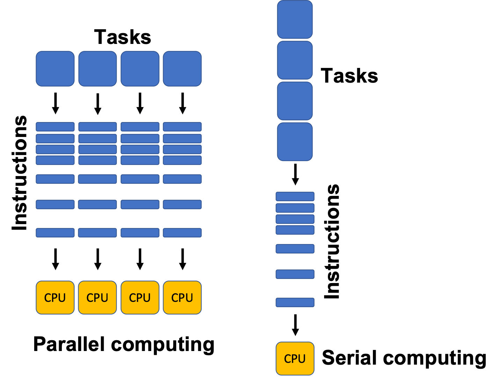
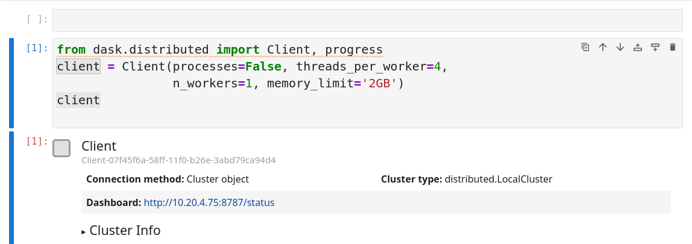
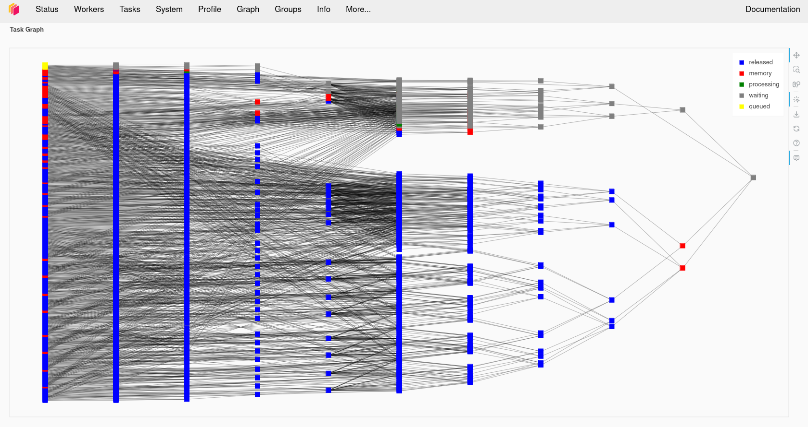
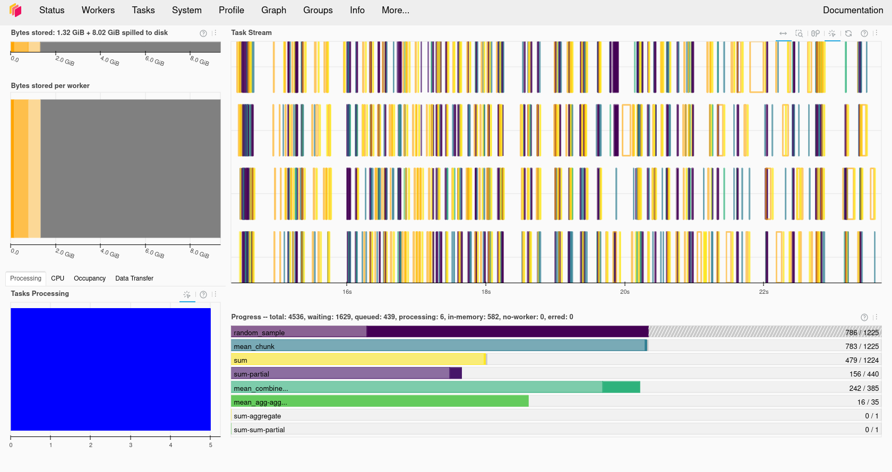

:::::::::::::::::::::::::::::::::::::::::: objectives

- Explain why parallel processing matters for large Zarr datasets.
- Use Dask with xarray and Zarr to parallelise common array computations.
- Understand how chunking, lazy loading, and task graphs work together.
- Recognise a few other Python parallelism patterns that are sometimes used with Zarr workflows.

::::::::::::::::::::::::::::::::::::::::::::::::::

::::::::::::::::::::::::::::::::::::::::::: questions

- Why do we need parallel processing for large Zarr datasets?
- How does Dask parallelise xarray and Zarr computations?
- How do chunking and lazy loading support parallel work?
- What other parallelism tools do Python users sometimes combine with Zarr?

::::::::::::::::::::::::::::::::::::::::::::::::::


## Why parallel processing?

Large environmental datasets can be too slow or too large to process on a single core or in a single process. This becomes especially important with Zarr because the format is designed to be read and written chunk-by-chunk, which makes it a natural fit for parallel work.

Processing such data on a single core or in a single process can be:

- **Slow** - long runtimes for even simple operations.
- **Memory-limited** - datasets or intermediate results may not fit into RAM.
- **I/O-bound** - reading and writing data dominates computation time, especially from disks or across networks.

Parallel processing helps when your workflow needs to:

- read many chunks from a Zarr store,
- compute statistics over large spatial or temporal regions,
- or run the same operation over many independent files, variables, or ensemble members.

In practice, parallelism works best when both the compute layer and the data layout are aligned. Chunked storage such as Zarr lets multiple workers read different chunks independently, while Dask can schedule the work across those chunks.


{alt="Diagram showing parallel vs serial processing."}

## Dask: distributed processing for Python

Dask is a Distributed processing library for Python. It enables parallel processing of Python code across multiple cores on the same computer or across multiple computers. It can be
used behind the scenes by Xarray with minimal modification to code. JASMIN users can make use of a Dask gateway that allows their Dask code submitted from the Jupyter notebook interface
to run on the LOTUS HPC cluster. Dask has two broad categories of features, high level data structures which behave in a similar way to common Python data structures but with the
ability to perform operations in parallel and low level task scheduling to run any Python code in parallel.

Key ideas:

- **Task graph**: Dask builds a graph of tasks and dependencies when you write code, but does not execute immediately.
- **Lazy evaluation**: computations are only executed when you call `.compute()` or similar methods.
- **Cluster**: a set of workers managed by a scheduler; can be local (one machine) or remote (HPC cluster, Kubernetes, etc.).

Basic setup on a local machine:

```python
from dask.distributed import Client, progress

client = Client(processes=False, threads_per_worker=4,
                n_workers=1, memory_limit="2GB")
client  # Show cluster information
```

The code above will create a local Dask cluster with one worker and 4 threads for each worker and a limit of 2GB of memory. Displaying the `client` object will tell us all about the
cluster.

{alt="Dask setup showing a local cluster with one worker and four threads."}

### Using the Dask dashboard

In the information about the Dask cluster is a link to a Dashboard webpage. From the Dashboard we can monitor our Dask cluster and see how busy it is, view a graph of task dependencies, memory usage and the status of the Dask workers. This can be really useful when checking if our Dask cluster is behaving correctly and working out how optimially our code is making use of Dask's parallelism. Note that it is not possible (or at least not without significant additional complexity) to access the Dask dashboard when running on the JASMIN notebook service.

{alt="Dask dashboard showing task progress and worker status."}



### Using the JASMIN Dask gateway

JASMIN offers a Dask Gateway service which can submit Dask jobs to a special queue on the HPC cluster. To use this we need to do a bit of extra setup. We will need to import the `dask_gateway` library and configure the gateway.

```python
import dask_gateway
gw = dask_gateway.Gateway("https://dask-gateway.jasmin.ac.uk", auth="jupyterhub")
```

The gateway can be given a set of options including how many worker cores to use, initially we can set this to one and scale it up later. We also need to allocate at least one core as to the scheduler which will manage our Dask cluster. JASMIN requires us to specify a project to associate the Dask jobs with. Users of training accounts should use "workshop".
Finally we need to tell Dask which Conda/Mamba environment to use and this needs to match the one we're running in our notebook.

```python
options = gw.cluster_options()
options.worker_cores = 1
options.scheduler_cores = 1
options.account = "workshop"
options.worker_setup='source /apps/jasmin/jaspy/miniforge_envs/jaspy3.11/mf3-23.11.0-0/bin/activate /work/scratch-nopw2/tobfer/cloud-native-geoscience'
```

Finally we can check if we already had a cluster running and reuse that if we do and then get a `client` object from the cluster that will behave
the same way as the local Dask client did.

```python
clusters = gw.list_clusters()
if not clusters:
    cluster = gw.new_cluster(options, shutdown_on_close=False)
else:
    cluster = gw.connect(clusters[0].name)

client = cluster.get_client()
client
```

Now that we have a running cluster we can allow it to adapt and scale up and down as we demand it. This will translate to jobs being launched on the JASMIN cluster itself. JASMIN allows users to spawn up to 16 jobs in the Dask queue, but one of these will be taken by the scheduler so the we can only launch a maximum of 15 workers.

```python
cluster.adapt(minimum=1, maximum=15)
```

Once we are done with Dask we can shutdown the cluster by calling its shutdown function. This should cause the jobs in the SLURM queue to finish.

```python
cluster.shutdown()
```

### Dask arrays and lazy computation

Dask arrays are chunked arrays that mimic NumPy's API but execute lazily and in parallel. Any processing operations can work in parallel across these chunks. Data can also be loaded "lazily" into Dask Arrays, this means it is only loaded from disk when it is accessed. This can give us the illusion of loading a dataset that is larger than our memory.

Example:

```python
import dask.array as da

# Create a 10000x10000 array of random numbers, chunked 1000x1000
x = da.random.random((10000, 10000), chunks=(1000, 1000))
print(x)
```

Simple operation: add ones

```python
y = da.ones((10000, 10000), chunks=(1000, 1000))
z = x + y
print(z)  # Still a Dask array, not yet computed
```

As you can see, the addition operation does not compute the result immediately. Instead, it builds a task graph that describes how to compute `z` from `x` and `y`. The actual computation happens when you call `.compute()`:

```python
# Trigger computation
result = z.mean().compute()
print("Mean value:", result)
```

The new variable result will now contain the result of the computation and will be of the type numpy.ndarray.

```python
type(result)
```

Important points:

- Creating `x` and `y` defines a Dask array with specified chunking, but no data is computed until needed.
- Operations build a task graph; `.compute()` runs the tasks.
- Chunking lets Dask process different blocks in parallel and only load chunks into memory when required.

::::::::::::::::::::::::::::::::::::::: challenge

## Exercise 1 - Compare Dask and NumPy performance

Compare the performance of the following code using Numpy and Dask functions. Use the %%time magic in the cells to find out the execution time. Ensure you only time the core computation and not the Dask cluster setup or library imports, this means you'll have to write this code into multiple cells. Dask version (note you'll need to do the Dask client setup first):

```python
# Dask version
import dask.array as da
x = da.random.random((20000,20000), chunks=(1000,1000))
x_mean = x.mean()
x_mean.compute()
```

Numpy version:

```python
import numpy as np
npx = np.random.random((20000,20000))
npx_mean = npx.mean()
```

Which went faster overall? Why do you think you got the result you did? Try making the dataset a little larger, going much beyond 25000x25000 might use too much memory. Try running the top command in a terminal while your notebook is running, look at the CPU % when running the Numpy and Dask versions and compare them. Try changing the number of Dask threads and see what effect this has on the CPU %.

::::::::::::::::::::::::::::::::::::::::::::::::::

:::::::::::::::::::::::::::::::::::::::::: callout

## Troubleshooting Dask

Sometimes Dask can jam up and stop executing tasks. If this happens try the following:

- Shutdown the client and restart it.
- Shutdown the kernel of your notebook and rerun the notebook.

::::::::::::::::::::::::::::::::::::::::::::::::::

:::::::::::::::::::::::::::::::::::::::::: callout

## Some pitfalls to watch out for

Combining lazy loading with parallel processing can be tricky. It is difficult to know when the data are actually being read from disk or downloaded from a remote source. This can lead to unexpected memory usage or performance issues.

So, when do the download and processing actually happen? Things that are usually obvious but catch us all off guard!

When you open a Zarr dataset with xarray, the data are not read into memory. The data are only read when you access them (e.g., by slicing or computing a statistic).

::::::::::::::::::::::::::::::::::::::::::::::::::


### Dask with Zarr via xarray

The most common pattern in this workshop is to open a Zarr store with xarray and ask xarray to use Dask-backed chunks. Xarray then keeps the data lazy until you compute something.

First, create the client:

```python
import xarray as xr
from dask.distributed import Client

client = Client(n_workers=2, threads_per_worker=2, memory_limit="1GB")
client
```

Then open the Zarr dataset with chunking:

```python
ds = xr.open_zarr("data/ocean_temperature.zarr", chunks={})
print(ds)

sst = ds["sst"]
print(sst)
```

Because this dataset is already chunked, xarray can use the existing chunking from the Zarr store. In this case, you can set the `chunks` argument to `{}` or don't specify it at all. Xarray will use the chunking from the Zarr store.

If you are using a netCDF dataset, to integrate Dask you would need to specify the chunk sizes when opening the dataset. For example:

```python
ds = xr.open_dataset("data/ocean_temperature.nc", chunks={"time": 10, "latitude": 100, "longitude": 100})
```


### A simple parallel computation

```python
corrected = sst * 1.1 - 1.0
global_mean = corrected.mean(dim=("latitude", "longitude"))
result = global_mean.compute()
print(result)
```

This workflow is important because the data stay lazy until `.compute()` is called. At that point Dask schedules the work across the chunks.

::::::::::::::::::::::::::::::::::::::: challenge

## Exercise 1 - Dask and xarray together

Using the zarr (`data/ocean_temperature.zarr`) dataset and the netCDF (`data/ocean_temperature.nc`) dataset, try the following:

1. Open each one with xarray, using `xr.open_zarr` for the Zarr dataset and `xr.open_dataset` for the netCDF dataset.
2. Compute a spatial mean over latitude and longitude.
3. Call `.compute()` in the zarr case and compare the result with and without Dask-backed chunks. Try to calculate the time taken for each computation and compare the results. You can use the `%%time` magic command in a Jupyter notebook to time the execution of a cell.

Questions:

- How does the chunking affect the computation?
- How does the performance differ between the Zarr and netCDF datasets?

::::::::::::::: solution

For the Zarr dataset:

```python
%%time
ds_zarr = xr.open_zarr("data/ocean_temperature.zarr")
sst_zarr = ds_zarr["sst"]
global_mean_zarr = sst_zarr.mean(dim=("latitude", "longitude"))
result_zarr = global_mean_zarr.compute()
```

For the netCDF dataset:

```python
%%time
ds_nc = xr.open_dataset("data/ocean_temperature.nc")
sst_nc = ds_nc["sst"]
result_nc = sst_nc.mean(dim=("latitude", "longitude"))
```

When you compute the spatial mean over latitude and longitude for the Zarr dataset with Dask, you should see a reduction in computation time compared to the netCDF dataset. The exact performance gain will depend on the size of the dataset and the chunking strategy used.

Xarray plus Dask gives them a lazy, chunk-aware workflow. The important link is that chunking from the storage lesson now becomes the basis for parallel computation.

:::::::::::::::::::::::::

::::::::::::::::::::::::::::::::::::::::::::::::::

:::::::::::::::::::::::::::::::::::::::::: callout

## Other ways to parallelise Zarr workflows

Dask is the main parallel tool in this lesson, but Python has other ways to run work in parallel. The best choice depends on whether the task is CPU-bound, I/O-bound, or already chunked.

### Threads

Thread-based parallelism can help when the work spends time waiting on I/O, which happens when reading chunks from a Zarr store. Threads are often useful for data access and downloading, but they are less flexible than Dask for organising a whole analysis workflow.

### Multiprocessing

Python's built-in multiprocessing is useful for independent tasks that do not need to share much state. It can work well for embarrassingly parallel jobs, but it is usually less convenient than Dask for Zarr and xarray because it does not understand chunks, task graphs, or labelled arrays automatically.

### Cubed

Cubed is a library for chunked, out-of-core array processing. It is designed for large array computations and can be a good fit when you want to process Zarr-like data in a memory-aware way, especially in cloud-oriented workflows.

::::::::::::::::::::::::::::::::::::::::::::::::::

## Visualising the Task Graph

To see how Dask is scheduling work, you can visualise the task graph. This can help you understand how many tasks are being created and how they depend on each other.

```python
import dask
import xarray as xr

ds = xr.open_zarr("data/ocean_temperature.zarr")
sst = ds["sst"]
corrected = sst * 1.1 - 1.0
global_mean = corrected.mean(dim=("latitude", "longitude"))
dask.visualize(global_mean, filename='task_graph.png')
```

This will create a PNG file showing the task graph for the computation. You can also use `global_mean.visualize()` to see the graph directly in a Jupyter notebook.


::::::::::::::::::::::::::::::::::::::: challenge

## Exercise 2 - A small parallel workflow

Now, we are going to compare the results with different chunk sizes. Using the original zarr (`data/ocean_temperature.zarr`) and the rechunked zarr (`data/ocean_temperature_rechunked.zarr` - you created this in the previous episode) datasets, try the following:

1. Open the dataset
2. Run one spatial statistic and one time-based statistic.

For example (but you can choose any statistic you like):

```python
# Spatial statistic: mean over latitude and longitude
spatial_mean = sst.mean(dim=("latitude", "longitude"))
# Time-based statistic: mean over time
time_mean = sst.mean(dim="time")
```

3. Repeat the same operation for the other dataset (the one you didn't use in step 1).
4. Compare which version creates a more efficient task structure and which one runs faster. You can use the `%%time` magic command in a Jupyter notebook to time the execution of a cell.

Questions:

- Which dimensions matter most for your workflow?
- Did the chunk layout help or hurt parallel execution?
- How might the answer change if the data were much larger?

::::::::::::::: solution

For the original zarr dataset:

```python
import xarray as xr

# Open the original zarr dataset
ds_original = xr.open_zarr("data/ocean_temperature.zarr")
sst_original = ds_original["sst"]
# Spatial statistic: mean over latitude and longitude
spatial_mean_original = sst_original.mean(dim=("latitude", "longitude"))
# Time-based statistic: mean over time
time_mean_original = sst_original.mean(dim="time")

%time spatial_mean_original.compute()
%time time_mean_original.compute()
```

For the rechunked zarr dataset:

```python
# Open the rechunked zarr dataset
ds_rechunked = xr.open_zarr("data/ocean_temperature_rechunked.zarr")
sst_rechunked = ds_rechunked["sst"]
# Spatial statistic: mean over latitude and longitude
spatial_mean_rechunked = sst_rechunked.mean(dim=("latitude", "longitude"))
# Time-based statistic: mean over time
time_mean_rechunked = sst_rechunked.mean(dim="time")
%time spatial_mean_rechunked.compute()
%time time_mean_rechunked.compute()
```

When you compute the spatial and time-based statistics for both the original and rechunked datasets, you should observe differences in execution time. The chunk layout can significantly affect parallel execution, especially for larger datasets.

:::::::::::::::::::::::::

::::::::::::::::::::::::::::::::::::::::::::::::::


::::::::::::::::::::::::::::::::::::::: challenge

## Exercise 3 (Optional) - Parallel workflow using a Dask cluster on HPC

Now we are going to explore how to run a parallel workflow using a Dask cluster on an HPC system like JASMIN. For this example, we are going to use a bigger dataset, the subset of the GLORYS Reanalysis dataset, stored in a single Zarr group (`data/glorys_202605.zarr`). This dataset is too large to process efficiently on a single core, so we will use Dask to parallelise the computation.

Please follow the steps below:

1. Set up a Dask cluster on JASMIN using the Dask Gateway service.
2. Open the GLORYS u-component of the ocean current velocity (`uo`) with Xarray.
3. Run a correction algorithm on the `uo` data (for example, multiply by a factor and subtract an offset). For example `corrected_uo = uo * 1.1 - 1.0`.
4. Experiment with:
- Changing the number of worker cores
- Changing the number of workers (set in cluster.adapt)

::::::::::::::: solution

Create a Dask cluster on JASMIN using the Dask Gateway service. You can use the following code snippet to set up the cluster and connect to it:

```python
import dask_gateway
import xarray as xr

# Create a connection to dask-gateway.
gw = dask_gateway.Gateway("https://dask-gateway.jasmin.ac.uk", auth="jupyterhub")

options = gw.cluster_options()
options.worker_cores = 2
options.scheduler_cores = 1
options.account = "workshop"
options.worker_setup='source /apps/jasmin/jaspy/miniforge_envs/jaspy3.11/mf3-23.11.0-0/bin/activate /work/scratch-nopw2/colinsau/esces-env'
clusters = gw.list_clusters()
if not clusters:
    cluster = gw.new_cluster(options, shutdown_on_close=False)
else:
   cluster = gw.connect(clusters[0].name)
```

Now that we have a running cluster, we can get a client object from the cluster that will behave the same way as the local Dask client did.

```python
client = cluster.get_client()
cluster.adapt(minimum=1, maximum=4)
ds = xr.open_zarr("data/glorys_202605.zarr")
uo = ds['uo']
corrected_uo = uo * 1.1 - 1.0
corrected_uo.compute()
print(corrected_uo)
```

Remember to shutdown the cluster when you are done to free up resources:

```python
cluster.shutdown()
```

:::::::::::::::::::::::::

::::::::::::::::::::::::::::::::::::::::::::::::::


:::::::::::::::::::::::::::::::::::::::::: keypoints

- "Dask is the main parallel tool used here."
- "Zarr and Dask work well together because Zarr stores data in independent chunks."
- "Xarray can open Zarr data lazily and hand chunked work to Dask."
- "Other Python parallelism tools exist, but Dask is the most natural fit for chunked environmental data."

::::::::::::::::::::::::::::::::::::::::::::::::::
