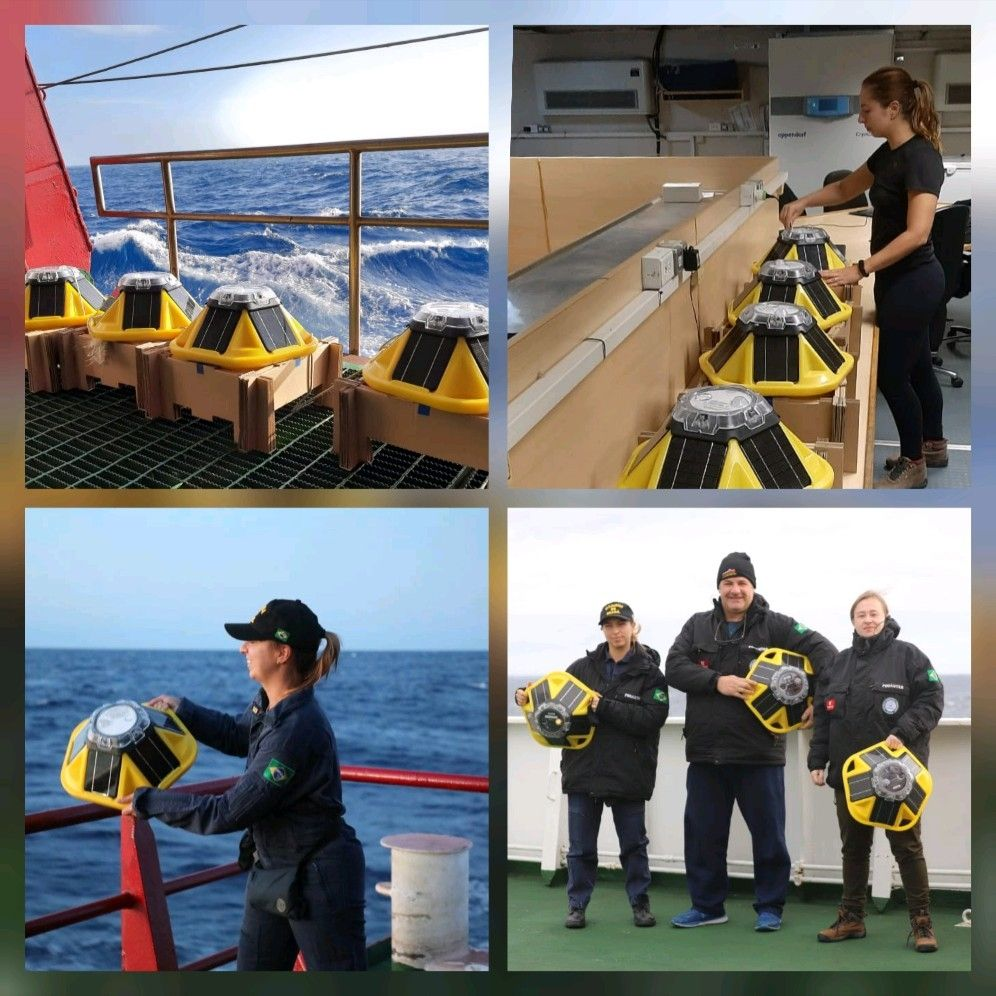
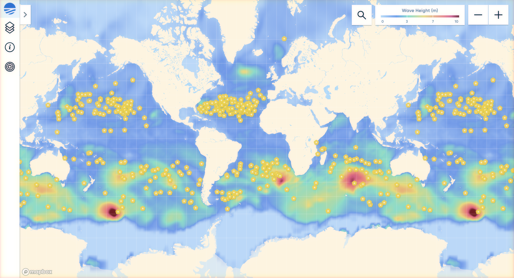
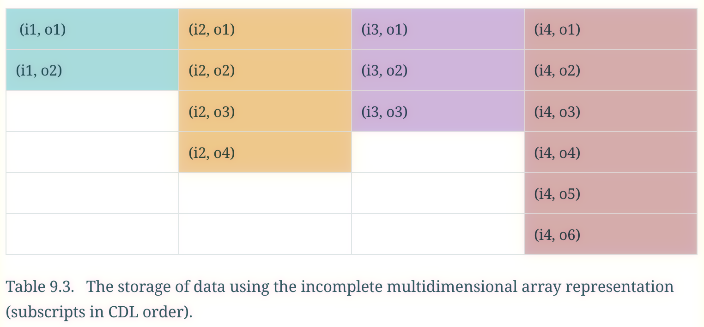
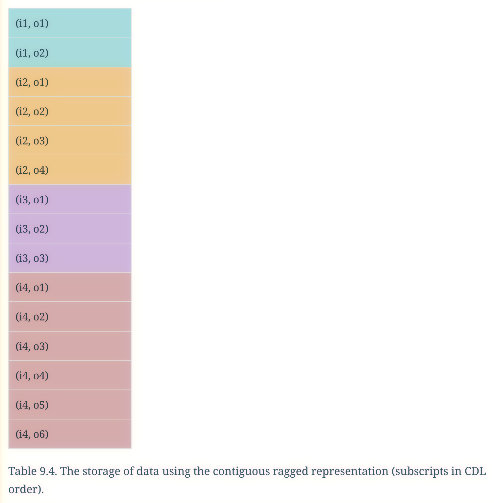
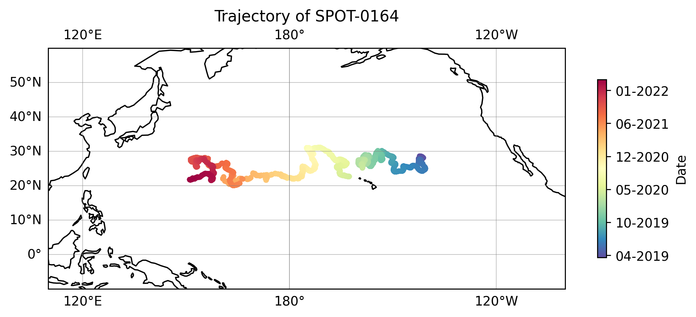

:::::::::::::::::::::::::::::::::::::::::: objectives

- "Discover several open Zarr datasets for oceanography, climate, and meteorology."
- "Use Python tools (xarray, zarr, fsspec, clouddrift) to open and explore Zarr datasets hosted in the cloud."
- "Inspect dimensions, coordinates, and chunk layouts in real-world Zarr stores."
- "Practice basic analysis and think about how chunking and storage affect performance."

::::::::::::::::::::::::::::::::::::::::::::::::::

::::::::::::::::::::::::::::::::::::::::::: questions

- "Which publicly available Zarr datasets can I use for experimentation and learning?"
- "How do I open Zarr datasets from cloud object storage (Google Cloud, AWS S3) with Python?"
- "How do irregular grids, ragged arrays, and ensembles appear in Zarr + xarray?"
- "How do chunks and storage layout influence how I analyse these datasets?"

::::::::::::::::::::::::::::::::::::::::::::::::::


## Overview: a tour of open Zarr datasets

In this lesson, we work hands‑on with several open Zarr datasets:

- [**IFS ensemble forecasts**](https://dynamical.org/catalog/) in Icechunk/Zarr from dynamical.org - global ensemble forecasts on AWS.
- [**ERA5 ARCO**](https://cds.climate.copernicus.eu/datasets/reanalysis-era5-single-levels?tab=analysis_ready_data) reanalysis in Zarr on Climate Data Store - global atmospheric data ready for analysis.
- [**Sofar Spotter drifters**](https://registry.opendata.aws/sofar-spotter-archive/) - ragged array buoy data in Zarr, accessible via `clouddrift`.
- **Additional examples** such as CMIP6, downscaled climate, or Copernicus marine Zarr data, depending on your interests.

Each dataset illustrates different aspects:

- Regular latitude-longitude grids.
- Ragged arrays (varying-length trajectories).
- Non-regular or irregular grids.
- Ensembles with `member` dimensions.

All these datasets are hosted in cloud object storage (Google Cloud, AWS S3, or HTTPS) and can be accessed programmatically with Python tools like `xarray`, `zarr`, and `fsspec`. I will explain later what object storage is and how it differs from traditional file systems.

These datasets can be several terabytes in size. DO NOT DOWNLOAD THEM LOCALLY.


## Ensemble forecasts - ECMWF AIFS ENS Icechunk/Zarr

Dynamical.org hosts ECMWF AIFS single and ensemble forecasts (ENS) in Icechunk/Zarr format on AWS S3. It is possible to access the data using dynamical.org API or directly via the S3 url.

For example, the ECMWF AIFS SINGLE are accessible this way:


```python
import xarray as xr

ds = xr.open_zarr("https://data.dynamical.org/ecmwf/aifs-single/forecast/latest.zarr")
ds
```

You can see as output that the dataset is large (14TB) and has dimensions for `init_time`, `lead_time`, `latitude`, and `longitude`. The data variables include various meteorological fields such as temperature, wind, and cloud cover.

If we inspect temperature_2m, we see that it represents hundreds of gigabytes of data:

```python
ds['temperature_2m']
```

Let's try and read it by slicing out a small part of the file. We will slice out the last initialisation time, and get all the lead_times and latitude and longitudes related to it:


```python
temperature_2m = ds['temperature_2m'].isel(init_time=slice(-1, None))
temperature_2m
```
Now:
- init_time is reduced to 1
- the selected time corresponds to the most recent model run (yesterday or today depending on the time of day)

This subset is much smaller, but no data has been loaded yet. If we explore further and print the temperature_2m array we'll see that it is actually using a Dask array underneath.

```python
print(temperature_2m)
```

To convert this into a standard Xarray DataArray we can call .compute on the temperature_2m.

```python
temperature_2m_local = temperature_2m.compute()
```

We can now plot this by selecting the data for the first lead time and then plotting it (we also need to select the first initialisation time since we only have one):

```python
temperature_2m_local.isel(init_time=0, lead_time=0).plot()
```
Or access some of the data:

```python
temperature_2m_local[0,0,0,0]
```

If you want to slice the data by the latitude and longitude coordinates you can use sel instead of isel:

```python
temperature_2m_slice = ds['temperature_2m'].sel(latitude=slice(50, 60), longitude=slice(-10, 0))
temperature_2m_slice
```

### Exploring more datasets and examples

If you want to have access to more datasets, you can explore the dynamical.org catalog for other ECMWF datasets in Icechunk/Zarr format.

You can also find some examples of how to access and manipulate these datasets in the [dynamical.org documentation](https://dynamical.org/docs/).


## ERA5 ARCO - global reanalysis in Zarr

A subset of the ERA5 single-levels dataset is available in analysis-ready, cloud-optimised (ARCO) Zarr stores. The ARCO data is a repackaged version of the original ERA5 data. It allows direct programmatic access to a selection of the surface and wave variables (see below) without downloading individual files, enabling efficient and scalable data access and retrieval.

### Create a CDS account and get an API key

1. Go to the [Copernicus Climate Data Store](https://cds.climate.copernicus.eu/) and create an account.

2. After logging in, go to your [API key page](https://cds.climate.copernicus.eu/api-how-to) and copy your API key.

### Access datasets

```bash
import xarray as xr

cdsapi_key = "<INSERT-CDS-API-KEY-HERE>"

# Geo-chunked wave data (optimised for time-series at a single location)
geochunked_wav_url = "https://arco.datastores.ecmwf.int/cadl-arco-geo-003/arco/reanalysis_era5_single_levels/wav/geoChunked.zarr"

# Time-chunked wave data (optimised for global map at a single time step)
timechunked_wav_url = "https://arco.datastores.ecmwf.int/cadl-arco-time-003/arco/reanalysis_era5_single_levels/wav/timeChunked.zarr"


# Open the zarr store with xarray, users must insert their API key where indicated.
ds = xr.open_zarr(
    timechunked_wav_url,
    consolidated=True,
     storage_options = {
        "headers": {"Authorization": f"Bearer {cdsapi_key}"}
    }
)

# Inspect the variables
ds
```

This is the output you should see:

```output
<xarray.Dataset> Size: 2TB
Dimensions:    (time: 758352, latitude: 361, longitude: 720)
Coordinates:
  * time       (time) datetime64[ns] 6MB 1940-01-01 ... 2026-07-05T23:00:00
  * latitude   (latitude) float64 3kB -90.0 -89.5 -89.0 -88.5 ... 89.0 89.5 90.0
  * longitude  (longitude) float64 6kB -180.0 -179.5 -179.0 ... 179.0 179.5
Data variables:
    mwd        (time, latitude, longitude) float32 788GB dask.array<chunksize=(1, 361, 720), meta=np.ndarray>
    mwp        (time, latitude, longitude) float32 788GB dask.array<chunksize=(1, 361, 720), meta=np.ndarray>
    swh        (time, latitude, longitude) float32 788GB dask.array<chunksize=(1, 361, 720), meta=np.ndarray>
Attributes:
    Conventions:             CF-1.7
    GRIB_centre:             ecmf
    GRIB_centreDescription:  European Centre for Medium-Range Weather Forecasts
    GRIB_edition:            1
    GRIB_subCentre:          0
    history:                 2024-09-05T05:51 GRIB to CDM+CF via cfgrib-0.9.1...
    institution:             European Centre for Medium-Range Weather Forecasts
```


For a full list of available variables, see the [ERA5 ARCO documentation](https://cds.climate.copernicus.eu/datasets/reanalysis-era5-single-levels?tab=analysis_ready_data).

### Create a plot of a variable

```python
import matplotlib.pyplot as plt

# Select a variable (e.g. significant wave height)
swh = ds["swh"]  # adjust to match the dataset variable names

# Select a single time step
one_time = swh.sel(time="2000-01-01T00:00:00")

# Plot the variable
plt.figure(figsize=(12, 6))
one_time.plot(cmap="coolwarm")
plt.title("ERA5 Significant Wave Height on 2000-01-01")
plt.xlabel("Longitude")
plt.ylabel("Latitude")
plt.show()
```

### Additional resources

To see a full list of available datasets and examples, you can explore the [Copernicus Climate Data Store](https://cds.climate.copernicus.eu/) and the  [ECMWF Training datasets repository](https://github.com/ecmwf-training/dss-notebooks/tree/main/datasets).


## Sofar Spotter drifters - ragged arrays

The Sofar Spotter Archive provides historical wave and inferred wind data from a global network of Spotter buoys, in both NetCDF and Zarr formats.

{alt="Sofar Spotter drifters deployed by Brazilian Navy and INPE"}

{alt="Array of spotter buoys"}


```python
import xarray as xr

s3_uri = "https://sofar-spotter-archive.s3.amazonaws.com/spotter_data_bulk_zarr"
ds = xr.open_zarr(s3_uri, engine="zarr")
ds
```

```output
<xarray.Dataset>
Dimensions:                (index: 6390651, trajectory: 871)
Coordinates:
    time                   (index) datetime64[ns] ...
  * trajectory             (trajectory) object 'SPOT-010001' ... 'SPOT-1975'
Dimensions without coordinates: index
Data variables:
    latitude               (index) float64 ...
    longitude              (index) float64 ...
    meanDirection          (index) float64 ...
    meanDirectionalSpread  (index) float64 ...
    meanPeriod             (index) float64 ...
    peakDirection          (index) float64 ...
    peakDirectionalSpread  (index) float64 ...
    peakPeriod             (index) float64 ...
    rowsize                (trajectory) int64 ...
    significantWaveHeight  (index) float64 ...
Attributes:
    author:         Isabel A. Houghton
    creation_date:  2023-10-18 00:43:55.333537
    email:          isabel.houghton@sofarocean.com
    institution:    Sofar Ocean
    references:     https://content.sofarocean.com/hubfs/Spotter%20product%20...
    source:         Spotter wave buoy
    title:          Sofar Spotter Data Archive - Bulk Wave Parameters
```

### Dataset structure

This dataset was designed to follow the conventions used by NOAA for a similar dataset: Global Drifter Program (GDP) Drifter data. The explanation below was extracted and adapted from the [OHW 2024 Tutorials - collocating_noaa_gfs_sofar_spotter_during_hurricane](https://github.com/oceanhackweek/ohw-tutorials/tree/OHW24/us/01-Tue/collocating_noaa_gfs_sofar_spotter_during_hurricane)

Due to factors including, but not limited to: different reporting frequencies, deployment times, device lifetimes, and missing observations - the number of observations can, and do, vary significantly between each Spotter in the dataset. For ease of readability, one could imagine structuring the data in the following way, which is called an incomplete multidimensional array representation:

{alt="incomplete Array representation"}

As you can see, while this representation appears easy to read and manipulate, there are a number of missing values for columns associated with less observations compared to the column corresponding to the greatest number of observations. When storing large amounts of data, this results in a significant amount of space dedicated to missing values. To reduce storage size, GDP, and the Sofar Spotter Archive, represent drifter data using a contiguous ragged array representation:

{alt="Ragged array structure"}

Since the data is stored in a single, contiguous array for multiple, unique, drifters/trajectories, it is necessary to identify the indices associated with the Spotter of interest, which we've done above.

### Plot drift trajectory for individual drifter colored by date

Get the data for a single drifter:

```python
# choose a drifter by ID
spotter_id = 'SPOT-0164'


# create array that points to indices for each trajectory
traj_idx = np.insert(np.cumsum(ds.rowsize.values), 0, 0)


# find index of chosen drifter
j = np.where(ds.trajectory==spotter_id)[0][0]
print(f"Drifter index for {spotter_id} is {j}")


# create the slice index `sli` for data from that drifter
sli = slice(traj_idx[j], traj_idx[j+1])
```

Plot the trajectory colored by date:

```python
import matplotlib.pyplot as plt
import matplotlib.dates as mdates
import cartopy.crs as ccrs

# set up cartopy map
fig, ax = plt.subplots(1,1, figsize=[9,5], subplot_kw={'projection': ccrs.PlateCarree()}, dpi=250)
ax.coastlines()
ax.gridlines(crs=ccrs.PlateCarree(), draw_labels=True,
                  linewidth=.5, color='gray', alpha=0.5)

ax.set_extent([110, 260, -10, 60], crs=ccrs.PlateCarree())


lons = ds.longitude[sli]
lons[lons<0] += 360 # make sure lons span [0,360] for easier mapping
lats = ds.latitude[sli]
pcm1 = ax.scatter(lons, lats,
                  c=mdates.date2num(ds.time[sli]),
                  s=10,
                  cmap='Spectral_r',
                  edgecolor='face',
                  transform=ccrs.PlateCarree())

cb = fig.colorbar(pcm1,ax=ax, label='Date', shrink=0.5)
cb.ax.yaxis.set
cb.ax.yaxis.set_major_formatter(mdates.DateFormatter('%m-%Y'))

ax.set_ylabel('Latitude')
ax.set_xlabel('Longitude')
ax.set_title('Trajectory of '+str(spotter_id))
plt.show()

```

{alt="Trajectory of SPOT-0164"}


::::::::::::::::::::::::::::::::::::::: challenge

## Exercise 1 - ECMWF AIFS SINGLE

Assuming you have opened an AIFS single dataset:

1. Identify the dimensions and coordinates of the dataset (e.g. `init_time`, `lead_time`, `latitude`, `longitude`).
2. Choose a variable (e.g. `temperature_2m` or similar, depending on the dataset's naming).
3. Compute:
  - A global mean time series over a limited period (e.g. one week).
  - A spatial map at a single time step.

::::::::::::::: solution

```python
import xarray as xr

# Open the AIFS single dataset
ds = xr.open_zarr("https://data.dynamical.org/ecmwf/aifs-single/forecast/latest.zarr")

# Inspect dimensions and coordinates
print(ds.dims)
print(ds.coords)

# Choose a variable
temp = ds["temperature_2m"]  # adjust to match the dataset variable names

# Subset to one week (e.g. first week of the latest init_time)
temp_week = temp.isel(init_time=-1).sel(lead_time=slice("2024-06-01T00:00:00", "2024-06-07T00:00:00"))

# Global mean time series
global_ts = temp_week.mean(dim=("latitude", "longitude"))
print(global_ts)

# Map at a single time step (e.g. first lead_time of the week)
one_time = temp_week.isel(lead_time=0)
one_time.plot()
```

:::::::::::::::::::::::::

::::::::::::::::::::::::::::::::::::::::::::::::::


::::::::::::::::::::::::::::::::::::::: challenge

## Exercise 2 - Climate Data Store ERA5 inspection and simple analysis

1. First, ensure you have your CDS API key set up as described above.
2. Inspect the ERA5 dataset:
   - Print `era5.dims`, `era5.data_vars`, and `era5.coords`.
   - Identify at least 2 variables of interest (e.g. `mwp`, `swh`).
3. Select one variable (e.g. `mwp` for mean wave period) and subset it to a specific time range (e.g. one year).
4. Compute:
   - A global mean time series over a limited period (e.g. one year).
   - A spatial map at a single time step.

::::::::::::::: solution

```python
import xarray as xr

cdsapi_key = "<INSERT-CDS-API-KEY-HERE>"
# Open the ERA5 dataset
era5 = xr.open_zarr(
    "https://arco.datastores.ecmwf.int/cadl-arco-time-003/arco/reanalysis_era5_single_levels/wav/timeChunked.zarr",
    consolidated=True,
    storage_options={"headers": {"Authorization": f"Bearer {cdsapi_key}"}}
)

# Inspect dimensions, data variables, and coordinates
print(era5.dims)
print(era5.data_vars)
print(era5.coords)

# Select a variable (e.g. mean wave period)
mwp = era5["mwp"]  # adjust to match the dataset variable names

# Subset to a specific time range (e.g. one year)
mwp_year = mwp.sel(time=slice("2020-01-01", "2020-12-31"))

# Global mean time series
global_ts = mwp_year.mean(dim=("latitude", "longitude"))
print(global_ts)

# Spatial map at a single time step (e.g. first time step of the year)
one_time = mwp_year.isel(time=0)
one_time.plot()
```

:::::::::::::::::::::::::

::::::::::::::::::::::::::::::::::::::::::::::::::


::::::::::::::::::::::::::::::::::::::: challenge

## Exercise 3 - Working with ragged arrays

1. Open the Sofar Spotter drifter dataset as shown above.
2. Inspect `ds_spot`:
   - Print `ds_spot.dims`, `ds_spot.coords`, and `ds_spot.data_vars`.
   - Identify the ragged structure: which dimensions represent trajectories, which represent sample indices?
3. Choose one trajectory (e.g. `trajectory="SPOT-010001"` or similar) and extract its time series:
4. Plot a time series of a variable of interest (e.g. `significantWaveHeight`) for that trajectory.

::::::::::::::: solution

```python
import xarray as xr

# Open the Sofar Spotter drifter dataset
s3_uri = "https://sofar-spotter-archive.s3.amazonaws.com/spotter_data_bulk_zarr"
ds_spot = xr.open_zarr(s3_uri, engine="zarr")

# Inspect dimensions, coordinates, and data variables
print(ds_spot.dims)
print(ds_spot.coords)
print(ds_spot.data_vars)

# Identify the ragged structure
# 'trajectory' dimension represents different drifters, 'index' represents sample indices
# Choose one trajectory and extract its time series
spotter_id = "SPOT-010001"
traj_idx = np.insert(np.cumsum(ds_spot.rowsize.values), 0, 0)
j = np.where(ds_spot.trajectory == spotter_id)[0][0]
sli = slice(traj_idx[j], traj_idx[j + 1])

# Plot a time series of significant wave height for that trajectory
import matplotlib.pyplot as plt

plt.figure(figsize=(12, 6))
plt.plot(ds_spot.time[sli], ds_spot.significantWaveHeight[sli])
plt.title(f"Significant Wave Height for {spotter_id}")
plt.xlabel("Time")
plt.ylabel("Significant Wave Height (m)")
plt.grid()
plt.show()
```

:::::::::::::::::::::::::

::::::::::::::::::::::::::::::::::::::::::::::::::


:::::::::::::::::::::::::::::::::::::::::: callout

## Other open Zarr datasets to explore

You can broaden the lesson with other open Zarr datasets:

- [**CMIP6 Zarr on AWS**](https://registry.opendata.aws/cmip6/) - global climate model output in Zarr format in the AWS open data.
- [**CarbonPlan Zarr datasets**](https://carbonplan.org/data) - downscaled climate and other datasets accessible via HTTPS-friendly Zarr URLs.
- [Earthmover Marketplace](https://app.earthmover.io/marketplace) - a collection of open geoscience datasets, some of which are available in Zarr format.
- [NEMO Near-Present-Day](https://noc-msm.github.io/OceanDataStore/catalog/) - ocean model output in Zarr format, including near-present-day simulations.

::::::::::::::::::::::::::::::::::::::::::::::::::


::::::::::::::::::::::::::::::::::::::: challenge

## Exercise 4 - Build your own mini project

Choose one of the datasets (ERA5, Spotter, AIFS, CMIP6, or another Zarr dataset you know) and design a mini project:

1. Define a question you want to answer (e.g. "How has near‑surface temperature changed in a region over a given period?" or "What is the distribution of wave heights across the Spotter network?").
2. Write code to:
   - Open the dataset with xarray and/or supporting libraries.
   - Explore dimensions, variables, and metadata.
   - Perform a small analysis or visualisation that addresses your question.
3. Reflect on:
   - How easy or difficult it was to access and manipulate the Zarr dataset.
   - How chunks and storage affected performance and workflow.
   - Any issues or surprises you encountered (e.g. irregular grids, ragged arrays, ensemble dimensions).

You can share your mini projects with the class or colleagues and discuss different approaches.

::::::::::::::::::::::::::::::::::::::::::::::::::


:::::::::::::::::::::::::::::::::::::::::: keypoints

- "Many open Zarr datasets are available for oceanography, climate, and meteorology, including ERA5 ARCO, Sofar Spotter drifters, ECMWF IFS ensemble forecasts, CMIP6, and marine products."
- "Python tools like xarray, zarr, fsspec, and clouddrift make it straightforward to open and explore Zarr datasets hosted on cloud object storage."
- "Real-world Zarr datasets illustrate regular grids, ragged arrays, ensemble dimensions, and more, providing rich practice for accessing, analysing, and understanding chunked data."
- "Working hands-on with open Zarr datasets helps learners build intuition about data structures, performance, and best practices for cloud-native scientific workflows."

::::::::::::::::::::::::::::::::::::::::::::::::::
