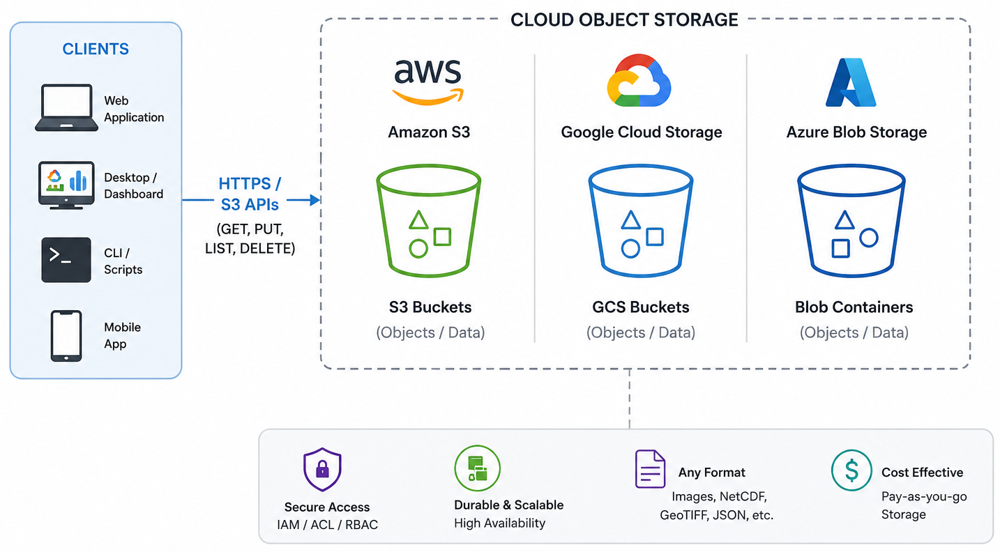

:::::::::::::::::::::::::::::::::::::::::: objectives

- "Explain what object storage is and how it differs from traditional file and block storage."
- "Describe why object storage is useful for sharing, durability, and parallel access."
- "Understand how to access cloud object stores (S3, GCS, Azure Blob) from Python."
- "Deploy a simple self-hosted S3-compatible object store (MinIO) using Docker."

::::::::::::::::::::::::::::::::::::::::::::::::::

::::::::::::::::::::::::::::::::::::::::::: questions

- "What is an object store, and how is it different from storing data on a server filesystem?"
- "Why is object storage a good fit for large-scale data sharing and cloud-native science?"
- "How does object storage support secure, concurrent, and parallel access?"
- "How can I use commercial cloud object stores and self-hosted solutions like MinIO?"

::::::::::::::::::::::::::::::::::::::::::::::::::

## What is object storage?

Object storage stores data as **objects** in a flat address space, usually inside **buckets**. Each object contains binary data and metadata (such as content type or custom tags) and is identified by a unique key within a bucket, rather than by a path in a nested directory tree.

Unlike traditional storage systems:

- **File storage** (POSIX filesystems) organises data into directories and files.
- **Block storage** presents fixed-size blocks to an operating system and is commonly used for disks and databases.

Object storage is designed for storing large collections of independent objects that are accessed through APIs such as HTTP or S3. This architecture enables systems to scale across many disks and nodes while providing high durability.

### Object storage and traditional servers

Traditional scientific workflows often store data on local or network filesystems:

- Data are stored in directories on one server or a small cluster.
- Access is provided through SSH, NFS, or mounted drives.
- Storage capacity and bandwidth are limited by the underlying hardware.

Object storage takes a different approach:

- Data are distributed across many disks and nodes, often spanning multiple availability zones or data centres.
- Applications access data through standard APIs, such as Amazon S3, Google Cloud Storage (GCS), or Azure Blob Storage.
- Storage systems can grow incrementally by adding new nodes rather than replacing existing hardware.

For scientific datasets, this makes it practical to store millions of independent objects, such as NetCDF files, image tiles, or Zarr chunks. Because each object can be accessed independently, applications running on HPC systems, cloud platforms, or local infrastructure can efficiently process data in parallel while accessing the same shared dataset.

](episodes/fig/file_object.png){alt="File vs Object Storage."}

## Advantages of object storage

### Sharing and durability

Object storage is well suited for sharing and long-term preservation because it provides:

- Global access through URLs or API endpoints.
- Fine-grained access control using bucket policies, access control lists (ACLs), identity management, or signed URLs.
- High durability through replication or erasure coding across multiple disks and nodes.
- Support for per-object metadata, versioning, and public or private buckets.

{alt="Cloud Object Storage Architecture."}

### Security and access control

Object stores provide several layers of security:

- **Authentication** verifies the identity of users or services through access keys, OAuth tokens, or service identities.
- **Authorisation** controls who can read, write, list, or manage objects using policies, roles, and ACLs.
- **Encryption** protects data both in transit and at rest, with some systems also supporting client-side encryption.

### Parallel and concurrent access

Each object in an object store can be accessed independently. As a result:

- Multiple clients can read and write different objects simultaneously.
- Large datasets composed of many objects (such as Zarr chunks) can be processed in parallel.
- Requests are distributed across many servers and disks, increasing aggregate throughput.

Frameworks such as Dask, Spark, and Apache Beam take advantage of this model by assigning different objects or chunks to different workers. This is one reason why cloud-native formats such as Zarr are commonly paired with object storage.

### Cost and storage classes

Cloud providers typically offer multiple storage classes for different access patterns:

- **Frequent access:** higher performance for data that are accessed regularly.
- **Infrequent access:** lower storage cost with higher retrieval charges.
- **Archive (cold storage):** lowest storage cost, but higher retrieval latency and fees.

Selecting the appropriate storage class helps balance cost and performance according to how often the data are used.

:::::::::::::::::::::::::::::::::::::::::: discussion

### Deployment trade-offs

There are several ways to deploy object storage:

- **Traditional file servers:** simple to operate for small groups but limited by local hardware.
- **Cloud object storage:** provides elastic capacity, managed infrastructure, and high durability, with costs based on storage, requests, and data transfer.
- **Self-hosted object storage:** allows institutions to use existing hardware while retaining control over their infrastructure, but requires ongoing management, monitoring, backups, and maintenance.

The best choice depends on factors such as dataset size, access patterns, operational expertise, and budget.

For large scientific archives, the key question is not only "what is cheapest per terabyte?", but also "what is cheapest and safest over the full life of the data?"

::::::::::::::::::::::::::::::::::::::::::::::::::

All the advantages of object storage make it a good fit for scientific data workflows, especially when combined with chunked formats like Zarr. The ability to store many independent objects, access them in parallel, and manage them through APIs allows researchers to build scalable, reproducible, and shareable data systems.

{alt="Traditional workflows vs New workflows."}

::::::::::::::::::::::::::::::::::::::: challenge

## Exercise 1 - Compare storage options for a workflow

Imagine your group needs to store a 10 TB Zarr dataset that is read often by several researchers.

1. Decide whether the dataset would be better suited to:
   - a traditional server filesystem,
   - cloud object storage,
   - or a self-hosted object store.
2. Write down two reasons for your choice.
3. Consider the following:
   - How often the data are accessed.
   - Whether multiple users need concurrent access.
   - Whether the data need to stay inside an institution.
   - Whether the group has staff to operate storage infrastructure.

Questions:

- Which option would be easiest to scale?
- Which option would be easiest to share securely?
- Which option would be most difficult to maintain over time?

::::::::::::::: solution

The answer will depend on the specific context of the group and their requirements. For example:
- If the dataset is accessed frequently by multiple researchers and needs to be shared securely, cloud object storage may be the best option due to its scalability and built-in access controls.
- If the dataset must remain within the institution due to data sovereignty concerns, a self-hosted object store may be preferable, provided the institution has the necessary staff and infrastructure to maintain it.
- If the dataset is small and accessed by a single researcher, a traditional server filesystem may suffice, but it may become difficult to scale and maintain over time.

:::::::::::::::::::::::::

::::::::::::::::::::::::::::::::::::::::::::::::::

## Accessing cloud object storage from Python

Common cloud object stores include AWS S3, Google Cloud Storage (GCS), Azure Blob Storage, and S3-compatible services such Cloudflare and JASMIN. Each has its own API and client libraries, but they all support S3-style access.

In Python, different providers have different client libraries, but for scientific workflows the most common pattern is to use S3-style access through `boto3`, `fsspec`, or `s3fs`:

- **`boto3`** for AWS S3 and S3-compatible services.
- **`fsspec` / `s3fs`** for opening remote filesystems from Python and xarray.
- **`gcsfs`** or provider-specific libraries for Google Cloud Storage.
- **`azure-storage-blob`** for Azure Blob.

In this lesson, we focus on S3-style access because it is widely supported and works well with Zarr and xarray. It is the same one that JASMIN and other HPC/cloud platforms use for object storage.

### Listing objects

For listing data in the object store, we will focus on `boto3` (AWS S3) and `fsspec`/`s3fs` (for xarray and Zarr).

First, let's see how to list objects in a public bucket using `boto3` in a public cloud object store. For this example, we will use the [NOAA GOES-18 public bucket](https://registry.opendata.aws/noaa-goes/), which has data from the GOES-18 satellite. This bucket is public, which does not require credentials for reading objects.

The first step is to create the client.

```python
import boto3
from botocore import UNSIGNED
from botocore.config import Config

s3 = boto3.client(
    "s3",
    config=Config(signature_version=UNSIGNED), # UNSIGNED allows public access without credentials
)
```

After creating the client, we can list objects in a bucket. For example, to list the first 10 objects in the `noaa-goes18` bucket under the prefix `ABI-L2-CMIPF/`, we can use the following code:

```python
response = s3.list_objects_v2(
    Bucket="noaa-goes18",
    Prefix="ABI-L2-CMIPF/",
    MaxKeys=10,
)

for obj in response.get("Contents", []):
    print(obj["Key"])
```

To access a protected bucket, like the course bucket, you first provide your credentials. In this workshop, the credentials were supplied by the instructor. As we are using JASMIN, we also need to specify the endpoint URL for the S3-compatible service.

The following example shows how to list objects in a private bucket using `boto3` with credentials:

```python
import boto3

s3 = boto3.client(
    "s3",
    endpoint_url="https://atlantis-vis-o.s3-ext.jc.rl.ac.uk",
    aws_access_key_id="your-access-key",
    aws_secret_access_key="your-secret-key",
)

bucket_name = "cloud-native-geoscience-course"

response = s3.list_objects_v2(Bucket=bucket_name, MaxKeys=10)

for obj in response.get("Contents", []):
    print(obj["Key"], obj["Size"])
```

Once authenticated, you can list objects, inspect prefixes, and identify Zarr stores that you want to open later with xarray or zarr.

:::::::::::::::::::::::::::::::::::::::::: callout

## Bucket policy

The bucket used in this workshop allows public read access to objects, so files can be opened without AWS credentials if you already know the object path. For discovery and bucket listing, however, the workshop provides read-only credentials so participants can browse the bucket contents without being able to modify anything.

The bucket is configured with a policy similar to the example below:

```json
{
  "Version": "2012-10-17",
  "Statement": [
    {
      "Effect": "Allow",
      "Principal": "*",
      "Action": [
        "s3:GetObject",
        "s3:ListBucket"
      ],
      "Resource": [
        "arn:aws:s3:::my-bucket",
        "arn:aws:s3:::my-bucket/*"
      ]
    }
  ]
}
```

This approach provides a simple and secure way to share datasets with a group of users. Participants can discover and read data without requiring full access to the bucket or individual AWS accounts.

::::::::::::::::::::::::::::::::::::::::::::::::::

::::::::::::::::::::::::::::::::::::::: challenge

## Exercise 2 - Access the course bucket with credentials

In this exercise, use the course credentials to connect to the object store we are using in this workshop.

1. Load the credentials provided by the instructor into your Python environment.
2. Use `boto3` to list a few objects in the course bucket.

Questions:

- What prefixes or object names can you see?
- How does the organisation of the bucket reflect the data structure?
- How does accessing the bucket with credentials compare with mounting a filesystem?

::::::::::::::: solution

To access the course bucket, you can use the following Python code snippet. Make sure to replace `"your-access-key"` and `"your-secret-key"` with the actual credentials provided in the course materials.

```python
import os
import boto3

os.environ["AWS_ACCESS_KEY_ID"] = "your-access-key"
os.environ["AWS_SECRET_ACCESS_KEY"] = "your-secret-key"

s3 = boto3.client("s3", endpoint_url="https://atlantis-vis-o.s3-ext.jc.rl.ac.uk")

bucket_name = "cloud-native-geoscience-course"
response = s3.list_objects_v2(Bucket=bucket_name)

for obj in response.get("Contents", []):
    print(obj["Key"], obj["Size"])
```

Authenticated access to object storage is straightforward in Python once the credentials are set. Bucket and key naming reflect the organisation of the data, such as by variable, time, or dataset.

:::::::::::::::::::::::::

::::::::::::::::::::::::::::::::::::::::::::::::::

### Using xarray with a bucket

Assuming the credentials are already set, you can open a Zarr store directly with xarray once you know the bucket and object path:

```python
import os
import xarray as xr

storage_options = {
    "key": os.environ["AWS_ACCESS_KEY_ID"],
    "secret": os.environ["AWS_SECRET_ACCESS_KEY"],
    "client_kwargs": {"endpoint_url": "https://atlantis-vis-o.s3-ext.jc.rl.ac.uk"},
    # these are JASMIN-specific options to avoid checksum errors on some datasets
    "config_kwargs": {
        "request_checksum_calculation": "when_required",
        "response_checksum_validation": "when_required",
    },
}

ds = xr.open_zarr(
    "s3://cloud-native-geoscience-course/ocean_temperature.zarr",
    storage_options=storage_options,
)

print(ds)
```

Once you know the bucket and object path, you can use the same pattern for other remote stores.

Because this bucket is public, you can also open the Zarr store without credentials (using the public endpoint) as follows:

```python
ds = xr.open_zarr("https://atlantis-vis-o.s3-ext.jc.rl.ac.uk/cloud-native-geoscience-course/ocean_temperature.zarr")
```

Listing the bucket contents still requires the read-only credentials described above.


::::::::::::::::::::::::::::::::::::::: challenge

## Exercise 3 - Open a Zarr store from the course bucket

In the same object store that you explored in the previous exercise, now open a Zarr store with xarray and inspect its contents. Reuse the bucket listing from Exercise 2 to find a Zarr dataset different from `ocean_temperature.zarr`, then open that store and inspect its dimensions, variables, and metadata.

::::::::::::::: solution

Reuse the bucket listing from Exercise 2 to identify a Zarr store, for example `glorys_202605.zarr`. Then open it with xarray:

```python
import xarray as xr
import os

storage_options = {
    "key": os.environ["AWS_ACCESS_KEY_ID"],
    "secret": os.environ["AWS_SECRET_ACCESS_KEY"],
    "client_kwargs": {"endpoint_url": "https://atlantis-vis-o.s3-ext.jc.rl.ac.uk"},
    # these are JASMIN-specific options to avoid checksum errors on some datasets
    "config_kwargs": {
        "request_checksum_calculation": "when_required",
        "response_checksum_validation": "when_required",
    },
}

ds = xr.open_zarr(
    "s3://cloud-native-geoscience-course/glorys_202605.zarr",
    storage_options=storage_options,
)

print(ds)
```

In this example, you will see the variables, dimensions, and shapes of the Zarr store. The key point is that object storage discovery and dataset analysis are separate steps: first find the store, then open it with xarray.

:::::::::::::::::::::::::

::::::::::::::::::::::::::::::::::::::::::::::::::

## Self-hosted object storage

Some institutions cannot or do not want to place all data in a commercial cloud. Common reasons include data sovereignty, procurement rules, local security requirements, network bandwidth constraints, and the desire to keep very large datasets close to on-premise compute systems.

In those settings, self-hosted object storage can be a strong option. It gives you the S3-style API that modern scientific tools expect, while keeping the data inside your own infrastructure. This is especially useful for universities, research institutes, and government organisations that already run their own servers, storage, and clusters.

### What infrastructure is needed locally?

A production-ready object store is more than "just a server with a disk". For a high-speed and reliable deployment, institutions usually need:

- Multiple storage nodes, not a single machine.
- Fast networking, ideally 10/25/100 GbE depending on scale.
- Redundant disks, typically SSD or NVMe for higher throughput, or carefully planned HDD tiers for colder data.
- Enough memory and CPU to support erasure coding, metadata handling, and many concurrent requests.
- Separate backup and monitoring systems.
- Stable power, cooling, and physical security.
- A plan for identity, access control, and certificate management.

:::::::::::::::::::::::::::::::::::::::::: spoiler

### Minimal MinIO deployment with Docker Compose

In class, we will not expect you to run these commands yourself. Instead, we will show how a self-hosted S3-compatible service such as MinIO could be deployed inside an institution's own infrastructure, so that you can see how the same tools and APIs work on-prem as well as in the cloud.

On a Linux server with Docker and Docker Compose installed:

Create a directory and a `docker-compose.yml`:

```yaml
services:
  minio:
    image: minio/minio:latest
    container_name: minio
    ports:
      - "9000:9000"  # S3 API
      - "9001:9001"  # Web UI
    environment:
      MINIO_ROOT_USER: minioadmin
      MINIO_ROOT_PASSWORD: minioadmin123
    volumes:
      - /data:/data   # bind mount for data
    command: server /data --console-address ":9001"
    restart: unless-stopped
```

Start MinIO:

```bash
docker compose up -d
```

Then:

- Open the web console at `http://localhost:9001`.
- Log in with `minioadmin` / `minioadmin123` (change these in production!).
- Create a bucket (e.g. `example-bucket`).
- Upload a test file.

You now have a self-hosted S3-compatible object store. You can use standard S3 tools (e.g. AWS CLI, `boto3`, `mc` MinIO client) to interact with this bucket, just pointing them at your MinIO endpoint (`http://localhost:9000`).

::::::::::::::::::::::::::::::::::::::::::::::::::

## Organising data in buckets and objects

Whether you use cloud or self-hosted object storage, you need a sensible organisation scheme. Typical patterns include:

- Per project or product bucket (e.g. `era5-reanalysis`, `spotter-archive`, `ifs-ens-forecast`).
- Hierarchical prefixes in object keys to represent logical structure, for example:
  - `variable/time/region/chunk.zarr`
  - `year/month/day/file.nc`
  - `model/experiment/member/store.zarr`

Design considerations:

- Make it easy to list all data for a given variable or time range.
- Align prefixes with common queries (e.g. `model/experiment` for CMIP6; `instrument/trajectory` for drifters).
- Avoid excessively deep or inconsistent naming. Object storage does not require directories, but prefixes mimic them.

For Zarr stores:

- Each store typically resides under a single prefix (`path/to/store.zarr`), containing nested JSON metadata and data chunk objects.
- You may create separate stores for different variables, domains, or time ranges depending on data volumes and workflows.

::::::::::::::::::::::::::::::::::::::: challenge

## Exercise 4 - Design a bucket layout

Imagine you are responsible for storing:

- A global reanalysis (regular grid).
- A network of drifter trajectories (ragged arrays).
- An ensemble prediction system (with `member` dimension).

Propose a bucket and object key layout that:

1. Makes it easy to find data for a given product, variable, and time range.
2. Supports storing Zarr stores for gridded data.
3. Accommodates ragged and ensemble data in a clear way.

Write your proposed naming scheme (bucket names and key patterns) and share it with the group.

::::::::::::::: solution

We can propose a bucket layout that reflects the structure of the datasets and their access patterns. Here are some example layouts:

- `reanalysis/<variable>/<year>/<month>/store.zarr` for gridded data.
- `drifters/<platform>/<trajectory>/data.zarr` for ragged data.
- `ens/<model>/<run>/<member>/store.zarr` for ensemble data.

They will gain practice in thinking about organisational schemes that work well with object storage's flat namespace and prefix listing.

:::::::::::::::::::::::::

::::::::::::::::::::::::::::::::::::::::::::::::::


:::::::::::::::::::::::::::::::::::::::::: keypoints

- "Object storage stores data as objects with keys and metadata in buckets, accessed via HTTP/S3-style APIs rather than local filesystems."
- "Cloud object stores (S3, GCS, Azure Blob, S3-compatible services) offer durable, scalable, and secure storage well suited to large scientific datasets."
- "Parallel and concurrent access are natural in object storage, making it a good fit for chunked formats and distributed processing frameworks."
- "Self-hosted object storage solutions like MinIO provide S3-compatible APIs and can be deployed with Docker on your own servers."
- "Thoughtful bucket and key organisation is essential for efficient data discovery and workflow design in the cloud."

::::::::::::::::::::::::::::::::::::::::::::::::::
