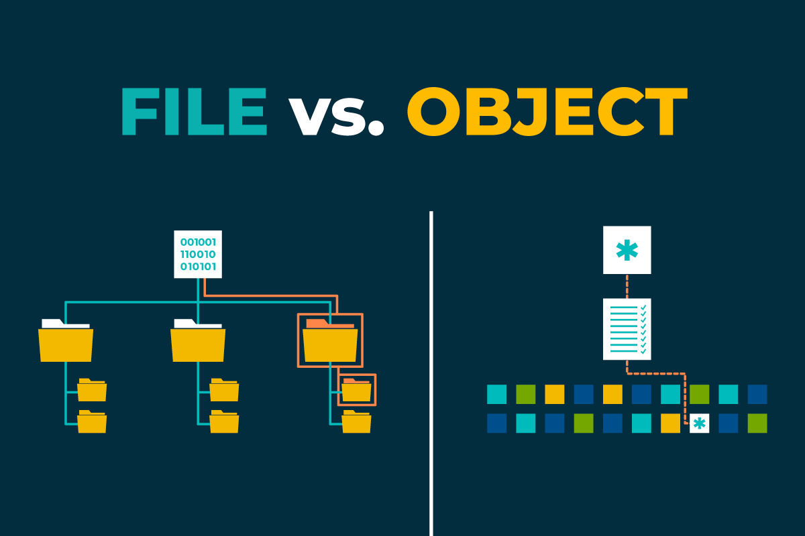
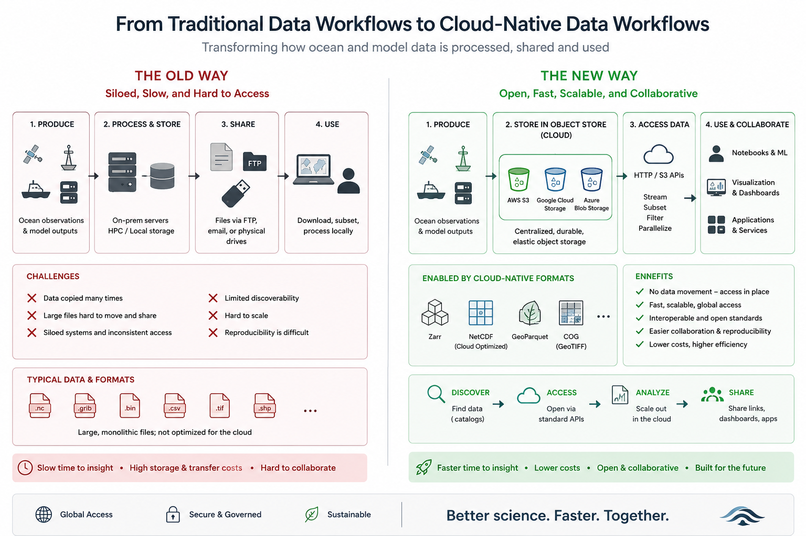

:::::::::::::::::::::::::::::::::::::::::: objectives

- "Explain what object storage is and how it differs from traditional file and block storage."
- "Describe why object storage is useful for sharing, durability, and parallel access."
- "Understand how to access cloud object stores (S3, GCS, Azure Blob) from Python."
- "Deploy a simple self-hosted S3-compatible object store (MinIO) using Docker."

::::::::::::::::::::::::::::::::::::::::::::::::::

::::::::::::::::::::::::::::::::::::::::::: questions

- "What is an object store, and how is it different from storing data on a server filesystem?"
- "Why is object storage a good fit for large-scale data sharing and cloud-native science?"
- "How does object storage support secure, concurrent, and parallel access?"
- "How can I use commercial cloud object stores and self-hosted solutions like MinIO?"

::::::::::::::::::::::::::::::::::::::::::::::::::

## What is object storage?

Object storage stores data as **objects** in a flat address space, usually inside **buckets**. Each object contains binary data plus metadata, such as content type or custom tags, and is identified by a unique key within a bucket rather than by a path in a nested directory tree.

This makes object storage different from:

- **File storage** (POSIX filesystems), which organises data in directories and files with paths.
- **Block storage**, which presents fixed-size blocks to operating systems and is typically used for disks and databases.

Object storage is designed for:

- Large numbers of relatively independent objects, such as files, datasets, tiles, or chunks.
- Access over APIs such as HTTP or S3, rather than local filesystem calls.
- Scalability and durability across many disks and nodes.

## Object storage and traditional servers

Traditional storage on a server usually means:

- A single machine, or a small cluster, with a local filesystem such as ext4 or XFS.
- Access through SSH, NFS, or mounted drives.
- Capacity and bandwidth that grow only when you add or upgrade hardware.
- Failover and redundancy that must often be managed manually.

Object storage systems, whether cloud-based or self-hosted, work differently:

- Data are spread across many disks and nodes, often across multiple availability zones or data centres.
- Users interact with the data through a uniform API, such as S3, GCS, or Azure Blob.
- Capacity can scale more smoothly by adding nodes.
- Durability is built in through replication or erasure coding.

For data-intensive science, this is especially useful because:

- Huge datasets can be stored as many independent chunks or files, such as Zarr chunks or NetCDF files.
- Applications and users can run on HPC systems, in the cloud, or on-premises and still access the same data over the network.

{alt="File vs Object Storage."}

## Advantages of object storage

### Sharing and durability

Object storage is widely used for sharing and archiving because it offers:

- **Global accessibility**: data can be accessed through URLs or API endpoints from anywhere with network connectivity.
- **Fine-grained access control**: identity and access management, bucket policies, ACLs, and signed URLs let you share specific objects or buckets securely.
- **High durability**: systems replicate or erasure-code data across multiple disks and nodes, and cloud providers often advertise very high durability figures.

Cloud providers such as AWS S3, Google Cloud Storage, Azure Blob, and S3-compatible services all provide:

- Bucket-based organisation.
- Per-object metadata and versioning options.
- Public or private access controls, including pre-signed URLs for time-limited downloads.

{alt="Cloud Object Storage Architecture."}

### Security and access control

Object stores implement security at several layers:

- **Authentication**: users and services authenticate with access keys, OAuth tokens, or service identities.
- **Authorisation**: policies, roles, and ACLs determine who can read, write, list, or manage data.
- **Encryption**: data can be encrypted at rest and in transit, and some systems also support client-side encryption.

### Parallel and concurrent access

Because object storage treats each object independently:

- Multiple clients can read and write different objects concurrently.
- Large datasets split into many chunks, such as Zarr chunks, can be accessed in parallel by many workers.
- Requests can be spread across multiple servers and disks, improving throughput compared to a single filesystem.

For parallel processing:

- Tools like Dask, Spark, or Beam can schedule tasks that read different chunks at the same time.
- Object store APIs often support high concurrency and range requests, which helps when fetching only part of a large object.

This is one reason why cloud-native formats such as Zarr are often paired with object stores.

### Cost and storage classes

Cloud object storage is often cheaper than traditional block storage or fully managed databases, especially for large datasets that are accessed infrequently. Providers offer different storage classes:

- **Frequent access**: for data that is read and written often, with higher performance and cost.
- **Infrequent access**: for data that is read less often, with lower storage cost but higher retrieval fees.
- **Archive / cold storage**: for data that is rarely accessed, with the lowest storage cost but higher retrieval latency and fees.

### Deployment trade-offs

The old way of storing research data was often to buy a server, attach disks, and share files over NFS or SSH. That can work well for small groups, but scaling usually means buying more hardware, managing backups manually, and accepting that performance and resilience depend on one machine or a small cluster.

Cloud object storage changes that model. You pay for storage, requests, and sometimes retrieval or egress, but you gain elastic capacity, high durability, and easy access from many systems. Different storage classes are designed for different access patterns.

Self-hosted object storage sits between those two models. If an institution already owns the hardware and has staff to operate it, the direct storage cost can be lower than cloud storage. But it also takes on hidden costs such as power, cooling, rack space, monitoring, upgrades, backups, and staff time.

{alt="Traditional workflows vs New workflows."}

:::::::::::::::::::::::::::::::::::::::::: callout

## Simple comparison

| Approach | Strengths | Trade-offs |
|---|---|---|
| Traditional server disks | Simple, familiar, low initial setup | Hard to scale, weaker durability, manual recovery, single-point-of-failure risk |
| Cloud object storage | Scales easily, durable, API-based, good for sharing | Ongoing storage, request, and egress costs |
| Self-hosted object storage | Keeps data local, good for sovereignty and internal workflows | Requires hardware, networking, operations, monitoring, and backup expertise |

For large scientific archives, the key question is not only “what is cheapest per terabyte?”, but also “what is cheapest and safest over the full life of the data?”

::::::::::::::::::::::::::::::::::::::::::::::::::

All the advantages of object storage make it a good fit for scientific data workflows, especially when combined with chunked formats like Zarr. The ability to store many independent objects, access them in parallel, and manage them through APIs allows researchers to build scalable, reproducible, and shareable data systems.

::::::::::::::::::::::::::::::::::::::: challenge

## Exercise 1 - Compare storage options for a workflow

Imagine your group needs to store a 10 TB Zarr dataset that is read often by several researchers.

1. Decide whether the dataset would be better suited to:
   - a traditional server filesystem,
   - cloud object storage,
   - or a self-hosted object store.
2. Write down two reasons for your choice.
3. Consider the following:
   - How often the data are accessed.
   - Whether multiple users need concurrent access.
   - Whether the data need to stay inside an institution.
   - Whether the group has staff to operate storage infrastructure.

Questions:

- Which option would be easiest to scale?
- Which option would be easiest to share securely?
- Which option would be most difficult to maintain over time?

::::::::::::::: solution

The answer will depend on the specific context of the group and their requirements. For example:
- If the dataset is accessed frequently by multiple researchers and needs to be shared securely, cloud object storage may be the best option due to its scalability and built-in access controls.
- If the dataset must remain within the institution due to data sovereignty concerns, a self-hosted object store may be preferable, provided the institution has the necessary staff and infrastructure to maintain it.
- If the dataset is small and accessed by a single researcher, a traditional server filesystem may suffice, but it may become difficult to scale and maintain over time.

:::::::::::::::::::::::::

::::::::::::::::::::::::::::::::::::::::::::::::::

## Accessing cloud object storage from Python

Common cloud object stores include AWS S3, Google Cloud Storage (GCS), Azure Blob Storage, and S3-compatible services such Cloudflare and JASMIN. Each has its own API and client libraries, but they all support S3-style access.

In Python, different providers have different client libraries, but for scientific workflows the most common pattern is to use S3-style access through `boto3`, `fsspec`, or `s3fs`:

- **`boto3`** for AWS S3 and S3-compatible services.
- **`fsspec` / `s3fs`** for opening remote filesystems from Python and xarray.
- **`gcsfs`** or provider-specific libraries for Google Cloud Storage.
- **`azure-storage-blob`** for Azure Blob.

In this lesson, we focus on S3-style access because it is widely supported and works well with Zarr and xarray. It is the same one that JASMIN and other HPC/cloud platforms use for object storage.

### Listing objects

For listing data in the object store, we will focus on `boto3` (AWS S3) and `fsspec`/`s3fs` (for xarray and Zarr).
To access a protected bucket, you first provide your credentials. In this workshop, those credentials are provided in the course materials.

```python
import os
import boto3

os.environ["AWS_ACCESS_KEY_ID"] = "your-access-key"
os.environ["AWS_SECRET_ACCESS_KEY"] = "your-secret-key"

s3 = boto3.client("s3")

bucket_name = "my-bucket"
response = s3.list_objects_v2(Bucket=bucket_name)

for obj in response.get("Contents", []):
    print(obj["Key"], obj["Size"])
```

If the bucket is private, the access key and secret key must be valid for that bucket. Once authenticated, you can list objects, inspect prefixes, and open Zarr stores if they are present.

These patterns generalise: once you know the bucket and object path, you can connect via the appropriate filesystem adapter and pass a mapper or URL to xarray or zarr.


:::::::::::::::::::::::::::::::::::::::::: callout

## Bucket policy

The bucket used in this workshop allows public read access to objects, so files can be accessed without AWS credentials. However, listing the contents of the bucket (ListBucket) requires valid credentials.

For the workshop, we provide credentials that grant participants read-only access to the bucket. This allows you to browse the bucket contents, list available objects, and access datasets such as Zarr stores, while preventing any modifications.

The bucket is configured with a policy similar to the example below:

```json
{
  "Version": "2012-10-17",
  "Statement": [
    {
      "Effect": "Allow",
      "Principal": "*",
      "Action": [
        "s3:GetObject",
        "s3:ListBucket"
      ],
      "Resource": [
        "arn:aws:s3:::my-bucket",
        "arn:aws:s3:::my-bucket/*"
      ]
    }
  ]
}
```

This approach provides a simple and secure way to share datasets with a group of users. Participants can discover and read data without requiring full access to the bucket or individual AWS accounts.

::::::::::::::::::::::::::::::::::::::::::::::::::

::::::::::::::::::::::::::::::::::::::: challenge

## Exercise 2 - Access the course bucket with credentials

In this exercise, use the course credentials to connect to the object store we are using in this workshop.

1. Load the credentials provided in the course materials.
2. Use `boto3` to list a few objects in the course bucket.

Questions:

- What prefixes or object names can you see?
- How does the organisation of the bucket reflect the data structure?
- How does accessing the bucket with credentials compare with mounting a filesystem?

::::::::::::::: solution

To access the course bucket, you can use the following Python code snippet. Make sure to replace `"your-access-key"` and `"your-secret-key"` with the actual credentials provided in the course materials.

```python
import os
import boto3

os.environ["AWS_ACCESS_KEY_ID"] = "your-access-key"
os.environ["AWS_SECRET_ACCESS_KEY"] = "your-secret-key"

s3 = boto3.client("s3")

bucket_name = "my-bucket"
response = s3.list_objects_v2(Bucket=bucket_name)

for obj in response.get("Contents", []):
    print(obj["Key"], obj["Size"])
```

Authenticated access to object storage is straightforward in Python once the credentials are set. Bucket and key naming reflect the organisation of the data, such as by variable, time, or dataset.

:::::::::::::::::::::::::

::::::::::::::::::::::::::::::::::::::::::::::::::

### Using xarray with a bucket

With the bucket and object path, you can open a Zarr store directly with xarray:

```python
import xarray as xr

ds = xr.open_zarr(
    "s3://my-bucket/path/to/store.zarr",
    storage_options={
        "key": os.environ["AWS_ACCESS_KEY_ID"],
        "secret": os.environ["AWS_SECRET_ACCESS_KEY"],
    },
)

print(ds)
```

These patterns generalise: once you know the bucket and object path, you can connect through the appropriate filesystem adapter and pass the URL or mapper to xarray or zarr.


::::::::::::::::::::::::::::::::::::::: challenge

## Exercise 3 - Access the course bucket with credentials

In the same object store that we listed in the previous exercise, we will now open a Zarr store with xarray and inspect its contents. This is a public object store and we can access it without credentials, but in a real-world scenario, you would need to provide valid credentials to access private buckets.
When you open the Zarr store, you can inspect the dimensions, variables, and basic metadata.

Questions:
- What variables are present in the Zarr store?
- What are the dimensions and shapes of the variables?
- What is the chunking layout of the data, and how does it relate to the object store structure?

::::::::::::::: solution

```python
import xarray as xr

ds = xr.open_zarr(
    "s3://my-bucket/path/to/store.zarr",
    storage_options={
        "key": os.environ["AWS_ACCESS_KEY_ID"],
        "secret": os.environ["AWS_SECRET_ACCESS_KEY"],
    },
)

print(ds)
```

In this example, you will see the variables, dimensions, and shapes of the Zarr store. You can explore the dataset further by accessing specific variables or performing computations on the data.

:::::::::::::::::::::::::

::::::::::::::::::::::::::::::::::::::::::::::::::

## Self-hosted object storage for institutions

Some institutions cannot or do not want to place all data in a commercial cloud. Common reasons include data sovereignty, procurement rules, local security requirements, network bandwidth constraints, and the desire to keep very large datasets close to on-premise compute systems.

In those settings, self-hosted object storage can be a strong option. It gives you the S3-style API that modern scientific tools expect, while keeping the data inside your own infrastructure. This is especially useful for universities, research institutes, and government organisations that already run their own servers, storage, and clusters.

### Why institutions choose this approach

- Keep sensitive or regulated data on-premises.
- Avoid moving large volumes of data over the public internet.
- Integrate object storage directly with local HPC or campus compute.
- Reuse existing procurement, monitoring, backup, and identity systems.
- Control costs by using hardware the institution already owns.

### What infrastructure is needed locally?

A production-ready object store is more than “just a server with a disk”. For a high-speed and reliable deployment, institutions usually need:

- Multiple storage nodes, not a single machine.
- Fast networking, ideally 10/25/100 GbE depending on scale.
- Redundant disks, typically SSD or NVMe for higher throughput, or carefully planned HDD tiers for colder data.
- Enough memory and CPU to support erasure coding, metadata handling, and many concurrent requests.
- Separate backup and monitoring systems.
- Stable power, cooling, and physical security.
- A plan for identity, access control, and certificate management.

:::::::::::::::::::::::::::::::::::::::::: callout

### Minimal MinIO deployment with Docker Compose

In class, we will not expect you to run these commands yourself. Instead, I will show how a self-hosted S3-compatible service such as MinIO could be deployed inside an institution's own infrastructure, so that you can see how the same tools and APIs work on-prem as well as in the cloud.

On a Linux server with Docker and Docker Compose installed:

Create a directory and a `docker-compose.yml`:

```yaml
services:
  minio:
    image: minio/minio:latest
    container_name: minio
    ports:
      - "9000:9000"  # S3 API
      - "9001:9001"  # Web UI
    environment:
      MINIO_ROOT_USER: minioadmin
      MINIO_ROOT_PASSWORD: minioadmin123
    volumes:
      - /data:/data   # bind mount for data
    command: server /data --console-address ":9001"
    restart: unless-stopped
```

Start MinIO:

```bash
docker compose up -d
```

Then:

- Open the web console at `http://<server-ip>:9001`.
- Log in with `minioadmin` / `minioadmin123` (change these in production!).
- Create a bucket (e.g. `example-bucket`).
- Upload a test file.

You now have a self-hosted S3-compatible object store.

You can use standard S3 tools (e.g. AWS CLI, `boto3`, `mc` MinIO client) to interact with this bucket, just pointing them at your MinIO endpoint (`http://<server-ip>:9000`).

::::::::::::::::::::::::::::::::::::::::::::::::::

## Organising data in buckets and objects

Whether you use cloud or self-hosted object storage, you need a sensible organisation scheme. Typical patterns:

- **Per project or product bucket** (e.g. `era5-reanalysis`, `spotter-archive`, `ifs-ens-forecast`).
- **Hierarchical prefixes in object keys** to represent logical structure, for example:
  - `variable/time/region/chunk.zarr`
  - `year/month/day/file.nc`
  - `model/experiment/member/store.zarr`

Design considerations:

- Make it easy to list all data for a given variable or time range.
- Align prefixes with common queries (e.g. `model/experiment` for CMIP6; `instrument/trajectory` for drifters).
- Avoid excessively deep or inconsistent naming; object storage does not require directories, but prefixes mimic them.

For Zarr stores:

- Each store typically resides under a single prefix (`path/to/store.zarr`), containing nested JSON metadata and data chunk objects.
- You may create separate stores for different variables, domains, or time ranges depending on data volumes and workflows.


::::::::::::::::::::::::::::::::::::::: challenge

## Exercise 3 - Design a bucket layout

Imagine you are responsible for storing:

- A global reanalysis (regular grid).
- A network of drifter trajectories (ragged arrays).
- An ensemble prediction system (with `member` dimension).

Propose a bucket and object key layout that:

1. Makes it easy to find data for a given product, variable, and time range.
2. Supports storing Zarr stores for gridded data.
3. Accommodates ragged and ensemble data in a clear way.

Write your proposed naming scheme (bucket names and key patterns) and share it with the group.

::::::::::::::: solution

Learners should propose patterns like:

- `reanalysis/<variable>/<year>/<month>/store.zarr` for gridded data.
- `drifters/<platform>/<trajectory>/data.zarr` for ragged data.
- `ens/<model>/<run>/<member>/store.zarr` for ensemble data.

They will gain practice in thinking about organisational schemes that work well with object storage's flat namespace and prefix listing.

:::::::::::::::::::::::::

::::::::::::::::::::::::::::::::::::::::::::::::::


:::::::::::::::::::::::::::::::::::::::::: keypoints

- "Object storage stores data as objects with keys and metadata in buckets, accessed via HTTP/S3-style APIs rather than local filesystems."
- "Cloud object stores (S3, GCS, Azure Blob, S3-compatible services) offer durable, scalable, and secure storage well suited to large scientific datasets."
- "Parallel and concurrent access are natural in object storage, making it a good fit for chunked formats and distributed processing frameworks."
- "Self-hosted object storage solutions like MinIO provide S3-compatible APIs and can be deployed with Docker on your own servers."
- "Thoughtful bucket and key organisation is essential for efficient data discovery and workflow design in the cloud."

::::::::::::::::::::::::::::::::::::::::::::::::::
