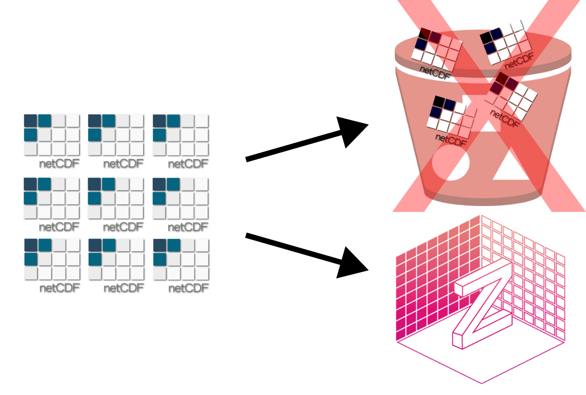
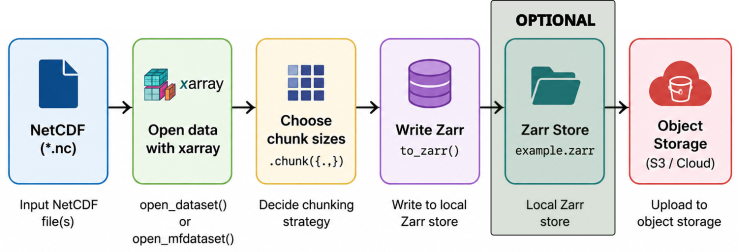

:::::::::::::::::::::::::::::::::::::::::: objectives

- "Explain the main steps in converting NetCDF datasets to Zarr."
- "Choose appropriate chunking strategies for the target Zarr dataset."
- "Use xarray, Dask, and `to_zarr` to convert NetCDF to Zarr in parallel."
- "Upload Zarr stores to object storage and verify basic analyses on the converted data."

::::::::::::::::::::::::::::::::::::::::::::::::::

::::::::::::::::::::::::::::::::::::::::::: questions

- "Why convert NetCDF data to Zarr, and what changes in the way we access and process data?"
- "How do we choose chunk sizes for Zarr when starting from NetCDF files?"
- "How can we use Dask and xarray to convert and write data to Zarr efficiently?"
- "How do we test that the converted data is usable and correct (e.g. computing mean values)?"

::::::::::::::::::::::::::::::::::::::::::::::::::


## Why convert NetCDF to Zarr?

NetCDF is widely used for ocean, climate, and meteorological data and works well on local filesystems and HPC storage.
However, as datasets grow and we move to cloud and parallel computing, Zarr offers several advantages:

- Chunked storage aligned with object stores and HTTP/S3 access.
- Easy parallel reads/writes of chunks by Dask or other frameworks.
- Flexible layout for large collections (many NetCDF files → one Zarr dataset).

Converting NetCDF to Zarr does not change the scientific content, but it changes how data is organised and accessed, enabling cloud-native workflows and more efficient analysis at scale.

{alt="NetCDF needs to be converted to Zarr for cloud-native workflows."}

### Converting from NetCDF to Zarr with xarray

To convert NetCDF to Zarr, we typically use xarray's `to_zarr` method, optionally with Dask for parallelism. The following example uses the `data/era5_sst/ocean_temperature.nc` dataset:

1. Open data netCDF dataset with xarray:

```python
import xarray as xr
base_path = "/gws/ssde/j25b/atlantis_vis/cloud-native-geoscience-course/" # or "" if you have the data in your current working directory
ds_nc = xr.open_dataset(f"{base_path}data/era5_sst/ocean_temperature.nc")
print(ds_nc)
```

2. Decide how the dataset should be chunked

The chunking scheme should match the way the data will be used later. A simple example chunking choice might look like this:

```python
ds_nc = ds_nc.chunk({"valid_time": 10, "latitude": 100, "longitude": 100})
print(ds_nc.chunks)
```

3. Write the Zarr store

Once the chunking looks right, write the dataset to Zarr.

```python
ds_nc.to_zarr("data/example.zarr", mode="w")
```

Now you have a local Zarr store that can be uploaded to object storage and accessed in parallel by multiple clients:

```python
ds_zarr = xr.open_zarr("data/example.zarr")
print(ds_zarr)
```

::::::::::::::::::::::::::::::::::::::: challenge

## Exercise 1 - Convert a NetCDF dataset to Zarr

Using the NetCDF dataset provided (`data/era5_sst/ocean_temperature.nc`), open a single file with `open_dataset`, chunk it with `{"valid_time": 10, "latitude": 100, "longitude": 100}`, and write it to a local Zarr store.

Then, reopen the Zarr store and verify that the dimensions and variables match the original NetCDF dataset, and if the chunking is as expected.

::::::::::::::: solution

```python
import xarray as xr

base_path = "/gws/ssde/j25b/atlantis_vis/cloud-native-geoscience-course/" # or "" if you have the data in your current working directory

ds_nc = xr.open_dataset(f"{base_path}data/era5_sst/ocean_temperature.nc")
ds_nc = ds_nc.chunk({"valid_time": 10, "latitude": 100, "longitude": 100})
ds_nc.to_zarr("data/example.zarr", mode="w")
```

```python
ds_zarr = xr.open_zarr("data/example.zarr")
print(ds_zarr)
```

:::::::::::::::::::::::::

::::::::::::::::::::::::::::::::::::::::::::::::::


## Overall workflow: NetCDF → Zarr → object store

In the real world, the conversion of NetCDF to Zarr is often done in a workflow that includes the following typical steps:

1. **Understand the NetCDF input**: check variables, dimensions, coordinates, and chunking.
2. **Decide chunking strategy for Zarr**: based on expected access patterns and approximate chunk sizes in MB.
3. **Open NetCDF with xarray**: using `open_dataset` or `open_mfdataset` for multiple files.
4. **Apply chunking and encoding**: use `.chunk()` and define any compression or encoding options.
5. (Optional) **Write Zarr to local storage**: using `Dataset.to_zarr()`, possibly with Dask for parallel writes.
6. **Upload Zarr store to object storage**: using cloud CLI tools or filesystem libraries, or directly write to object storage with fsspec.
7. **Verify by reopening from object storage and running analyses** (e.g. computing mean values).

We'll walk through these steps conceptually and via exercises. For the example below, we will use a subset of the [GLORYS Reanalysis dataset](https://data.marine.copernicus.eu/product/GLOBAL_MULTIYEAR_PHY_001_030/description). The data is located in the `data/glorys/` directory and is provided as multiple NetCDF files, one per day. The goal is to convert this collection of NetCDF files into a single Zarr store that can be accessed efficiently in parallel.

{alt="Pipeline diagram from NetCDF ingest to chunking, Zarr writing, validation, and cloud publication."}

## Step 1 - Inspect NetCDF inputs

Before converting, inspect the NetCDF file(s) you plan to convert.

Example of opening a single NetCDF file:

```python
import xarray as xr

ds_nc = xr.open_dataset(f"{base_path}data/glorys/glorys_20260501.nc")
print(ds_nc)
print(ds_nc.dims)
print(ds_nc.data_vars)
print(ds_nc.coords)
print(ds_nc.encoding)  # may show chunking and compression info
```

Questions to answer:

- Are there multiple files (e.g. one per time slice) or just a single file?
- Which dimensions are present (e.g. `time`, `lat`, `lon`, `depth`, `member`)?
- Are variables chunked already, and if so, how?
- Are all files consistent in terms of variables and coordinates if you plan to use `open_mfdataset`?

Because we have multiple NetCDF files, we can use `open_mfdataset` to open them all at once:

```python
ds_nc_multi = xr.open_mfdataset(
    f"{base_path}data/glorys/*.nc",
    combine="by_coords",
)
print(ds_nc_multi)
```

It is important to mention that `open_mfdataset` will combine multiple files into a single xarray dataset, but it requires that the variables and coordinates are consistent across files. And we are not loading the data into memory yet. Xarray will lazily load data as needed.

## Step 2 - Decide chunking strategy for Zarr

Chunks in Zarr have a major impact on performance. A common rule of thumb is to aim for compressed chunk sizes in the range of 10-100 MB, but exact choices depend on workloads and hardware.

Consider:

- Dimensions: which ones correspond to time, space, depth, ensemble member?
- Workloads: time series at points, spatial means, regional subsets, ensemble statistics.
- Storage: local HPC disk vs object store, network bandwidth, parallel framework (Dask).

Example chunk strategy for a dataset with dimensions `(time, latitude, longitude, depth)`:

- If time series are common: `{"time": 360, "latitude": 100, "longitude": 100, "depth": 1}`.
- If spatial maps per time are common: `{"time": 1, "latitude": 361, "longitude": 720, "depth": 1}`.
- If depth slices are common: `{"time": 1, "latitude": 100, "longitude": 100, "depth": 10}`.

You can experiment with different chunk shapes and use Dask's dashboard and performance measurements to refine choices.

## Step 3 - Convert NetCDF to Zarr with xarray and Dask

Once chunking decisions are made, you can use xarray's `to_zarr` method to write out the dataset. This can be done serially or in parallel using Dask. For large datasets, parallel writing is often necessary to avoid long runtimes.

First, create a Dask client to manage parallelism:

```python
from dask.distributed import Client
import xarray as xr

client = Client(n_workers=2, threads_per_worker=2)
```

Then, open the NetCDF dataset and apply chunking:

```python
ds_nc = xr.open_mfdataset(f"{base_path}data/glorys/*.nc", combine="by_coords")

# Choose chunking
ds_chunked = ds_nc.chunk({"time": 5, "latitude": 400, "longitude": 400, "depth": 10})
```

Now you can write the chunked dataset to Zarr. You can choose to consolidate metadata for faster reads later:

```python
ds_chunked.to_zarr("data/glorys.zarr", mode="w", consolidated=True)
```

Open the Zarr store to verify:

```python
ds_zarr = xr.open_zarr("data/glorys.zarr", consolidated=True)
print(ds_zarr)
```

:::::::::::::::::::::::::::::::::::::::::: callout

## Consolidated metadata

When writing a Zarr store, you can choose to consolidate metadata. This means the store writes a single metadata index file, that collects the metadata for all arrays and attributes in one place.

This is useful because opening the dataset can be faster, especially when the store has many variables or many chunks. Instead of reading lots of small metadata files one by one, xarray can read the consolidated metadata in a single step.

A good practice is to use consolidated metadata when the dataset will be read many times after writing, especially in cloud or object-store workflows. It is usually a good default for analysis-ready Zarr stores.

::::::::::::::::::::::::::::::::::::::::::

:::::::::::::::::::::::::::::::::::::::::: callout

## Encoding and compression

When writing Zarr stores, you can choose how each variable is encoded and compressed. In most teaching and analysis workflows, the goal is not to maximise compression at all costs, but to choose a strategy that balances file size, speed, and ease of reading.

A simple example looks like this:

```python
import zarr
from zarr.codecs import BloscCodec, BloscShuffle
import xarray as xr

ds = xr.open_dataset(f"{base_path}data/era5_sst/ocean_temperature.nc")
compressor = BloscCodec(cname="zstd", clevel=3, shuffle=BloscShuffle.shuffle)
encoding = {
    "sst": {
        "compressors": compressor,
        "chunks": (10, 100, 100),
    }
}

ds.to_zarr(
    "data/example_compressed.zarr",
    mode="w",
    encoding=encoding,
    consolidated=True,
)
```

In this example:
- `zstd` gives good compression with reasonable speed.
- `clevel=3` is a moderate compression level, which is often a good compromise between speed and size.
- `shuffle=2` usually improves compression for many numerical datasets.
- The same compressor is applied to each data variable through the `encoding` dictionary.

For scientific data, moderate compression is often a good default because it reduces storage size, lower network transfer costs, and keeps read/write speeds reasonable. Very aggressive compression can save more space, but it may slow down writing and reading. For large workflows, that trade-off is often not worth it.

::::::::::::::::::::::::::::::::::::::::::


## Step 4 - Upload Zarr to object storage

After successfully writing Zarr locally, you can upload the Zarr directory store to an object store (AWS S3, GCS, MinIO, etc.).

The following example uses [s3cmd](https://s3tools.org/s3cmd), which is a command-line tool for interacting with S3-compatible object stores. You can also use other tools like `awscli`, `rclone`, or Python libraries like `boto3` or `fsspec`.

```bash
# Create a bucket (if it doesn't exist)
s3cmd mb s3://my-bucket

# Upload the Zarr store recursively
s3cmd put -r data/glorys.zarr s3://my-bucket/glorys.zarr
```

Once uploaded, you can access the Zarr store directly from the object store using xarray and filesystem adapters, as in previous lessons.

In our lesson here, instead of generating the zarr dataset locally and upload then later to the object store, we will directly write the zarr dataset to the object store using `fsspec`. This is a more efficient approach and avoids unnecessary local storage usage. In the code below, remember to replace `my-bucket` with the actual bucket name you have access to (please ask the instructor for the bucket name and credentials).

Because the dataset is large, we will use the JASMIN dask cluster to run the conversion and upload, as it has better network access to the object store. You can see an example below, but you can also take a look in the [Parallel Processing for Zarr](./07-parallel.html) episode for more details.

Create a connection to dask-gateway and start a cluster:

```python
import dask_gateway

# Create a connection to dask-gateway.
gw = dask_gateway.Gateway("https://dask-gateway.jasmin.ac.uk", auth="jupyterhub")

options = gw.cluster_options()
options.worker_cores = 4
options.scheduler_cores = 2
options.account = "workshop"
options.worker_setup='source /apps/jasmin/jaspy/miniforge_envs/jaspy3.11/mf3-23.11.0-0/bin/activate /work/scratch-nopw2/tobfer/cloud-native-geoscience-course'
clusters = gw.list_clusters()
if not clusters:
    cluster = gw.new_cluster(options, shutdown_on_close=False)
else:
   cluster = gw.connect(clusters[0].name)
client = cluster.get_client()
cluster.adapt(minimum=1, maximum=4)
```

Create a mapper for the object store:

```python
import xarray as xr
import fsspec
import os

store_url = "s3://my-bucket/glorys.zarr"

# remember to set the AWS_ACCESS_KEY_ID and AWS_SECRET_ACCESS_KEY environment variables with your credentials
os.environ["AWS_ACCESS_KEY_ID"] = "your-access-key"
os.environ["AWS_SECRET_ACCESS_KEY"] = "your-secret-key"

storage_options = {
    "key": os.environ["AWS_ACCESS_KEY_ID"],
    "secret": os.environ["AWS_SECRET_ACCESS_KEY"],
    "client_kwargs": {"endpoint_url": "https://atlantis-vis-o.s3-ext.jc.rl.ac.uk"},
    # The `config_kwargs` is required for JASMIN S3 object store.
    "config_kwargs": {
        "request_checksum_calculation": "when_required",
        "response_checksum_validation": "when_required",
    },
}

# Create a mapper for the object store
mapper = fsspec.get_mapper(
    store_url,
    **storage_options,
)
```

Write the dataset directly to the object store:

```python
ds_chunked.to_zarr(
    mapper,
    mode="w",
    consolidated=True,
)
```

## Step 5 - Verify with a simple analysis

To verify that the converted Zarr dataset is usable, run a simple analysis, such as computing a mean value. Example:

```python
import xarray as xr
import fsspec

# Replace `my-bucket` with the actual bucket name you have access to.
mapper = fsspec.get_mapper(
    store_url,
    **storage_options,
)
ds_zarr = xr.open_zarr(mapper, consolidated=True)

# You can also access the dataset directly, as it is in a public bucket (replace with your own bucket if needed):
ds_zarr = xr.open_zarr("https://atlantis-vis-o.s3-ext.jc.rl.ac.uk/my-bucket/glorys.zarr", consolidated=True)

# Choose a variable
var = ds_zarr["zos"]

# Mean for each time step (global spatial mean)
mean_per_time = var.mean(dim=("latitude", "longitude")).compute()
print(mean_per_time)

# Mean for each latitude/longitude location (time mean)
mean_per_latlon = var.mean(dim="time").compute()
print(mean_per_latlon)
```

::::::::::::::::::::::::::::::::::::::: challenge

## Exercise 2 - Understand your NetCDF dataset

For the exercises 2-5, we are going to work with the subset of the [ERA5 Reanalysis dataset](https://cds.climate.copernicus.eu/datasets/reanalysis-era5-single-levels) related to the variable `swh` (significant wave height). The dataset is provided as multiple NetCDF files, one per day, in the `data/daily_swh/` directory.

Using the NetCDF dataset(s) provided on the server:

1. Open a single file with `open_dataset` and print:
   - Dimensions and coordinates.
   - Data variables.
   - Encoding information (especially chunking).
2. Then, open multiple files with `open_mfdataset` and verify:
   - Consistency of variables and coordinates.
   - Combined time dimension length.

What are the main variables and dimensions you care about, and what is the existing chunking layout (if any)?

::::::::::::::: solution

Open a single NetCDF file:

```python
import xarray as xr
ds_nc = xr.open_dataset(f"{base_path}data/daily_swh/swh_2025-01-01.nc")
print(ds_nc.dims)
print(ds_nc.data_vars)
print(ds_nc.coords)
print(ds_nc.encoding)
```

Open multiple NetCDF files:

```python
ds_nc = xr.open_mfdataset(
    f"{base_path}data/daily_swh/swh_*.nc",
    combine="by_coords",
)
print(ds_nc.dims)
print(ds_nc.data_vars)
print(ds_nc.coords)
```

Now you should have a clear picture of the input data: variables, dimensions, coordinates, and any existing chunking or compression. This understanding is essential before deciding a Zarr chunk layout or doing any conversion.

:::::::::::::::::::::::::

::::::::::::::::::::::::::::::::::::::::::::::::::

::::::::::::::::::::::::::::::::::::::: challenge

## Exercise 3 - Propose Zarr chunk sizes

Based on your NetCDF dataset and expected workloads:

1. Propose a chunk dictionary, e.g. `{"time": 720, "lat": 100, "lon": 100}` or similar.
2. Estimate (roughly) the size of each chunk in bytes/MB (using variable sizes and dimension lengths).
3. Explain how your chunk choices support your intended analyses.

You do not need exact numbers. Focus on reasoning.

::::::::::::::: solution

```python
# Example chunk proposal
chunking = {"time": 720, "latitude": 100, "longitude": 100}

chunk_size_bytes = (
    ds_nc["swh"].dtype.itemsize  # bytes per element
    * chunking["time"]
    * chunking["latitude"]
    * chunking["longitude"]
)
chunk_size_MB = chunk_size_bytes / (1024 ** 2)
print(f"Estimated chunk size: {chunk_size_MB:.2f} MB")
```

After calculating the estimated chunk size, you can reason about how this chunking supports your analysis:

```python
ds_chunked = ds_nc.chunk(chunking)
```

You'd propose reasonable chunk sizes that reflect your workloads and aim for manageable chunk sizes.
You will practice linking chunk shapes to analysis patterns, preparing for actual conversion.

:::::::::::::::::::::::::

::::::::::::::::::::::::::::::::::::::::::::::::::


::::::::::::::::::::::::::::::::::::::: challenge

## Exercise 4 - Convert your NetCDF dataset to Zarr in object storage

After opening and chunking the NetCDF dataset, convert it to Zarr and write it directly to the object store using `fsspec`.

Please use the credentials provided by the instructor to access the object store. For this exercise, use the JASMIN Dask cluster (or the local Cluster) to perform the conversion and upload, as it provides better network access to the object store. You can refer to the [Parallel Processing for Zarr](./07-parallel.html) episode for more details.

Once the conversion is complete, reopen the dataset from the object store and verify that it can be read correctly.

Questions:

- How long did the conversion and upload take?
- Does the size of the Zarr store seem reasonable compared to the original NetCDF files?
- Were there any variables or attributes you needed to drop or adjust?
- Does the reopened dataset have the expected dimensions, variables, and attributes?

::::::::::::::: solution

First, create a Dask cluster and connect a client. You can use a local Cluster:

```python
from dask.distributed import Client

client = Client(n_workers=2, threads_per_worker=2)
```

Or a JASMIN Dask cluster:

```python
import dask_gateway

# Create a connection to dask-gateway.
gw = dask_gateway.Gateway(
    "https://dask-gateway.jasmin.ac.uk",
    auth="jupyterhub",
)

options = gw.cluster_options()
options.worker_cores = 2
options.scheduler_cores = 1
options.account = "workshop"
options.worker_setup = (
    "source /apps/jasmin/jaspy/miniforge_envs/jaspy3.11/"
    "mf3-23.11.0-0/bin/activate "
    "/work/scratch-nopw2/tobfer/cloud-native-geoscience-course"
)

clusters = gw.list_clusters()
if not clusters:
    cluster = gw.new_cluster(options, shutdown_on_close=False)
else:
    cluster = gw.connect(clusters[0].name)

client = cluster.get_client()
cluster.adapt(minimum=1, maximum=4)
```

Then convert the dataset directly to object storage and reopen it:

```python
import os
import xarray as xr
import fsspec

storage_options = {
    "key": os.environ["AWS_ACCESS_KEY_ID"],
    "secret": os.environ["AWS_SECRET_ACCESS_KEY"],
    "client_kwargs": {
        "endpoint_url": "https://atlantis-vis-o.s3-ext.jc.rl.ac.uk",
    },
    "config_kwargs": {
        "request_checksum_calculation": "when_required",
        "response_checksum_validation": "when_required",
    },
}

store_url = "s3://my-bucket/era5_swh.zarr"
mapper = fsspec.get_mapper(
    store_url,
    **storage_options,
)

ds_chunked.to_zarr(
    mapper,
    mode="w",
    consolidated=True,
)

ds_zarr = xr.open_zarr(
    mapper,
    consolidated=True,
)

print(ds_zarr)
```

Writing directly to object storage avoids creating an intermediate local copy and reflects a typical cloud-native workflow. Reopening the dataset verifies that the conversion completed successfully and that the dataset structure and metadata have been preserved.

The time taken for conversion and upload will depend on the dataset size, chunking, network speed, and cluster resources. You can use Dask's dashboard to monitor progress and performance.

:::::::::::::::::::::::::

::::::::::::::::::::::::::::::::::::::::::::::::::


::::::::::::::::::::::::::::::::::::::: challenge

## Exercise 5 - Check consistency and compute a mean

Using both the original NetCDF files dataset (`ds_nc`) and the converted Zarr dataset (`ds_zarr` from object storage):

1. Compute the same statistic in both cases (e.g. global mean temperature at a given time):
2. Compare the results for equality (or near-equality within floating point tolerance).
3. Compare the time taken to open the dataset and compute the statistic in both cases.

::::::::::::::: solution

```python
import time

# NetCDF
t0 = time.time()
ds_nc = xr.open_mfdataset(f"{base_path}data/daily_swh/swh_*.nc", combine="by_coords")
var_nc = ds_nc["swh"]
# slice to a single time step for comparison
var_nc = var_nc.isel(time=0)
t1 = time.time()
mean_nc = var_nc.mean(dim=("latitude", "longitude"))

t2 = time.time()
print("NetCDF mean:", float(mean_nc.values))
print("Time to open NetCDF files:", t1 - t0, "seconds")
print("Time taken for NetCDF computation:", t2 - t1, "seconds")
print("Total time for NetCDF:", t2 - t0, "seconds")

# Zarr
t0 = time.time()
ds_zarr = xr.open_zarr("https://atlantis-vis-o.s3-ext.jc.rl.ac.uk/my-bucket/era5_swh.zarr", consolidated=True)
var_zarr = ds_zarr["swh"]
var_zarr = var_zarr.isel(time=0)
t1 = time.time()
mean_zarr = var_zarr.mean(dim=("latitude", "longitude"))
mean_zarr = mean_zarr.compute()
t2 = time.time()
print("Zarr mean:", float(mean_zarr.values))
print("Time to open Zarr store:", t1 - t0, "seconds")
print("Time taken for Zarr computation:", t2 - t1, "seconds")
print("Total time for Zarr:", t2 - t0, "seconds")
```

When done carefully, converting NetCDF to Zarr and back preserves scientific values. The mean values should match within floating point tolerance, confirming that the conversion workflow is valid.

:::::::::::::::::::::::::

::::::::::::::::::::::::::::::::::::::::::::::::::

:::::::::::::::::::::::::::::::::::::::::: keypoints

- "Converting NetCDF to Zarr enables cloud-native, chunked, and parallel-friendly access to large scientific datasets."
- "Effective conversion requires understanding input data, choosing chunk sizes based on workloads, and using xarray's `to_zarr` with appropriate encoding and compression."
- "Dask can parallelise the conversion process, making it feasible to handle large collections of NetCDF files."
- "Uploading Zarr stores to object storage allows distributed teams and tools to access the same datasets efficiently."
- "Checking basic statistics (e.g. mean values) in NetCDF and Zarr versions helps verify that conversions preserve scientific content."

::::::::::::::::::::::::::::::::::::::::::::::::::
