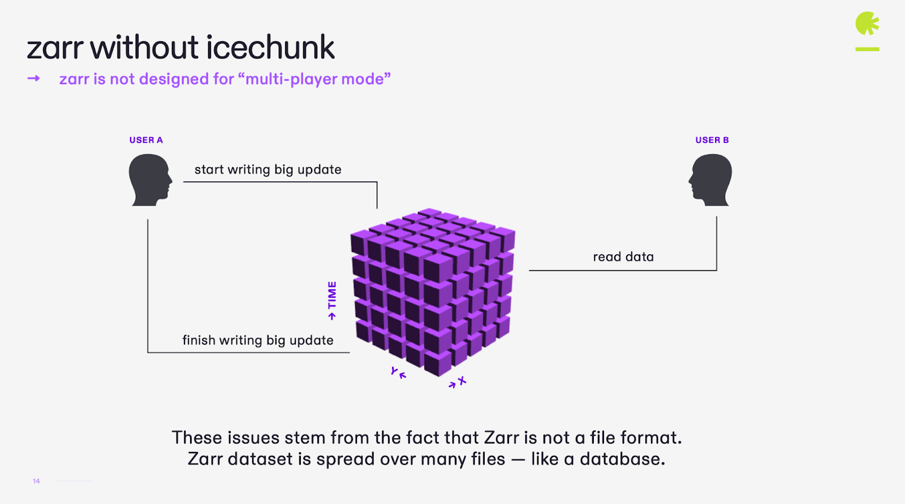
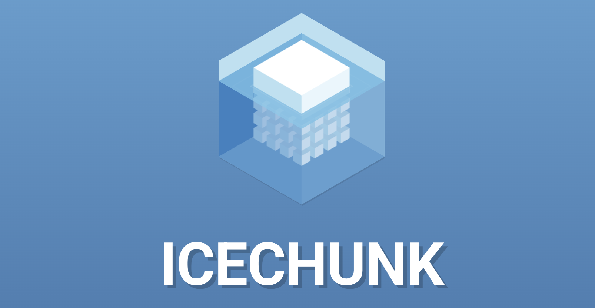
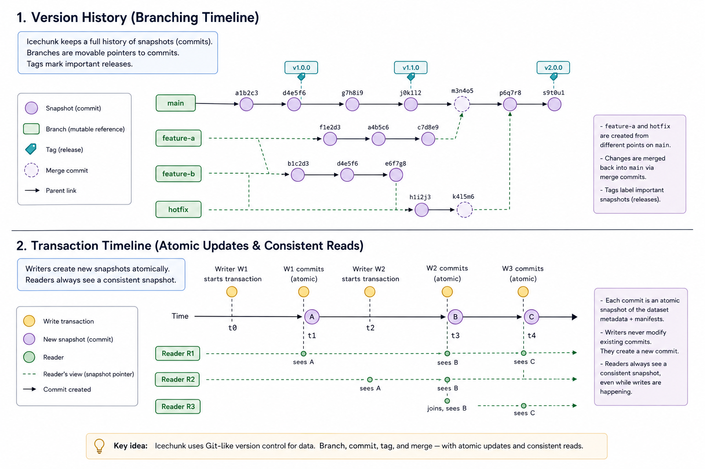

:::::::::::::::::::::::::::::::::::::::::: objectives

- Explain why versioning is important for Zarr-based scientific datasets.
- Describe Icechunk's core concepts: repositories, transactions, snapshots, branches, and tags.
- Use Icechunk with Zarr to perform atomic updates and create reproducible versions.
- Recover from mistakes and open specific versions of a dataset.

::::::::::::::::::::::::::::::::::::::::::::::::::

::::::::::::::::::::::::::::::::::::::::::: questions

- What problems arise when we use plain Zarr for shared, evolving datasets?
- How does Icechunk add safety, consistency, and reproducibility on top of Zarr?
- How can we use transactions to update data atomically and avoid partial writes?
- How can we reference and replay specific versions of data for reproducible analysis?

::::::::::::::::::::::::::::::::::::::::::::::::::

## Why data versioning matters

Zarr is a strong format for cloud and parallel data access, but by itself it does not provide transactions, version history, or a built-in way to recover from mistakes.

That can be a problem for shared scientific datasets. If several people are updating data, readers may see incomplete changes, accidental overwrites can be hard to recover from, and analyses can become difficult to reproduce later.

Icechunk adds version control on top of Zarr. It lets you manage data in a repository with transactions, snapshots, branches, and tags, so you can update data atomically, recover from mistakes, and refer to exact versions in future analysis.

{alt="Zarr without Icechunk."}



## Core concepts

Icechunk wraps Zarr stores inside **repositories** that track changes over time.

- **Repository**: the top-level object managing a Zarr hierarchy plus version history.
- **Transaction**: an atomic write session where multiple updates happen together; either all succeed or none do.
- **Snapshot**: an immutable version of the data after a transaction completes.
- **Branch**: a named line of development, such as `main` or `dev`.
- **Tag**: a human-readable label pointing to a specific snapshot, useful for reproducible references.

The main idea is simple: writes happen in transactions, commits create snapshots, and readers open read-only sessions that always see a complete version of the dataset.

:::::::::::::::::::::::::::::::::::::::::: callout

## Comparison of plain Zarr vs Icechunk

The example was adapted from the [Earth Mover Github repository](https://github.com/earth-mover/zarr-summit-2025) and shows how Icechunk adds versioning and transactional semantics to Zarr.

In the backend, I have a Zarr and a Icechunk repository that are being updated in a loop, following the same pattern.

If you try to read the plain zarr store while it is being updated, you will see a mix of old and new data:

```python
import matplotlib.pyplot as plt
import zarr

# Get all the zarr array values
store = zarr.storage.FsspecStore.from_url("s3://zarr-summit-italy-public/zarr3", storage_options={'anon': True})
root = zarr.open_group(store=store, mode='r')
arr = root['image']
img_data = arr[:]

# Plot the data
plt.imshow(img_data)
plt.axis('off')
plt.show()
```

If you try to read the Icechunk store while it is being updated, you will see either the old snapshot or the new snapshot, but never a mix.

```python
import matplotlib.pyplot as plt
import zarr
import arraylake as al

# Log in to arraylake
client = al.Client()

# Open the Icechunk repo from the arraylake catalog
ic_repo = client.get_repo("earthmover-demos/zarr-summit-2025")

# Start a read-only icechunk session
session = ic_repo.readonly_session("main")

# Get the zarr store
store = session.store

# Get all the zarr array values
root = zarr.open_group(store=store, mode='r')
arr = root['image']
img_data = arr[:]

# Plot the data
plt.imshow(img_data)
plt.axis('off')
plt.show()
```

This shows that Icechunk provides a safe, consistent, and reproducible way to manage evolving Zarr datasets, making it suitable for collaborative scientific workflows.


::::::::::::::::::::::::::::::::::::::::::::::::::

::::::::::::::::::::::::::::::::::::::: challenge

## Exercise 1 - Map Git concepts to Icechunk

Before writing any code:

1. In small groups, map familiar Git concepts to Icechunk:
   - Git repository → Icechunk repository.
   - Git commit → Icechunk snapshot.
   - Git branch → Icechunk branch.
   - Git tag → Icechunk tag.
2. Discuss how these concepts help you reason about data changes over time.
3. Discuss how “time travel” supports reproducibility.

Write a short summary of your mapping and keep it handy for later exercises.

::::::::::::::: solution

Icechunk brings familiar version control ideas into the realm of multidimensional scientific data.

:::::::::::::::::::::::::

::::::::::::::::::::::::::::::::::::::::::::::::::

## Basic Icechunk workflow

A common workflow with Icechunk is:

1. Configure access to your object store.
2. Create or open an Icechunk repository in that object store.
3. Start a writable session on a branch such as `main`.
4. Add data to the repository, either by writing a dataset directly or by creating a virtual layer over an existing Zarr store.
5. Commit the session to create a snapshot.
6. Open the repository again in read-only mode for analysis.

### Add an Icechunk layer on top of an existing Zarr store

For this lesson, we will start with one example Zarr dataset already stored in the object store. That dataset will be the basis for the exercises, so learners can see how Icechunk is used to version an existing scientific store rather than starting from scratch.

In this example, the source Zarr store already exists at `s3://my-bucket/existing/example.zarr`, and we create an Icechunk repository that points to it.


#### Step 1 - Connecting to the object store

```python
import os
import xarray as xr
import icechunk as ic

os.environ["AWS_ACCESS_KEY_ID"] = "your-access-key"
os.environ["AWS_SECRET_ACCESS_KEY"] = "your-secret-key"
os.environ["AWS_DEFAULT_REGION"] = "us-east-1"
```

#### Step 2 - Opening the example Zarr store

If the example store is already in the object store, open it with xarray as usual:

```python
example_zarr = "s3://my-bucket/example-data.zarr"

ds = xr.open_zarr(
    example_zarr,
    storage_options={
        "key": os.environ["AWS_ACCESS_KEY_ID"],
        "secret": os.environ["AWS_SECRET_ACCESS_KEY"],
        "client_kwargs": {"region_name": "us-east-1"},
    },
)
print(ds)
```

### Step 3 - Adding Icechunk to the store

Once the example dataset is open, create or open an Icechunk repository in the object store and add the Zarr data to it. Icechunk also supports existing Zarr stores through its virtual dataset workflow, which is the right pattern when you want to layer versioning onto data that already exists.

```python
import icechunk as ic
from virtualizarr import open_virtual_dataset
from virtualizarr.parsers import ZarrParser
from obstore.store import from_url
from obspec_utils.registry import ObjectStoreRegistry

source_bucket = "s3://my-bucket/"
source_zarr = "s3://my-bucket/example-data.zarr"

repo_bucket = "my-bucket"
repo_prefix = "icechunk-repo"

source_store = from_url(source_bucket, region="us-east-1")
registry = ObjectStoreRegistry({source_bucket: source_store})

virtual_ds = open_virtual_dataset(
    url=source_zarr,
    parser=ZarrParser(),
    registry=registry,
)

storage = ic.s3_storage(
    bucket=repo_bucket,
    prefix=repo_prefix,
    from_env=True,
)

config = ic.RepositoryConfig.default()
config.set_virtual_chunk_container(
    ic.virtual.VirtualChunkContainer(
        source_bucket,
        ic.storage.s3_store(region="us-east-1"),
    )
)

credentials = ic.credentials.containers_credentials(
    {
        source_bucket: ic.credentials.s3_credentials(
            access_key_id=os.environ["AWS_ACCESS_KEY_ID"],
            secret_access_key=os.environ["AWS_SECRET_ACCESS_KEY"],
            region="us-east-1",
        )
    }
)

repo = ic.Repository.create(storage, config, credentials)

session = repo.writable_session("main")
virtual_ds.vz.to_icechunk(session.store)
snapshot_id = session.commit("Add example Zarr store to Icechunk")
print("Committed snapshot:", snapshot_id)
```

After this, the Zarr store is managed through Icechunk, and the repository now has a version history.

### Step 4 - Reading from the `main` branch


```python
ro_session = repo.readonly_session("main")
ds_main = xr.open_zarr(ro_session.store)
print(ds_main)
```

This is the normal read path for analysis. Readers get a complete snapshot rather than a dataset that might be mid-update.


::::::::::::::::::::::::::::::::::::::: challenge

## Exercise 2 - Open the example store and add Icechunk

Using the example Zarr store:

1. Open the store with xarray.
2. Create an Icechunk repository in the object store.
3. Add the Zarr store to Icechunk.
4. Reopen the dataset from `main`.
5. Compare the result with the original store.

Questions:

- What changes when the store is managed by Icechunk?
- What do you gain by reading from a branch instead of a raw Zarr path?

::::::::::::::: solution

Learners should see that the scientific data do not change, but the repository now has version history, branches, and snapshots.

:::::::::::::::::::::::::

::::::::::::::::::::::::::::::::::::::::::::::::::

## Making an atomic update

Icechunk transactions let you update several variables together and commit them as one version.

```python
import zarr
import numpy as np

with repo.transaction("main", message="Update temperature and pressure") as store:
    root = zarr.open_group(store)
    root["temperature"][0, :, :] = np.random.rand(*root["temperature"].shape)
    root["pressure"][0, :, :] = np.random.rand(*root["pressure"].shape)
```

With plain Zarr, a reader might see one variable updated and another still old if they read while writes are in progress. With Icechunk, readers see either the old snapshot or the new snapshot, never a mixed state.


::::::::::::::::::::::::::::::::::::::: challenge

## Exercise 3 - Atomic update of multiple variables

Using the example dataset:

1. Open the dataset from the `main` branch.
2. Start a transaction and update at least two variables together.
3. Open the dataset again in a read-only session.
4. Confirm that you see either the old version or the new version, but not a mix.

Questions:

- Why is atomicity important for downstream analysis?
- How does this differ from writing directly to Zarr without Icechunk?

::::::::::::::: solution

Learners should see that Icechunk ensures consistent snapshots under updates.

:::::::::::::::::::::::::

::::::::::::::::::::::::::::::::::::::::::::::::::

## Recovering from mistakes

A major advantage of Icechunk is that mistakes are reversible. If a bad update is committed, you can go back to a previous snapshot and restore the branch.

```python
with repo.transaction("main", message="Bad update") as store:
    root = zarr.open_group(store)
    root["temperature"][:] = 0.0
```

After the bad update, inspect the snapshot history and reset the branch to the previous version:

```python
history = list(repo.ancestry("main"))
prev_snapshot = history.snapshot_id
repo.reset_branch("main", prev_snapshot)
```

Then reopen the dataset and confirm that the original data have returned:

```python
session = repo.readonly_session("main")
ds = xr.open_zarr(session.store)
print(ds)
```

This is much safer than overwriting a plain Zarr store, where recovery usually depends on external backups or manual copies.

::::::::::::::::::::::::::::::::::::::: challenge

## Exercise 4 - Simulate and recover from a bad update

Using the example dataset:

1. Make a good update and commit it to `main`.
2. Make a bad update that clearly corrupts one variable.
3. Inspect the dataset and confirm the bad values are present.
4. Find the previous snapshot and reset the branch.
5. Reopen the dataset and confirm recovery.

Questions:

- How many lines of code were needed to recover?
- What would you need to do to recover the same mistake in plain Zarr?

::::::::::::::: solution

Learners should see that Icechunk's version history makes recovery explicit and simple.

:::::::::::::::::::::::::

::::::::::::::::::::::::::::::::::::::::::::::::::

## Branches and reproducibility

Branches and tags are useful when the dataset evolves but you need to preserve a stable version for analysis. A branch such as `main` can continue changing, while a tag gives you a fixed reference point for a publication, report, or operational run.

```python
session_main = repo.readonly_session("main")
ds_main = xr.open_zarr(session_main.store)

# Example tag access
# session_release = repo.readonly_session(tag="v1.0")
# ds_release = xr.open_zarr(session_release.store)
```

This makes it easy to say exactly which version of the data was used, and to reopen that same version later for verification or reruns.



::::::::::::::::::::::::::::::::::::::: challenge

## Exercise 5 - Tag a reproducible version

1. Create a tag for the version you want to treat as a release.
2. Open the dataset using that tag.
3. Run a small analysis, such as a mean over space or time.
4. Repeat the same analysis later using the same tag.

Questions:

- Did the results stay the same?
- Why is a tag better than saying “we used the latest version”?

::::::::::::::: solution

Learners should see how tags provide stable, human-readable references to immutable data versions.

:::::::::::::::::::::::::

::::::::::::::::::::::::::::::::::::::::::::::::::

:::::::::::::::::::::::::::::::::::::::::: keypoints

- Plain Zarr lacks built-in transactions, history, and recovery.
- Icechunk adds repositories, transactions, snapshots, branches, and tags.
- Transactions make multi-variable updates atomic.
- Branches and tags make reproducible analysis possible.
- Version history makes it much easier to recover from mistakes.

::::::::::::::::::::::::::::::::::::::::::
