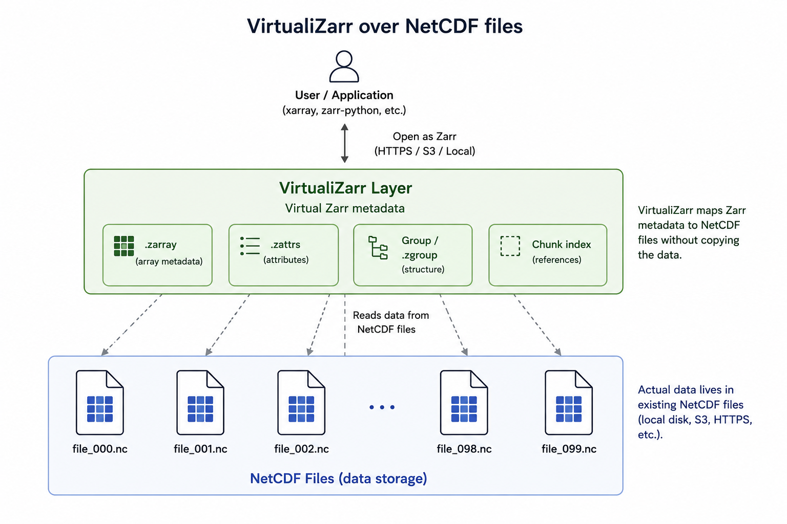

:::::::::::::::::::::::::::::::::::::::::: objectives

- Explain what a virtual Zarr store is.
- Create a virtual Zarr dataset from local NetCDF files.
- Open the virtual dataset with xarray and inspect its structure.
- Compare virtual access with direct NetCDF access.

::::::::::::::::::::::::::::::::::::::::::::::::::

::::::::::::::::::::::::::::::::::::::::::: questions

- Why might we prefer a virtual Zarr store over fully converting data to Zarr?
- How do we create a virtual dataset from NetCDF files already on the server?
- How does a virtual Zarr store look when opened with xarray?
- What do we gain by virtualising instead of copying all the data?

::::::::::::::::::::::::::::::::::::::::::::::::::

## Why virtual Zarr stores?

Converting all archival data to Zarr is sometimes impractical. Archives may contain many NetCDF files, and fully rewriting them into physical Zarr can take time and storage space. Some sites also need to keep the original NetCDF files for legacy workflows or operational reasons.

A virtual Zarr store gives you a way to access those files in a Zarr-like way without copying all the data. Instead of writing new chunk files, Virtualizarr builds a virtual dataset that points back to the original NetCDF data.

This is useful when you want:

- Fast, chunked access without full conversion.
- A way to keep the original NetCDF files unchanged.
- A simple bridge between NetCDF archives and xarray-based analysis.

## When to use Virtualizarr instead of physical conversion

Common scenarios:

- You have a large archive of NetCDF/HDF/GRIB files and want **fast, chunked access** with xarray and Dask, but cannot or do not want to rewrite everything.
- You must keep the original files unchanged for regulatory, legacy, or operational reasons.
- Your storage system struggles with huge numbers of small files that physical Zarr stores generate.
- You want to **prototype cloud‑optimised data access** before committing to a full migration.

Physical Zarr conversion is still useful when:

- You expect heavy use and want maximum performance.
- You have resources to restructure data into coherent Zarr datacubes.
- You don't need original files for legacy applications.

Virtualizarr provides a middle path: a lightweight abstraction layer that lets archival data behave like Zarr without copying or restructuring underlying files.

Virtualizarr lets you create a virtual dataset from one file or many files. From the user's point of view, the result looks like a normal xarray dataset, but the data are still backed by the original NetCDF files rather than copied into new Zarr chunks.

In this lesson, we will use the NetCDF files already available on the server. That means the workflow stays small and practical: open the files, virtualise them, and inspect the result.

{alt="Diagram showing NetCDF files with a virtual Zarr layer on top."}


::::::::::::::::::::::::::::::::::::::: challenge

## Exercise 1 - Decide when to virtualise

Discuss these situations in pairs:

1. A small archive used by one team.
2. A large archive that must keep the original NetCDF files.
3. A dataset that will be queried repeatedly by many users.

For each case, decide whether you would:

- Keep the files as NetCDF.
- Create a virtual Zarr store.
- Fully convert to physical Zarr.

Write down your reasoning.

::::::::::::::: solution

Virtualisation is a good fit when the original files must remain in place or when full conversion is too expensive.

:::::::::::::::::::::::::

::::::::::::::::::::::::::::::::::::::::::::::::::

## Virtualizarr example workflow

### Inspect the NetCDF files

Before virtualising, look at the files you already have.

```python
import xarray as xr

ds_nc = xr.open_mfdataset("data/example_*.nc", combine="by_coords")

print(ds_nc)
print(ds_nc.dims)
print(ds_nc.data_vars)
print(ds_nc.coords)
```

This helps you check the dimensions, variables, and coordinates before you build the virtual store.


### Create a virtual dataset

Now create a virtual dataset from the NetCDF files. You point Virtualizarr at the files and let it build the virtual store for you.

```python
import virtualizarr as vz

vds = vz.open_virtual_mfdataset(
    "data/example_*.nc",
    combine="by_coords",
    engine="netcdf4",
)

print(vds)
print(vds.dims)
print(vds.data_vars)
print(vds.coords)
```

The key idea is that this does not copy the full dataset into new Zarr files. It creates a virtual representation that can be opened and analysed like a Zarr-like dataset.

### Save the virtual dataset to a reference file

You can save the virtual dataset to a reference file (JSON) that describes how to access the underlying NetCDF files. This allows you to share the virtual dataset with others without copying all the data.

```python
vds.virtualize.to_kerchunk("data/example_virtual.parquet", format="parquet")
```

And then, you can load it later with:

```python
vds_loaded = vz.open_virtual_mfdataset("data/example_virtual.parquet", engine="kerchunk")
```

### Open the virtual dataset with xarray

Once the virtual dataset is created, open it with xarray and inspect it as usual.

```python
import xarray as xr

ds_virtual = xr.open_zarr(vds.store, consolidated=False)
print(ds_virtual)
print(ds_virtual.dims)
print(ds_virtual.data_vars)
```

Now, you can work with the virtual dataset as if it were a physical Zarr store, but the data remain in the original NetCDF files.


### Compare a simple analysis

Now compare a small analysis on the original NetCDF files and on the virtual dataset.

```python
import time

pattern = "data/example_*.nc"

t0 = time.time()
ds_nc = xr.open_mfdataset(pattern, combine="by_coords")
result_nc = ds_nc["temperature"].mean(dim=("lat", "lon")).compute()
t1 = time.time()
print("NetCDF time:", t1 - t0)

t0 = time.time()
vds = vz.open_virtual_mfdataset(pattern, combine="by_coords", engine="netcdf4")
ds_virtual = xr.open_zarr(vds.store, consolidated=False)
result_virtual = ds_virtual["temperature"].mean(dim=("lat", "lon")).compute()
t1 = time.time()
print("Virtual time:", t1 - t0)
```

The exact timings will depend on the dataset and environment, but the goal is to show that virtualisation can give you a Zarr-like access pattern without fully converting the data.

:::::::::::::::::::::::::::::::::::::::::: callout


### Why this is useful

Virtualizarr keeps the original files in place, but lets you work with a chunked, cloud-friendly view of the data. You can choose chunks that match your access pattern, such as time-based chunks for time series or spatial chunks for maps.

A small caveat: if the underlying files are poorly aligned with your chosen chunks, access may be less efficient because the virtual store still has to read from those files underneath. So the best chunk strategy is usually the one that fits analysis needs while also staying reasonably aligned with the source layout.

::::::::::::::::::::::::::::::::::::::::::


::::::::::::::::::::::::::::::::::::::: challenge

## Exercise 2 - Open a virtual dataset from server NetCDF files

Using the NetCDF files available on your server:

1. Identify a pattern (e.g. `data/example_*.nc`) covering several files with compatible dimensions.
2. Use `virtualizarr.open_virtual_mfdataset` (or equivalent function in your installed version) to create a virtual dataset.
3. Print:
   - Dimensions (`.dims`).
   - Data variables (`.data_vars`).
   - Coordinates (`.coords`).
4. Save the virtual dataset to a reference file (JSON or Parquet).

Questions:

- Does the virtual dataset look similar to an xarray dataset created via `open_mfdataset`?
- How does Virtualizarr differ in terms of storage usage (no new data files created)?

::::::::::::::: solution

```python
import virtualizarr as vz
vds = vz.open_virtual_mfdataset("data/example_*.nc", combine="by_coords", engine="netcdf4")
print(vds.dims)
print(vds.data_vars)
print(vds.coords)
```

Save to a file if desired:

```python
vds.virtualize.to_kerchunk("data/example_virtual.parquet", format="parquet")
```

You can obtain an xarray-like dataset from multiple NetCDF files without physically converting them to Zarr.
Virtualizarr constructs a virtual datacube on top of existing files, rather than writing new chunk files.

:::::::::::::::::::::::::

::::::::::::::::::::::::::::::::::::::::::::::::::

:::::::::::::::::::::::::::::::::::::::::: callout

## Integration with other tools and examples

Virtualizarr is part of a broader ecosystem:

- It builds on ideas from Kerchunk (reference files for virtual Zarr).
- It can integrate with Icechunk for storing and reusing virtual references in a versioned manner.

::::::::::::::::::::::::::::::::::::::::::::::::::

:::::::::::::::::::::::::::::::::::::::::: keypoints

- Virtualizarr creates virtual Zarr datasets without copying the data.
- It is useful when full conversion is impractical or unnecessary.
- You can create a virtual dataset directly from NetCDF files already on the server.
- xarray can open the virtual dataset and analyse it like a familiar dataset.
- Virtualisation is a useful bridge between NetCDF archives and Zarr-style workflows.

::::::::::::::::::::::::::::::::::::::::::
