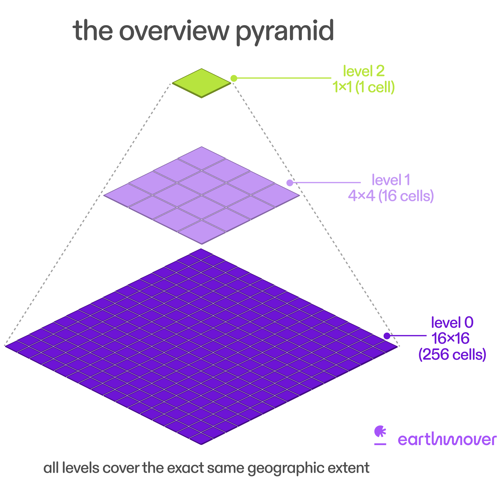

:::::::::::::::::::::::::::::::::::::::::: objectives

- "Explain how geospatial Zarr datasets can be visualised efficiently in the browser and in desktop tools."
- "Describe why chunking and multiscale pyramids are important for interactive visualisation."
- "Introduce the GeoZarr conventions for geospatial, multiscale Zarr datasets."
- "Use Topozarr to build a multiscale Zarr dataset from an existing Zarr store."
- "Understand how browser clients (e.g. OpenLayers, zarrita, zarr-cesium) can render multiscale GeoZarr without a dedicated tiling server."

::::::::::::::::::::::::::::::::::::::::::::::::::

::::::::::::::::::::::::::::::::::::::::::: questions

- "How does chunking affect interactive visualisation of Zarr data in the cloud?"
- "What is a multiscale pyramid, and why does it come from Cloud-Optimized GeoTIFF ideas?"
- "What does GeoZarr add on top of Zarr for geospatial visualisation?"
- "How can we use Topozarr to create multiscale Zarr from our example dataset and explore it in a browser?"

::::::::::::::::::::::::::::::::::::::::::::::::::

## Introduction

Zarr can be used for web visualisation as well as scientific analysis. Because the data are stored in chunks, browsers or servers can fetch only the pieces needed for the current map view instead of loading the full dataset.

There are two main patterns. In a **server-based** workflow, a backend reads the Zarr store and serves tiles or images; in a **client-side** workflow, the browser reads chunks directly from object storage and renders them with WebGL or similar tools.

We will see now how to prepare a Zarr dataset for interactive visualisation, and how to explore it in a browser using GeoZarr conventions and simple HTML/JS clients. And we understand why chunking, multiscale pyramids and GeoZarr metadata are important for performance and user experience.


## Chunking matters for visualisation

Zarr stores multidimensional arrays as many small chunks. For large geospatial datasets (e.g. global grids, satellite imagery), interactive visualisation often means:

- Looking at relatively small windows (map viewports) at a time.
- Zooming and panning, which changes which subset of data is needed.

Good chunking:

- Aligns chunks with typical viewports or tiles (e.g. 256×256 or 512×512 pixels).
- Keeps chunks small enough for fast transfer (tens or hundreds of kilobytes) but large enough to avoid too many separate HTTP requests.

Poor chunking (e.g. huge chunks or misaligned shapes):

- Forces the viewer to load far more data than needed for each map view.
- Can cause slow interaction, high bandwidth usage, and poor user experience.

For geospatial visualisation, we typically prefer **chunking along spatial dimensions** (x, y) and possibly band/time, with chunk sizes chosen to balance latency and throughput.


## Multiscale pyramids and Cloud-Optimized GeoTIFFs

Cloud-Optimized GeoTIFF (COG) is a widely used format for imagery that:

- Stores multiple resolutions (overview levels) inside a single file.
- Organises data so that HTTP range requests can retrieve just the tiles needed for a given viewport and zoom level.

Multiscale pyramids in Zarr follow the same idea:

- Level 0: full-resolution grid.
- Level 1: downsampled (e.g. 2× coarser) version.
- Level 2: further downsampled, and so on.

Benefits:

- At low zoom (whole world), we display coarse data (few tiles, faster).
- At high zoom (local detail), we display fine data (more tiles, but only for a small area).

GeoZarr's **multiscales** convention formalises how to store and describe these pyramids in Zarr.



## GeoZarr: geospatial conventions for Zarr

GeoZarr is a set of modular conventions for encoding geospatial datasets in Zarr.

Core conventions include:

- **`proj`** - describes the coordinate reference system (CRS) using EPSG codes, WKT2, or PROJJSON.
- **`spatial`** - defines affine transforms between array indices and coordinates (e.g. pixel to lat/lon).
- **`multiscales`** - describes multiscale pyramid structures (resolution levels, layouts).

These conventions are registered via a `zarr_conventions` metadata attribute and use namespaced attributes like `proj:code`, `spatial:transform`, and `multiscales`.

GeoZarr is being developed as an OGC standard that builds upon the Unidata Common Data Model and CF conventions, and aims to bridge scientific and geospatial communities.

Useful references:

- GeoZarr overview: <https://geozarr.org>
- Conventions (proj, spatial, multiscales): <https://geozarr.org/conventions.html>
- GeoZarr spec draft: <https://zarr.dev/geozarr-spec/documents/standard/template/geozarr-spec.html>


::::::::::::::::::::::::::::::::::::::: challenge

## Exercise 1 - Design a multiscale strategy

Before writing code:

1. Look at your example Zarr dataset (dimensions, spatial resolution, domain).
2. Propose:
   - Number of levels (e.g. 3-5).
   - Downsampling method (e.g. mean, min, max, nearest).
   - Spatial chunk size (e.g. 256×256 or 512×512).

3. Discuss with a neighbour:
   - How your choices affect visualisation at different zoom levels.
   - How they might impact performance and storage.

Write down your multiscale plan; you'll implement it with Topozarr in the next exercise.

::::::::::::::: solution

Learners should think about how many overview levels they need and how chunk sizes map to typical map tiles.
They will connect multiscale design decisions to performance and user experience.

:::::::::::::::::::::::::

::::::::::::::::::::::::::::::::::::::::::::::::::

## Topozarr: creating multiscale Zarr for visualisation

[Topozarr](https://github.com/carbonplan/topozarr) is a Python library from CarbonPlan that helps create multiscale Zarr stores for visualisation.

Typical workflow:

1. Start with an existing Zarr dataset (e.g. your example dataset stored in an object store).
2. Use Topozarr to generate multiple resolution levels (pyramid).
3. Save the multiscale Zarr store with appropriate GeoZarr multiscales metadata.


Conceptually, for your existing Zarr dataset (e.g. `s3://my-bucket/converted.zarr`):

```python
import xarray as xr
import zarr
import topozarr

# 1. Open the original Zarr dataset
store_url = "s3://my-bucket/converted.zarr"
ds = xr.open_zarr(store_url, consolidated=True)

# 2. Choose a variable to visualise (e.g. 'temperature')
var = ds["temperature"]
```
And then create the multiscale pyramid:

```python
pyramid = topozarr.build_pyramid(
    var,  # or dataset
    levels=4,              # number of resolution levels
    downsampling="mean",   # or 'nearest', etc.
    chunk_size=(256, 256)  # spatial chunking
)
```

Now, you can inspect the pyramid structure, which will have multiple levels, each with its own group in the Zarr hierarchy. Each level will contain downsampled versions of the original data, suitable for different zoom levels in a map viewer.

```python
for level in pyramid.levels:
    print(f"Level {level.level}: shape={level.shape}, chunks={level.chunks}")
```

You can see that it is not a normal xarray dataset, but a xarray datatree that contains multiple levels of downsampled data. Each level can be accessed and visualised separately, and the pyramid can be saved to a new Zarr store for use in browser-based visualisation tools.

Instead of saving each level separately, Topozarr can save the entire pyramid to a single multiscale Zarr store, which is compatible with GeoZarr conventions. And, we will save the data directly to an object store (e.g. S3) for browser access:

```python
mapper = zarr.storage.FSStore("s3://my-bucket/converted_multiscale.zarr")
pyramid.to_zarr(mapper, consolidated=True)
```

::::::::::::::::::::::::::::::::::::::: challenge

## Exercise 2 - Build and save a multiscale Zarr store

Using your example dataset and Topozarr:

1. Implement your multiscale strategy with Topozarr and write a new Zarr store (in the object store).
2. Inspect the Zarr hierarchy:
   - Check how levels are organised (e.g. groups for each resolution level).
   - Check metadata related to multiscales if available.

Questions:

- How does the multiscale structure look compared to the original single-resolution dataset?
- How might different levels be used by a viewer when zooming in and out?

::::::::::::::: solution

```python
import xarray as xr
import zarr
import topozarr

# Open the original Zarr dataset
store_url = "s3://my-bucket/converted.zarr"
ds = xr.open_zarr(store_url, consolidated=True)

# Choose a variable to visualise
var = ds["temperature"]

# Build the multiscale pyramid
pyramid = topozarr.build_pyramid(
    var,
    levels=4,
    downsampling="mean",
    chunk_size=(256, 256)
)

# Save the multiscale Zarr store
mapper = zarr.storage.FSStore("s3://my-bucket/converted_multiscale.zarr")
pyramid.to_zarr(mapper, consolidated=True)
```

:::::::::::::::::::::::::

::::::::::::::::::::::::::::::::::::::::::::::::::

## Browser-based visualisation: server and client options

Once you have a multiscale GeoZarr-compliant Zarr store, you can visualise it in the browser in two main ways: with a **server** that serves tiles, or with a **client** that reads Zarr directly from object storage.

### Server-side visualisation

In the server-side approach, a Python service reads the Zarr data and turns it into map tiles on demand. This is the familiar web-mapping model: the browser asks for tiles, and the server returns ready-to-display images for the current zoom and extent.

Common options include:

- **TiTiler** / **titiler-multidim**: dynamic tile services that can render Zarr and other xarray-readable datasets.
- **xpublish-tiles**: a tile router for xpublish that can serve tiles from xarray/Zarr-backed data.

This approach is useful when you need server-side control over styling, reprojection, access control, or heavy processing. It also works well when you want the browser to stay simple and just consume tiles.

### Client-side visualisation

In the client-side approach, the browser reads Zarr chunks directly from object storage and renders them itself. This removes the need for a dedicated tile server, but it means the browser has to do more work.

Examples include:

- [**GeoZarr in OpenLayers**](https://github.com/spacebel/geozarr-openlayers): OpenLayers can read GeoZarr sources directly and render multiscale data in the browser.
- [**zarr-maps**](https://github.com/noc-oi/zarr-maps): a client-side layer for Leaflet and OpenLayers-style web maps.
- [**zarr-cesium**](https://github.com/noc-oi/zarr-cesium): client-side visualisation for 2D and 3D in CesiumJS.
- [**zarr-layer**](https://github.com/carbonplan/zarr-layer) / [**deck.gl-raster**](https://github.com/developmentseed/deck.gl-raster): browser rendering built around Zarr chunk loading and GPU display.

These tools usually rely on a JavaScript reader such as [**Zarrita**](https://zarrita.dev/) to fetch chunk data from object storage. The browser then combines that data with [**WebGL**](https://developer.mozilla.org/en-US/docs/Web/API/WebGL_API) and the **GPU** to render images, surfaces, or map tiles efficiently.

### How the two approaches work

Server-side tools read the data on the backend, process it into tiles, and send those tiles to the browser. Client-side tools skip that backend step: they fetch the Zarr chunks directly, choose the right multiscale level, and render in the browser using WebGL.

In both cases, multiscale metadata is important because it tells the viewer which resolution level to use at each zoom level. Good chunking also matters, because viewers work best when the chunks line up reasonably well with the data they need to display.

In this lesson, we will not go deep into front-end code, but we will show a simple browser example that learners can run locally and point at their own multiscale Zarr store.

### Simple HTML example

In the [zarr-maps-openlayers.html](files/zarr-maps-openlayers.html) file, we provide a minimal HTML page that uses **zarr-maps** with **OpenLayers** to visualise a multiscale zarr dataset in the browser. It follows the documented `ZarrLayer` options from the zarr-maps getting-started guide and can be served as a static HTML page.

The lesson renders the same example inline below so learners can inspect it directly in the page:

<iframe
  src="files/zarr-maps-openlayers.html"
  title="Zarr-maps OpenLayers example"
  style="width: 100%; height: 800px; border: 1px solid #d0d7de; border-radius: 0.75rem;"
  loading="lazy"
></iframe>

::::::::::::::::::::::::::::::::::::::: challenge

## Exercise 3 - Explore your multiscale Zarr in the browser

1. Upload your multiscale Zarr store to an object store and make it accessible via HTTPS (or serve it locally with an appropriate static server).
2. In the page above, edit the `zarrUrl` and `variable`, add your multiscale zarr dataset. You can edit it directly in the browser, or you can get the [HTML file](files/zarr-maps-openlayers.html) and edit it to point to your multiscale Zarr store and the variable you want to visualise.
4. Run a local web server in the directory containing `zarr-maps-openlayers.html`:

   ```bash
   python -m http.server 8000
   ```

   Then open `http://localhost:8000/zarr-maps-openlayers.html` in your browser.

5. Pan and zoom the map, observing how data loads and renders at different scales.

Questions:

- How responsive is the visualisation, and how does it change as you zoom?
- What might you adjust in your multiscale strategy (levels, chunk size) to improve performance?

::::::::::::::: solution

You should experience direct browser-based visualisation of your multiscale Zarr data.
You will see how multiscale pyramids and chunking decisions affect the responsiveness and smoothness of interaction.

:::::::::::::::::::::::::

::::::::::::::::::::::::::::::::::::::::::::::::::


::::::::::::::::::::::::::::::::::::::: challenge

## Exercise 4 - Open your multiscale Zarr with zarr-cesium

Open the https://noc-oi.github.io/zarr-cesium/ and enter the URL of your multiscale Zarr store in the input field. You may need to specify additional parameters depending on your dataset (e.g. group name, band selection).

Try to play a little with the controls, zooming and panning around the globe. Observe how the data loads and renders at different zoom levels.

::::::::::::::: solution

Learners should experience direct browser-based visualisation of their multiscale Zarr data.
They will see how multiscale pyramids and chunking decisions affect the responsiveness and smoothness of interaction.

:::::::::::::::::::::::::

::::::::::::::::::::::::::::::::::::::::::::::::::

:::::::::::::::::::::::::::::::::::::::::: keypoints

- "Chunking and multiscale pyramids are central to interactive visualisation of geospatial Zarr datasets, allowing efficient tile-based access at different zoom levels."
- "GeoZarr defines modular conventions (proj, spatial, multiscales) for encoding geospatial metadata and multiscale layouts on top of Zarr."
- "Topozarr can be used to build multiscale Zarr stores from existing datasets, preparing them for efficient visualisation."
- "Browser clients such as OpenLayers (GeoZarr source), zarrita, and zarr-cesium can render Zarr data directly from object storage using WebGL and GPU acceleration, without a dedicated tiling server."
- "By combining GeoZarr conventions, multiscale Zarr, and simple HTML/JS clients, you can build fully cloud-native visualisation workflows for your geospatial datasets."

::::::::::::::::::::::::::::::::::::::::::::::::::
