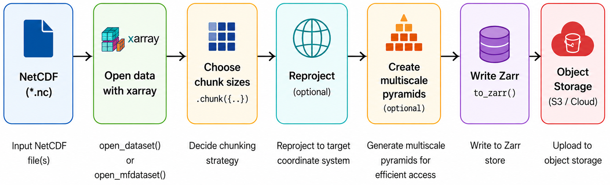

:::::::::::::::::::::::::::::::::::::::::: objectives

- "Explain how geospatial Zarr datasets can be visualised efficiently in the browser and in desktop tools."
- "Describe why chunking and multiscale pyramids are important for interactive visualisation."
- "Introduce the GeoZarr conventions for geospatial, multiscale Zarr datasets."
- "Use Topozarr to build a multiscale Zarr dataset from an existing Zarr store."
- "Understand how browser clients (e.g. OpenLayers, zarrita, zarr-cesium) can render multiscale GeoZarr without a dedicated tiling server."

::::::::::::::::::::::::::::::::::::::::::::::::::

::::::::::::::::::::::::::::::::::::::::::: questions

- "How does chunking affect interactive visualisation of Zarr data in the cloud?"
- "What is a multiscale pyramid, and why does it come from Cloud-Optimized GeoTIFF ideas?"
- "What does GeoZarr add on top of Zarr for geospatial visualisation?"
- "How can we use Topozarr to create multiscale Zarr from our example dataset and explore it in a browser?"

::::::::::::::::::::::::::::::::::::::::::::::::::

## Introduction

Zarr can be used for web visualisation as well as scientific analysis. Because the data are stored in chunks, browsers or servers can fetch only the pieces needed for the current map view instead of loading the full dataset.

There are two main patterns. In a **server-based** workflow, a backend reads the Zarr store and serves tiles or images. In a **client-side** workflow, the browser reads chunks directly from object storage and renders them with [WebGL](https://developer.mozilla.org/en-US/docs/Web/API/WebGL_API)+GPU or similar tools.

We will see now how to prepare a Zarr dataset for interactive visualisation, and how to explore it in a browser using [GeoZarr](https://geozarr.org) conventions and simple HTML/JS clients. And we understand why chunking, multiscale pyramids, and GeoZarr metadata are important for performance and user experience.

## Chunking matters for visualisation

Zarr stores multidimensional arrays as many small chunks. For large geospatial datasets (e.g. global grids, satellite imagery), interactive visualisation often means:

- Looking at relatively small windows (map viewports) at a time.
- Zooming and panning, which changes which subset of data is needed.

Because of that, a good chunking should align with the typical viewports, zoom levels and tiles (e.g. 256×256 or 512×512 pixels) so that the viewer can fetch only the chunks needed for the current view. Another consideration is that the chunks should be small enough for fast transfer (tens or hundreds of kilobytes) but large enough to avoid too many separate HTTP requests.

Inefficient chunking (e.g. huge chunks or misaligned shapes) can lead to the forced loading of much more data than needed for each map view, potentially resulting in sluggish interactions, high bandwidth consumption, and a poor user experience.

For geospatial visualisation, we typically prefer chunking along spatial dimensions (x, y) and possibly band/time, with chunk sizes chosen to balance latency and throughput.

## Multiscale pyramids

The idea of multiscale pyramids comes from the concept of Cloud-Optimized GeoTIFFs (COGs), which are widely used for imagery. COGs store multiple resolutions of the same data in a single file, allowing clients to request only the resolution needed for the current zoom level, improving performance and reducing bandwidth.

Following the same idea, we can create **multiscale pyramids** in Zarr. Each level of the pyramid is a downsampled version of the original data, allowing viewers to fetch coarse data for low zoom levels and fine data for high zoom levels. Normally, the pyramid is structured as follows:

- Level 0: full-resolution grid.
- Level 1: downsampled (e.g. 2× coarser) version.
- Level 2: further downsampled, and so on.

As benefits, this allows for efficient visualisation at different zoom levels without overwhelming the client with unnecessary data. For example, a global map view can use a low-resolution overview, while a local zoom can fetch high-resolution tiles only for the area of interest.

GeoZarr's multiscales convention formalises how to store and describe these pyramids in Zarr.

](episodes/fig/geozarr_multiscale.png){alt="Diagram showing a multiscale pyramid with multiple levels of downsampled data, each level with its own group in the Zarr hierarchy."}

## GeoZarr: geospatial conventions for Zarr

GeoZarr is a set of modular conventions for encoding geospatial datasets in Zarr. The core conventions include `proj`, `spatial`, and `multiscales`, which describe the coordinate reference system, spatial transforms, and multiscale pyramid structure, respectively.

These conventions are registered via a `zarr_conventions` metadata attribute and use namespaced attributes like `proj:code`, `spatial:transform`, and `multiscales`. GeoZarr is being developed as an OGC standard that builds upon the Unidata Common Data Model and CF conventions, and aims to bridge scientific and geospatial communities.

Useful references:

- GeoZarr overview: <https://geozarr.org>
- Conventions (proj, spatial, multiscales): <https://geozarr.org/conventions.html>
- GeoZarr spec draft: <https://zarr.dev/geozarr-spec/documents/standard/template/geozarr-spec.html>


::::::::::::::::::::::::::::::::::::::: challenge

## Exercise 1 - Design a multiscale strategy

Creating a multiscale Zarr store requires some design decisions. Before implementing it, think about your dataset and how you want to visualise it. Because it can be resource-intensive to create multiple levels, we are going to use a small example dataset for this exercise, the `data/era5_sst/ocean_temperature.zarr`, related to the subset of [ERA5 Reanalysis dataset](https://cds.climate.copernicus.eu/datasets/reanalysis-era5-single-levels).

1. Look at your example Zarr dataset (dimensions, spatial resolution, domain).
2. Propose:
   - Number of levels (e.g. 3-5).
   - Downsampling method (e.g. mean, min, max, nearest).
   - Spatial chunk size (e.g. 256×256 or 512×512).
3. Discuss with a neighbour:
   - How your choices affect visualisation at different zoom levels.
   - How they might impact performance and storage.

Write down your multiscale plan. You'll implement it with Topozarr in the next exercise.

::::::::::::::: solution

The multiscale strategy will depend on the dataset's spatial resolution and the desired zoom levels for visualisation. For example, if the original dataset has a resolution of 0.1 degrees, you might choose:
- Levels: 4 (0.1°, 0.2°, 0.4°, 0.8°)
- Downsampling: mean (to preserve average values)
- Chunk size: (256, 256) for spatial dimensions

:::::::::::::::::::::::::

::::::::::::::::::::::::::::::::::::::::::::::::::

## Topozarr: creating multiscale Zarr for visualisation

[Topozarr](https://github.com/carbonplan/topozarr) is a Python library from [CarbonPlan](https://carbonplan.org) that helps create multiscale Zarr stores for visualisation, following the GeoZarr conventions. It can take an existing Zarr dataset and generate multiple resolution levels (pyramid) with appropriate metadata.

First, load the zarr dataset using xarray:

```python
import xarray as xr

base_path = "/gws/ssde/j25b/atlantis_vis/cloud-native-geoscience-course/" # or "" if you have the data in your current working directory

ds = xr.open_zarr(f"{base_path}data/era5_sst/ocean_temperature.zarr", consolidated=True)
```

To generate the multiscale pyramid, you need to set the CRS in the dataset attributes. For example, if the dataset uses WGS84 (EPSG:4326), you can set it like this:

```python
ds = ds.proj.assign_crs({"EPSG": 4326})
```

```python
from topozarr import create_pyramid

pyramid = create_pyramid(
    ds,
    levels=2, # number of downsampled levels
    x_dim="longitude", # x dimension name
    y_dim="latitude", # y dimension name
    target_chunk_bytes=512 * 512 * 4,  # target chunk size in bytes (e.g. 512x512 pixels with float32)
    method="mean",   # or 'nearest', etc.
    chunks_per_shard=4 # number of chunks per shard for better performance
)
```
The pyramid is a Pyramid object. In order to take a look at the levels and their shapes, you can convert it to a datatree and inspect the levels:

```python
pyramid_tree = pyramid.as_datatree()
print(pyramid_tree)
print(pyramid_tree["0"])  # Level 0 (full resolution)
print(pyramid_tree["1"])  # Level 1 (downsampled)
```

Instead of saving each pyramid level as a separate dataset, TopoZarr can write the entire pyramid to a single multiscale Zarr store that follows the GeoZarr conventions. In this example, we will save the multiscale dataset directly to an object store so that it can be accessed efficiently from a web browser:

First, create a mapper for the Zarr store. You can use `zarr.storage.FsspecStore` to write to an S3 bucket or other object storage:

```python
import xarray as xr
import zarr
import os

store_url = "s3://my-bucket/ocean_temperature_pyramid.zarr"

storage_options = {
    "key": os.environ["AWS_ACCESS_KEY_ID"],
    "secret": os.environ["AWS_SECRET_ACCESS_KEY"],
    "client_kwargs": {"endpoint_url": "https://atlantis-vis-o.s3-ext.jc.rl.ac.uk"},
    "config_kwargs": {
        "request_checksum_calculation": "when_required",
        "response_checksum_validation": "when_required",
    },
}

# Create a reference for the object store
store = zarr.storage.FsspecStore.from_url(
    store_url,
    storage_options=storage_options,
)
```

Because this task can be resource-intensive, you may want to use a local cluster:

```python
from dask.distributed import Client

client = Client(n_workers=4, threads_per_worker=2, memory_limit="4GB")
```

And then save the pyramid to the Zarr store:

```python
pyramid_tree.to_zarr(
    store,
    mode="w",
    consolidated=True, # You can set to False for performance
    encoding=pyramid.encoding, # You need to set the encoding as the same encoding in the Pyramid object
    align_chunks=True
)
```

Now, you can inspect the Zarr hierarchy in the object store to see how the multiscale levels are organised and check for metadata related to multiscales. Because it is a datatree, you need to use the `xr.open_datatree` function to open the multiscale Zarr store:

```python
import xarray as xr
url = "https://atlantis-vis-o.s3-ext.jc.rl.ac.uk/cloud-native-geoscience-course/ocean_temperature_pyramid.zarr"
ds_pyramid = xr.open_datatree(url, engine="zarr") # remember to use the correct engine for datatree
print(ds_pyramid)
```

:::::::::::::::::::::::::::::::::::::::::: caution

## Watch API churn

Support for multiscale pyramids is a relatively recent addition to the Zarr ecosystem. One of the libraries providing this functionality is **Topozarr**.

As the Zarr ecosystem continues to evolve, Topozarr is also under active development. As a result, the API for creating multiscale pyramids may change between releases. Always refer to the documentation for the specific version you are using, and consider pinning your package versions to ensure reproducible workflows and avoid unexpected breakages when upgrading dependencies.

::::::::::::::::::::::::::::::::::::::::::::::::::

::::::::::::::::::::::::::::::::::::::: challenge

## Exercise 2 - Build and save a multiscale Zarr store

Using the multiscale strategy you designed in Exercise 1, implement it with Topozarr and save the resulting multiscale Zarr store to an object store. Then, inspect the Zarr hierarchy and metadata.

Questions:

- How does the multiscale structure look compared to the original single-resolution dataset?
- How might different levels be used by a viewer when zooming in and out?

::::::::::::::: solution

```python
import xarray as xr
import zarr
from topozarr import create_pyramid

base_path = "/gws/ssde/j25b/atlantis_vis/cloud-native-geoscience-course/" # or "" if you have the data in your current working directory

ds = xr.open_zarr(f"{base_path}data/era5_sst/ocean_temperature.zarr", consolidated=True)

ds = ds.proj.assign_crs({"EPSG": 4326})

pyramid = create_pyramid(
    ds,
    levels=2,
    x_dim="longitude",
    y_dim="latitude",
    method="nearest",
    chunks_per_shard=4
)
# Build the multiscale pyramid
pyramid = topozarr.build_pyramid(
    var,
    levels=4,
    downsampling="mean",
    chunk_size=(256, 256)
)

pyramid_tree = pyramid.as_datatree()

# Save the multiscale Zarr store
mapper = "CREATE THE MAPPER"

client = "CREATE A DASK CLIENT"

pyramid_tree.to_zarr(
    store,
    mode="w",
    consolidated=False,
    encoding=pyramid.encoding,
    align_chunks=True
)
```

:::::::::::::::::::::::::

::::::::::::::::::::::::::::::::::::::::::::::::::

## Browser-based visualisation: server and client options

Once you have a multiscale GeoZarr-compliant Zarr store, you can visualise it in the browser in two main ways: with a **server** that serves tiles, or with a **client** that reads Zarr directly from object storage.

Server-side tools read the data on the backend, process it into tiles, and send those tiles to the browser. Client-side tools skip that backend step: they fetch the Zarr chunks directly, choose the right multiscale level, and render in the browser using WebGL.

In both cases, multiscale metadata is important because it tells the viewer which resolution level to use at each zoom level. Good chunking also matters, because viewers work best when the chunks line up reasonably well with the data they need to display.

### Server-side visualisation

In the server-side approach, a Python service reads the Zarr data and turns it into map tiles on demand. This is the familiar web-mapping model: the browser asks for tiles, and the server returns ready-to-display images for the current zoom and extent. There are two main options for this:

- [**TiTiler**](https://developmentseed.org/titiler/): dynamic tile services that can render Zarr and other xarray-readable datasets.
- [**xpublish-tiles**](https://github.com/earth-mover/xpublish-tiles): a tile router for xpublish that can serve tiles from xarray/Zarr-backed data.

This approach is useful when you need server-side control over styling, reprojection, access control, or heavy processing. It also works well when you want the browser to stay simple and just consume tiles.

### Client-side visualisation

In the client-side approach, the browser reads Zarr chunks directly from object storage and renders them itself. This removes the need for a dedicated tile server, but it means the browser has to do more work.

Examples include:

- [**zarr-maps**](https://github.com/noc-oi/zarr-maps): a client-side layer for [Leaflet](https://leafletjs.com/) and [OpenLayers](https://openlayers.org/)-style web maps.
- [**zarr-cesium**](https://github.com/noc-oi/zarr-cesium): client-side visualisation for 2D and 3D in [CesiumJS](https://cesium.com/cesiumjs/).
- [**zarr-layer**](https://github.com/carbonplan/zarr-layer) / [**deck.gl-raster**](https://github.com/developmentseed/deck.gl-raster): browser rendering built around Zarr chunk loading and GPU display. For [Mapbox](https://www.mapbox.com/) and [Maplibre](https://maplibre.org/).

These tools usually rely on a Zarr JavaScript reader such as [**Zarrita**](https://zarrita.dev/) to fetch chunk data from object storage. The browser then combines that data with [**WebGL**](https://developer.mozilla.org/en-US/docs/Web/API/WebGL_API) and the **GPU** to render images, surfaces, or map tiles efficiently.

](episodes/fig/zarr_cesium_workflow.png){alt="Diagram showing the workflow for visualising a multiscale Zarr dataset in the browser using zarr-cesium."}

### Simple HTML example

In this lesson, we will not go deep into front-end code, but we will show a simple browser example that you can run locally and point at their own multiscale Zarr store. It is the [zarr-maps-openlayers.html](files/zarr-maps-openlayers.html), which is a minimal HTML page that uses [zarr-maps](https://github.com/noc-oi/zarr-maps) with [OpenLayers](https://openlayers.org/) to visualise a multiscale zarr dataset in the browser.

The lesson renders the same example inline below so you can inspect it directly in the page:

<iframe
  src="files/zarr-maps-openlayers.html"
  title="Zarr-maps OpenLayers example"
  style="width: 100%; height: 800px; border: 1px solid #d0d7de; border-radius: 0.75rem;"
  loading="lazy"
></iframe>

::::::::::::::::::::::::::::::::::::::: challenge

## Exercise 3 - Explore your multiscale Zarr in the browser

1. In the page above, edit the `zarrUrl` and `variable`, add your multiscale zarr dataset.
2. Edit the [HTML file `zarr-maps-openlayers.html`](files/zarr-maps-openlayers.html) to point to your multiscale Zarr store and the variable you want to visualise.
3. Run a local web server in the directory containing the HTML file:

   ```bash
   python -m http.server 8000
   ```

   Then open `http://localhost:8000/zarr-maps-openlayers.html` in your browser.

4. Pan and zoom the map, observing how data loads and renders at different scales.

Questions:

- How responsive is the visualisation, and how does it change as you zoom?
- What might you adjust in your multiscale strategy (levels, chunk size) to improve performance?

::::::::::::::: solution

You should experience direct browser-based visualisation of your multiscale Zarr data.
You will see how multiscale pyramids and chunking decisions affect the responsiveness and smoothness of interaction.

:::::::::::::::::::::::::

::::::::::::::::::::::::::::::::::::::::::::::::::


::::::::::::::::::::::::::::::::::::::: challenge

## Exercise 4 - Open your multiscale Zarr with zarr-cesium

Open the https://noc-oi.github.io/zarr-cesium/ and enter the URL of your multiscale Zarr store in the input field. You may need to specify additional parameters depending on your dataset (e.g. group name, band selection).

Try to play a little with the controls, zooming and panning around the globe. Observe how the data loads and renders at different zoom levels.

Try to play with one of the Zarr-Cube and Zarr-Cube-Velocity examples, which are designed for 3D visualisation of multiscale Zarr datasets.

::::::::::::::: solution

You should experience direct browser-based visualisation of your multiscale Zarr data in 3D. You will see how multiscale pyramids and chunking decisions affect the responsiveness and smoothness of interaction, especially when rotating and zooming around the globe.

The integration of WebGL and GPU acceleration allows for efficient rendering of large datasets without a dedicated tiling server.

:::::::::::::::::::::::::

::::::::::::::::::::::::::::::::::::::::::::::::::


:::::::::::::::::::::::::::::::::::::::::: callout

## Pipeline for dataset conversion and visualisation

In [Lesson 10](./10-conversion-workflow.html), we converted a NetCDF dataset into Zarr. In this lesson, we built on that workflow by generating a multiscale Zarr pyramid with TopoZarr and visualising it in a web browser using the GeoZarr conventions.

This extends the original conversion pipeline with an additional multiscale processing step before visualisation.

For datasets on regular grids, the workflow is relatively straightforward. However, many geoscience datasets use irregular or curvilinear grids, where the relationship between Zarr chunks and map tiles is not direct. The [NEMO Near-Present-Day](https://noc-msm.github.io/NOC_Near_Present_Day/) dataset is a good example of this. In these cases, it is often necessary to reproject or resample the data onto a regular grid before generating the multiscale pyramid.

Several Python libraries can help with this preprocessing step, including [rioxarray](https://corteva.github.io/rioxarray/stable/), [xESMF](https://xesmf.readthedocs.io/en/latest/), and [rasterio](https://rasterio.readthedocs.io/en/latest/). For a detailed discussion of the available approaches and their performance, see the [Development Seed](https://developmentseed.org/) report: [*Reprojecting and Resampling Geospatial Data with Python*](https://developmentseed.org/warp-resample-profiling/). These tools can help prepare datasets for efficient multiscale visualisation, particularly when working with irregular grids or non-standard map projections.

The diagram below shows the full pipeline, from NetCDF to multiscale Zarr pyramid, ready for browser-based visualisation.

{alt="Pipeline diagram showing the conversion of a NetCDF dataset to a multiscale Zarr pyramid using Topozarr."}

::::::::::::::::::::::::::::::::::::::::::::::::::


:::::::::::::::::::::::::::::::::::::::::: keypoints

- "Chunking and multiscale pyramids are central to interactive visualisation of geospatial Zarr datasets, allowing efficient tile-based access at different zoom levels."
- "GeoZarr defines modular conventions (proj, spatial, multiscales) for encoding geospatial metadata and multiscale layouts on top of Zarr."
- "Topozarr can be used to build multiscale Zarr stores from existing datasets, preparing them for efficient visualisation."
- "Browser clients such as OpenLayers (GeoZarr source), zarrita, and zarr-cesium can render Zarr data directly from object storage using WebGL and GPU acceleration, without a dedicated tiling server."
- "By combining GeoZarr conventions, multiscale Zarr, and simple HTML/JS clients, you can build fully cloud-native visualisation workflows for your geospatial datasets."

::::::::::::::::::::::::::::::::::::::::::::::::::
