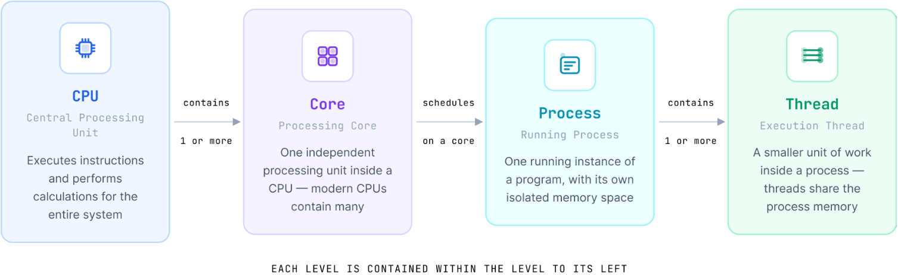
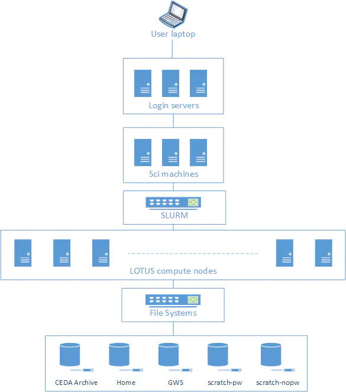

## Introduction

This workshop introduces practical tools and workflows for working with large n-dimensional scientific datasets used in oceanography, climate, and meteorology in a cloud-friendly way.

You’ll learn to:
- Migrate environmental data from traditional formats such as NetCDF to cloud-native formats like Zarr and VirtualiZarr
- Store, process, and access multi-terabyte datasets efficiently using object storage and parallel processing tools such as Dask
- Build scalable and reproducible cloud-native workflows for environmental data
- Visualise and explore large datasets efficiently in the cloud

The aim is to help you understand not only how these tools work, but also why they are useful for analysing, sharing, and managing environmental data more efficiently.

::::::::::::::::::::::::::::::::::::::: challenge

## What data do you work with?

Before we start, take a moment to think about your own experience with environmental data. This short activity will help us understand the kinds of datasets and challenges you bring to the workshop.

1. In the shared notes document (CodiMD), write one sentence about the data you usually work with and roughly how large it is.
2. Describe one challenge you have faced when working with data that is too large for your computer or too slow to process.
3. List one tool, library, or computing system you have used to help with analysis, storage, or data access.

::::::::::::::::::::::::::::::::::::::::::::::::::

In this workshop, we will use:

- `jupyterlab`
- `numpy`
- `netCDF4`
- `xarray`
- `zarr`
- `dask`
- `fsspec`, `s3fs`, `boto3`, and `obstore` for cloud storage access
- `matplotlib` and `cartopy` for plotting
- `icechunk` for versioning
- `virtualizarr` for virtual Zarr stores
- `stac` for cataloging
- `topozarr` for multiscale Zarr visualization
- others...

The exact environment is provided in the course repository as an [environment.yml file for creating a conda environment](episodes/files/environment.yml).

## Jargon busting

Here are some of the main terms that appear throughout the workshop.

### CPU, core, process, and thread

The **CPU** is the Central Processing Unit that executes instructions and performs calculations. A **core** is one processing unit inside a CPU, while a **process** is one running instance of a program and a **thread** is a smaller unit of work inside that process.

{alt="A diagram showing the relationship between CPU, core, process, and thread."}

### Parallel processing and Dask

**Parallel processing** means splitting work so that different parts run at the same time, often across cores, processes, or workers. **Dask** is a Python library that facilitates parallel computing by breaking down large computations into smaller tasks that can be executed concurrently.

### RAM and storage

**RAM** is the computer's short-term memory. **Storage** is where data live more permanently, such as on disk, SSDs, shared storage, or object storage.

### Cluster, node, and HPC

A **cluster** is a group of connected computers that work together, and a **node** is one computer within that cluster. **High-performance computing (HPC)** refers to large shared systems designed for heavy computation and large data processing.

](episodes/fig/hpc.png){alt="A picture of the JASMIN HPC system."}

### JASMIN and SSH

[JASMIN](https://jasmin.ac.uk) is the UK's data analysis facility for data-intensive environmental science. It provides notebook services, shared storage, and computing resources for environmental data work. **SSH** (Secure Shell) is a secure way to connect to a remote computer over a network.

{alt="An image illustrating the JASMIN system."}

### Group workspace

A **group workspace** is shared storage on JASMIN for collaborative work and course data.

### Jupyter notebook, and kernel

A **Jupyter notebook** is a browser-based environment for running code, text, and plots together. A **kernel** is the Python environment that runs notebook code.

### Environment.yml and conda/mamba

An **environment.yml** file is used to define a Conda environment, specifying the Python version and the packages required. **Conda** and **mamba** are tools for managing these environments and installing packages.

### Dataset, array, coordinate, and data variable

A **dataset** is a collection of related scientific data and metadata in different formats. An **array** is a multi-dimensional grid of values, while a **coordinate** is a named axis such as time, latitude, longitude, or depth. A **data variable** is the main measured or modelled value, such as temperature or salinity.

### Metadata and controlled vocabulary

**Metadata** is information about the data, such as units, long names, chunk sizes, and coordinate definitions. A **controlled vocabulary** is a curated list of standard terms and identifiers used to avoid ambiguity in metadata.

### Zarr, Xarray, chunk, and lazy loading

**Zarr** is a chunked data format for large N-dimensional arrays. **Xarray** is a labelled array library for working with multidimensional scientific data. A **chunk** is a smaller piece of a larger array, and **lazy loading** means data are not fully read into memory when a dataset is opened; they are loaded only when needed.

### Object storage and bucket

**Object storage** keeps data as independent objects in a storage system, often accessed through APIs such as S3. A **bucket** is a top-level container for objects in object storage.

](episodes/fig/bucket_and_object_store.png){alt="A diagram showing a bucket containing objects in object storage."}

### POSIX and Object-Store file system

A **POSIX file system** is a traditional file-system model with directories, files, and paths that are accessed through a local or mounted storage interface. It is commonly used for shared filesystems and local disks.

An **object-store file system** is a storage interface that exposes object storage through filesystem-like operations, often used in cloud workflows. It is different from a traditional POSIX filesystem because data are accessed through object APIs rather than a normal directory tree.

### Cloud-native format

A **cloud-native format** is designed to work efficiently with object storage and remote access patterns, often by allowing partial reads and parallel access.

### STAC

**STAC** is a standard for describing and organizing geospatial assets.

](episodes/fig/stac_example.png){alt="An example of a STAC catalog."}

### Icechunk

**Icechunk** adds versioning and history tracking to Zarr stores.

### VirtualiZarr

**VirtualiZarr** lets you work with existing files as if they were Zarr datasets without copying all of the data.

### Multiscale and pyramid

A **multiscale** dataset stores the same data at multiple resolutions, and a **pyramid** is the layered structure that makes it possible to display coarse views quickly and zoom in later.
